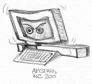

======= Amstrad NC family portable computers  hints & tools =======

This port covers the Amstrad NC-100, NC-150, NC-200 models and the NTS  Dreamwriter 225.

Other NTS-Dreamwriter models and clones are based on the NEC V20 CPU rather than on the Z80 and aren't supported.

# Quick start

### Program to be stored onto the PCMCIA card

    zcc +nc -lm -create-app application.c

A file with the ".ROM" extension will be created.

You need to rename it to "nc100.card" (or nc150, nc200) to run it on the emulator: press CTRL-X (Fn-X) to start the program.

### Program to be loaded (transferred) into RAM

    zcc +nc -subtype=ram -lm -create-app application.c

Press CTRL-B (Fn-B) to enter the BASIC interpreter, then use the *LOAD command.

Loader example:

	
	10 IF LOMEM>=&5400 THEN PRINT "Error - need 19k of lower memory free!":END
	20 *LOAD A.COM 8C00
	30 CALL &8C00

# Graphics

The monochrome graphics library is present, add "-lgfxnc200" for the NC-200 model (480x128 pixel rez), otherwise "-lgfxnc100".   The latter will work on all the models at 480x64.

In CP/M mode the "-lgfxzcn"option will permit a 480x64 resolution on the NC-100.

# Emulators

The NC100 emulator by Ian Collier and Russell Marks has been recently ported to the SDL library, and now is available on many more platforms.  Moreover all the existing models are supported (NC-100, NC-150, NC-200).

### Memory card usage

The built program (with .ROM extension) needs to be renamed to "nc100.card", "nc150.card" or "nc200.card";   after starting the emulation, press CRTL-X to run the program on the card.

### ZCN

The tools will edit directly "nc100.card" (you eventually need to rename it to nc150.card or nc200.card to run on different models):
    zcnformat a:
    zcnput A.COM a:

To run the emulation you must pick "zcn.bin" from the ZCN package and use it to boot CP/M in RAM;  the PD ROM will make it easy:

    dnc100em -p zcn.bin

# Links

https://www.ncus.org.uk/
