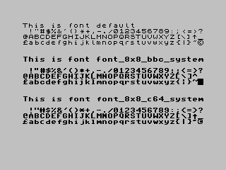
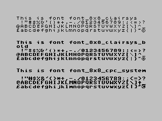
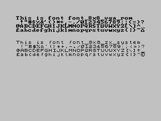

The classic library supports multiple target machines and each target may have its own idiosyncratic method of controlling print position and other limitations such as reserving areas of the screen for status lines etc

To simplify cross-platform porting, classic provides the following terminal emulation libraries:

* ANSI/VT100
* VT52/ZX (The generic console)

Both terminal libraries are hooked up to the functions and macros in `<conio.h>` allowing easy setting of colours, print locations without having to worry about writing escape codes by hand.

Both terminal emulators have different advantages, the ANSI/VT100 terminal understands control sequences that will also work on Linux, Mac, or even Windows consoles.

In general, the ANSI driver will prefer using a graphics mode which may well be slow, additionally the ANSI/VT100 driver is a large chunk of code, adding into the project may well increase the size of your project by around 2-3K.

On the other hand, the VT52/gencon terminal is a smaller alternative, and allows both text and hires graphics screen modes to be used to display text and, where possible UDGs.

#  Generic console

The generic console supports both ZX style and an extended VT52 control set.

### ZX Control codes

```
4,x       - Disable (0) or enable (1) vertical scrolling

8,9,11    - Move in x and y as you would expect
12        - Form feed - clears the screen and moves print posn to 0,0
10        - Carriage return - advances y and sets x to 0
13        - Moves down a row
16,n      - Set the ink colour (*)
17,n      - Set the paper colour (*)
20,n      - Enable/disable inverse video (*)
22,y,x    - Move to position y,x on the screen (0<=y<=23, 0<=x<=63)
            NB. y and x are displaced by 32 eg to move the print position
            to (0,0) use 22,32,32.

The parameter for those marked with (*) is taken as a bitwise and of the lower 4 bits. Typically these are offset to [0-9] for the lower values.
```

### VT52 control codes

The generic console additional supports VT52 control codes, the following are supported:

```
[ESC] A - Move the cursor to line above.
[ESC] B - Move the cursor to line below.
[ESC] C - Move the cursor right by one.
[ESC] D - Move the cursor left by one
[ESC] E - Clear the screen and place the cursor in the upper left corner.
[ESC] H - Move the cursor to the upper left corner.
[ESC] J - Erase all lines after our current line
[ESC] K - Clear the current line from the current cursor position.
[ESC] Y - row col 'Goto' Coordinate mode - first will change line number, then cursor position (both ASCII - 32)
[ESC] b - Byte after 'b' sets new foreground colour (ASCII - 32)
[ESC] c - Byte after 'c' sets new background colour (ASCII - 32)
[ESC] p - start inverse video
[ESC] q - stop inverse video
[ESC] 0 - start underlined
[ESC] 1 - stop underlined
[ESC] 2 - start bold
[ESC] 3 - stop bold
[ESC] r - nn print the nn character without translation (useful on non-ASCII text terminals)
[ESC] s - Enable/disable vertical scrolling
```

Both sets of control codes are active, if memory is extremely tight then one or the other set can be disabled and the library rebuilt - this will save around 40-60 bytes

## Colour mapping

By default, an attempt is made to map any colours to a standard range, this can be disabled (and the targets native colours will be used) with the compile time option `-pragma-define:CLIB_CONIO_NATIVE_COLOUR=1`. Colour can be set using `textbackground()` and `textcolor()` functions defined in `<conio.h>`.

## Defining a custom font

On those targets that support either bitmapped graphics or redefining the character set, a custom font can be specified in one of two ways.

At compile time the option `-pragma-redirect:CRT_FONT=_...` can be used, the available fonts are shown below. Note that on the command line the font name is prefixed with `_`:





The "default" font is only available on the ZX Spectrum/Timex - it simply references the font in ROM.

Alternatively, this can be done at compile time using `console_ioctl(IOCTL_GENCON_SET_FONT32, &addr)` where addr is a font reference from `<font/font.h>`

## Using external fonts

DamienG has designed a large number of fonts and shares them on his webpage: https://damieng.com/typography/zx-origins/ - to use one of these you should download and extract the zip for your chosen font. Inside the archive there will be a `.ch8` file which should be copied into your project.

The font can be included in your binary using a .asm file similar to the below:

```
SECTION rodata_user
PUBLIC font
PUBLIC _font

font:
   INCBIN "<font>.ch8"
```

You can then switch to the font with the following pragma: `-pragma-redirect:CRT_FONT=_font`


## Defining UDGs

Characters > 128 are treated as UDGs on platforms that support them. The number available depends on the platform, but at present is either 128 or 32 (Jupiter Ace, Exidy). The address for these can be set programmatically using: `console_ioctl(IOCTL_GENCON_SET_UDGS, &addr)`

## Text attributes

The generic console attempts to support inverse, bold and underline attributes. Information on whether they are supported by a particular target is on the target page. It should be noted that both bold and underline attributes prevent the `cvpeek()` from functioning in bitmap mode.

## Setting the screen mode

Some of the platforms support alternate screen modes, these can be switched to using: `console_ioctl(IOCTL_GENCON_SET_MODE, &mode)`.  For more information on the supported modes, see the individual target page.

## Capabilities

The generic console has been ported to run on a large number of machines of varying capability. The capabilities of a machine will also vary depending on the screen mode that is currently active: for example the MC6847 routines support defining a font in a bitmapped graphics screen mode, but not in text, to provide some information, a `console_ioctl()` call is available to query the current capabilities:


    int  caps;

    console_ioctl(IOCTL_GENCON_GET_CAPS, &caps)

On return, `caps` will be a bitset of the following capabilities (an updated list can be found in `{z88dk}/include/sys/ioctl.h`:

    #define CAP_GENCON_CUSTOM_FONT  1
    #define CAP_GENCON_UDGS         2
    #define CAP_GENCON_FG_COLOUR    4
    #define CAP_GENCON_BG_COLOUR    8
    #define CAP_GENCON_INVERSE      16
    #define CAP_GENCON_BOLD         32
    #define CAP_GENCON_UNDERLINE    64

# VT100 Terminal

The VT100 terminal is enabled using the `-clib=ansi` flag and supports standard VT100 codes.

The terminal works with a 256 character font, so UDGs have to part of the font

## Font configuration

For bitmapped displays, z88dk auto-configures the required font. This auto-configuration can be disabled (on certain platforms) using the following options:

    -pragma-define:ansifont=XXXX -pragma-define:ansifont_is_packed=0

The packed flag indicates that for fonts smaller than 4 pixels wide, two separate characters are included in each 8x8 character cell. The ANSI terminal works with a 256 character font, so UDGs must be included within the font. The address given should correspond to character 0x20/32/SPACE within the font.

## Console width

The number of columns shown on screen can be configured with:

    -pragma-define:ansicolumns=XXX

Where XXX is machine dependent and more information can be found on the relevant target page. 

## Combining with the generic console

In general, the ANSI screen drivers contain self-modifying code and such cannot be placed into the ROM. If your application is dependent on VT100 codes then you utilise the VT100 frontend with the gencon backend with the following option:

   -pragma-define:CLIB_ANSITERMINAL_BRIDGE=1

When using this option, sub-character width fonts (eg 80/85 columns on a 256 pixel display) are not yet supported.
