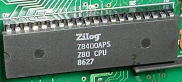
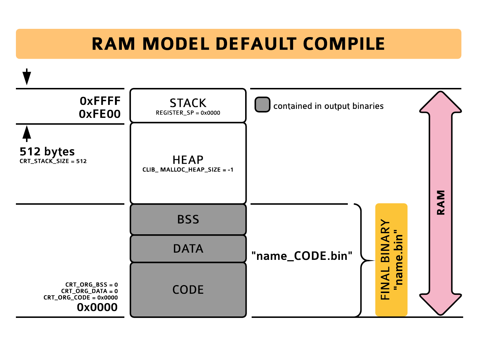
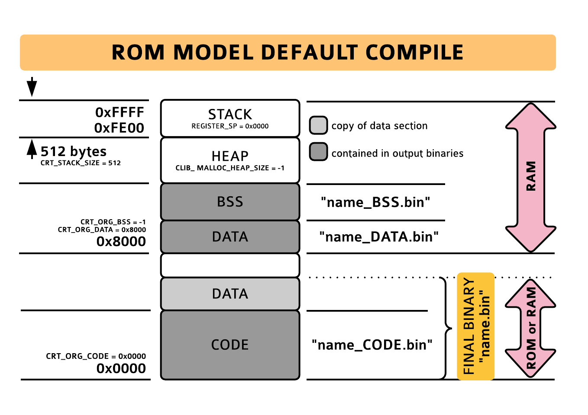
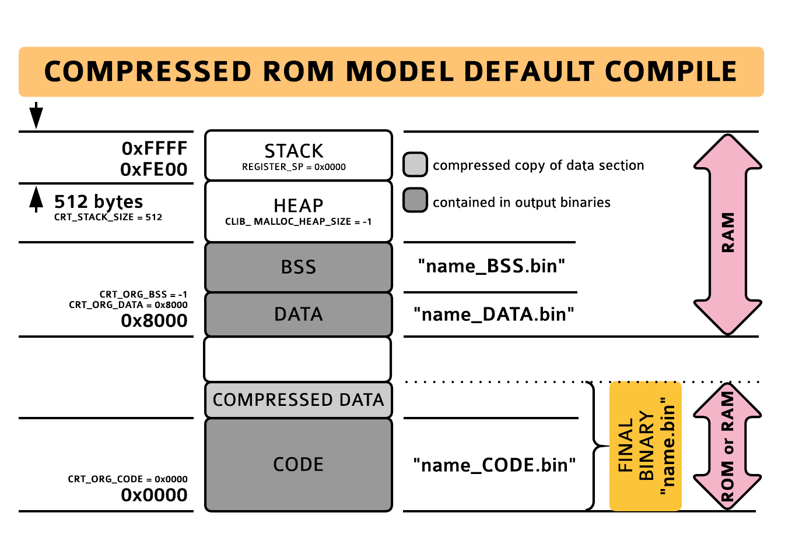
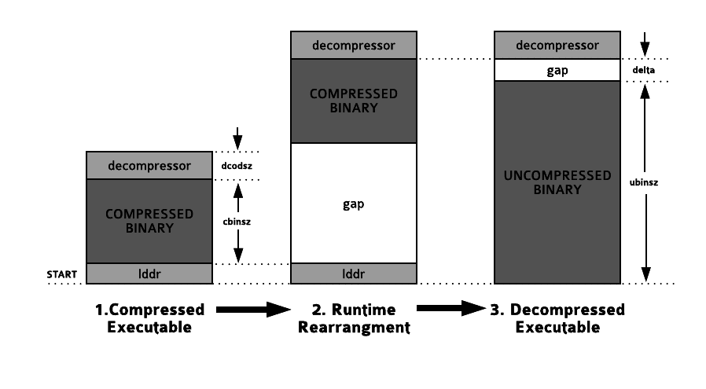

# Target: Embedded_Z80



The Embedded_Z80 target is the new C library's generic z80 target.  It will generate standalone code for any z80 machine but it is specifically designed for embedded z80 systems.  Because the target is generic, there is no file i/o or terminals attached to stdin, stdout and stderr.  The sprintf/sscanf families can still be used for formatted i/o to buffers and memory streams can still be opened for file i/o to memory.  If you'd like to add stream i/o, you can look into creating a custom target.

There are three flavours of compile selectable on the compile line with the "startup" switch:


*  **RAM MODEL** (startup=0)  The output of a ram model compile is a single monolithic binary named "name_CODE.bin" ("name" = output filename) that will contain the complete program including CODE, DATA and BSS sections.  This program is intended to be loaded into and executed from ram.  It **can only be run once with correct initial state** because the ram model crt does not initialize the DATA section so that variables will only hold their correct initial values on the first run.  The advantage over the rom models described next is that the ram model binary does not need to hold a stored copy of its DATA section, making programs smaller.  If the ORG of the compile is set to address 0, the compiler will automatically generate the z80 restarts and im1, nmi interrupt service routines.  **This is the most common execution model for systems that load programs into ram for execution.**


*  **ROM MODEL** (startup=1)  The output of a rom model compile will be three binaries named "name_CODE.bin", "name_DATA.bin" and "name_BSS.bin" corresponding to the CODE, DATA and BSS sections of the program.  To form the final binary image, the DATA section must be appended to the CODE section ("cat name_CODE.bin name_DATA.bin > name.bin" would do it on a unix-like system).  On startup, the crt will copy this stored DATA section into ram and zero the bss section before calling main().  This initialization means the program can be run more than once with correct initial state.  If the ORG of the compile is set to address 0, the compiler will automatically generate the z80 restarts and im1, nmi interrupt service routines.  This execution model is suitable for programs stored in rom but it will almost always be preferable to use the compressed rom model described next.  Despite the name, rom model programs can also be run from ram with the advantage that they can be run more than once.


*  **COMPRESSED ROM MODEL** (startup=2, default)  The output of a compressed rom model compile is the same as for the rom model compile and consists of the three binaries "name_CODE.bin", "name_DATA.bin" and "name_BSS.bin" as before.  The difference is the final image is formed by appending a compressed copy of the DATA section to the CODE section.  The compressor used is zx7, an optimal lz77 compression tool supplied with z88dk that has companion decompression routines in the z80 library.  Under unix-like systems the final image would be formed by running "zx7 name_DATA.bin ; cat name_CODE.bin name_DATA.bin.zx7 > name.bin"  As with the rom model, the crt will decompress the stored DATA section into ram and zero the BSS section before calling main, allowing the program to be run more than once with correct initial state.  If the ORG of the compile is set to address 0, the compiler will automatically generate the z80 restarts and im1, nmi interrupt service routines.  **This is the most common execution model for programs stored in ROM or for programs that need to be executed more than once in ram.**

# Quick Start

You must decide which of two C compilers to use (sccz80 or sdcc) and which of the three compile models to use.  Note that in order to use sdcc, a [patched version of sdcc (zsdcc)](http://www.z88dk.org/wiki/doku.php?id=temp:front#sdcc1) must be installed.  If you are using windows or osx, you don't have to take any extra steps as zsdcc is included in the download.  If you want to quickly check if you have it installed, running "zsdcc -v" should come up with version information.

The new C library supports both compilers equally.  The [documented list of headers and functions](temp/front#header_listing) in the library is only partially complete but a complete list of functions can be seen in the [header files](https///github.com/z88dk/z88dk/tree/master/include/_DEVELOPMENT/sdcc) themselves.

[The C compiler characteristics](temp/front#c_compiler_characteristics) section gives some details about the two compilers.  **sdcc provides better standards compliance and generates faster code.**  sccz80 has tended to generate smaller code in the past but that is not necessarily the case anymore when sdcc compiles use the aggressive peephole rules (-SO3) and optionally (--opt-code-size).  **If the program contains many longs or floats, sccz80 will generate smaller code unless (--opt-code-size) is selected for sdcc compiles.**

Below you will notice **there are two compile lines listed for sdcc.  The sdcc_iy version is preferred.**  In sdcc_iy compiles, the library uses one index register iy, leaves ix alone for sdcc to use as its frame pointer, and forbids sdcc from using iy.  Forbidding the use of iy leads to smaller code as it opens up many more opportunities for optimization in the peephole optimization step.  In sdcc_ix compiles, the library uses one index register ix which it must share with sdcc.  The sharing means the library must add code to push and pop ix around library functions which adds to program size.  The choice makes most sense for other targets where one index register is reserved by hardware or system software so is unavailable to the compiler.  Occasionally sdcc can produce better code for sdcc_ix in isolated fragments so if you'd like to try it you can, but we have not seen a single instance where a complete program was smaller using sdcc_ix (sdcc_iy tends to be smaller by a notable margin in fact).

| MODEL              | COMPILER | EXAMPLE COMPILE LINE                                         |
| ------------------ | -------- | ------------------------------------------------------------ |
| **ram**            | sccz80   | `zcc +z80 -vn -O3 -startup=0 -clib=new test.c -o test -lm -create-app` |
| startup=0          | sdcc iy  | `zcc +z80 -vn -SO3 -startup=0 -clib=sdcc_iy --max-allocs-per-node200000 test.c -o test -lm -create-app` |
|                    | sdcc ix  | `zcc +z80 -vn -SO3 -startup=0 -clib=sdcc_ix --max-allocs-per-node200000 test.c -o test -lm -create-app` |
|                    |          |                                                              |
| **rom**            | sccz80   | `zcc +z80 -vn -O3 -startup=1 -clib=new test.c -o test -lm -create-app` |
| startup=1          | sdcc iy  | `zcc +z80 -vn -SO3 -startup=1 -clib=sdcc_iy --max-allocs-per-node200000 test.c -o test -lm -create-app` |
|                    | sdcc ix  | `zcc +z80 -vn -SO3 -startup=1 -clib=sdcc_ix --max-allocs-per-node200000 test.c -o test -lm -create-app` |
|                    |          |                                                              |
| **compressed rom** | sccz80   | `zcc +z80 -vn -O3 -clib=new test.c -o test -lm -create-app`  |
| startup=2, default | sdcc iy  | `zcc +z80 -vn -SO3 -clib=sdcc_iy --max-allocs-per-node200000 test.c -o test -lm -create-app` |
|                    | sdcc ix  | `zcc +z80 -vn -SO3 -clib=sdcc_ix --max-allocs-per-node200000 test.c -o test -lm -create-app` |

The output binary is "test.bin".  By default the ORG is 0 and the binary should be loaded and executed from address 0. 

Other default settings have ram starting at address 0x8000 (rom models only) and the stack located at the top of memory (initial SP=0).

**NOTES:**

*  **-vn** Keeps zcc quiet.  Using **-v** will cause zcc to detail all steps taken in generating the output.

*  **-lm** Links against the floating point library.  Can be omitted if the program does not use floats.

*  **-create-app** Generates a complete rom image from the output binaries.  Described in an [upcoming section](#automatic_rom_generation) and recommended for all compiles.

*  **optimization is set to maximum** in the above compile lines.  The default setting for sccz80 is **-O2** and for sdcc is **-SO2 --max-allocs-per-node3000**.  For sdcc in particular, the large max-allocs-per-node setting can lead to much longer compile times.  Perhaps a more suitable development number is 30000.  The [optimization level](temp/front#optimization_level) section describes optimization in more detail and in particular note the comments on SO3 for sdcc optimization.  To emphasize smaller code **--opt-code-size** can be added for sdcc and **-O3** can be used for sccz80.

*  the **list of source files** on the compile line can consist of any number of .c, .s, .asm, .o, .m4 or .lst files.  zcc will generate a single binary executable out of all of them.  If the list of individual source files is lengthy, that list can be replaced by a .lst file, which is a file naming one source file per line.  .lst files are indicated to zcc by a leading '@' in their names as in "@src.lst".  The [compile sequence](temp/front#compile_sequence) section describes the mechanics of compilation in more detail.

**zcc uses a file's extension** to determine what to do with a particular source file.  These are some of the public file types understood by zcc:


*  **.c** c source file

*  **.s** asm source file in asz80 syntax; zcc will translate to more standard .asm form (experimental)

*  **.asm** asm source file for consumption by z80asm

*  **.o** object file generated by z80asm

**zcc will also pre-process input files ending in .m4** using the [m4 macro processor](https///www.gnu.org/software/m4/manual/m4-1.4.14/m4.html):


*  **.h.m4** m4 macro expanding to a .h file

*  **.inc.m4** m4 macro expanding to a .inc file

*  **.c.m4** m4 macro expanding to a .c file

*  **.s.m4** m4 macro expanding to a .s file

*  **.asm.m4** m4 macro expanding to a .asm file

The results of macro processing are copied immediately to the original source directory so that they can be used in the current compile.

**IMPORTANT:  Note that this means files of the form "foo.ext.m4" also reserve filenames "foo.ext" for macro expansion in the source directory.  Do not use "foo.ext" for unrelated source files as they will be overwritten during m4 expansion!**

There is a growing list of m4 macros that can be used in your .asm.m4 source files in [z88dk.m4](https///github.com/z88dk/z88dk/blob/master/src/m4/z88dk.m4).  Simply "include(`z88dk.m4')" at the top of your file to gain access to them.  At the time of writing Z88DK_FOR (repeat structure), Z88DK_FOREACH, Z88DK_FOREACHQ, Z88DK_FORARG (iteration over a list in a repeat structure), [Z88DK_ULBL, Z88DK_CLBL](https///github.com/z88dk/z88dk/issues/61) (creation of unique labels, eg as locals inside a macro) are defined.

An example compile line involving multiple source files:

`zcc +z80 -vn -O3 -clib=new test.c asmroutine.asm objfile.o @manyfiles.lst -o test -create-app`

manyfiles.lst:

```
test2.c
myasm.asm
res/graphics/asm.m4
```


*(A .lst file can contain a complete list of source files in the project so naming individual source files in addition to the .lst file only clutters up the compile line and is only done here to serve as illustration.  A leading semicolon character can be used to comment out an individual source file listed in a list file.)*

ASM code and data must be assigned to appropriate sections defined by the memory map to be made part of the main executable.  The [mixing c and assembly language](libnew/target_embedded#mixing_c_and_assembly_language) section has more information.


# Understanding the Output Files Generated by the Compiler

The assembler organizes its output into sections which are named containers that hold the assembled bytes.  The information delivered to the linker about where sections are placed in memory is contained in the memory map defined in the crt supplied by the library.

The memory map set up by z88dk for the embedded_z80 target defines three main sections:  CODE, DATA and BSS.  The CODE section will contain read-only items like program code or constant data.  The DATA section will contain self-modifying code or ram variables that are initialized to non-zero values.  The BSS section will contain ram variables that are initially zero.  With this separation, z88dk is able to generate programs that can be stored in ROM.

The three compile models (ram, rom, compressed rom) treat these sections differently.


*  In a **ram model** compile, the CODE/DATA/BSS sections are simply concatenated together and the output will be a single binary file "name_CODE.bin" ORGed to the CODE section's org address.

*  In a **rom model** compile, the CODE/DATA/BSS sections are output in three separate binaries "name_CODE.bin" (ORGed to code section's org address), "name_DATA.bin" (ORGed to data section's org address) and "name_BSS.bin" (ORGed such that it appends to the data section).  The crt startup code embedded in the code section expects a stored copy of the data section to immediately follow "name_CODE.bin" in memory.  This stored copy allows the crt to initialize the data section's non-zero ram variables in ram before main() is called.  Therefore the final binary image must consist of "name_DATA.bin" appended to "name_CODE.bin".

*  In a **compressed rom model** compile, the CODE/DATA/BSS sections are again output in three separate binaries "name_CODE.bin" (ORGed to code section's org address), "name_DATA.bin" (ORGed to data section's org address) and "name_BSS.bin" (ORGed such that it appends to the data section).  This time the crt startup code expects a compressed copy of the data section to immediately follow "name_CODE.bin" in memory.  This stored copy allows the crt to initialize the data section's non-zero ram variables in ram before main() is called.  Therefore the final binary image must consist of a compressed version of "name_DATA.bin" appended to "name_CODE.bin".  Because the stored data section is compressed, the final binary image will be smaller than a rom model compile except for programs with small data sections (1).

(1) The compressed rom model binary will be smaller than the rom model binary if the compression of the data section can save at least ~80 bytes.  The amount of memory saved is noted during a compressed rom model compile.

In addition to the binaries mentioned above, each compile will also generate a binary "name" without extension.  This binary corresponds to the unnamed section and collects all code and data not assigned to a section.  If this file is non-zero in size, this indicates an error where some code or data has not made it into the main executable due to not being assigned to a section.  

A memory map showing where the generated binaries are ORGed in memory when using the default compile for each model is shown below.  Also shown are the default values of the compile time variables controlling this placement of the sections in memory.

| |  |  |   |
|---|---|---|---|
| sample compile line  | **zcc +z80 -vn -SO3 -startup=0 -clib=sdcc_iy --max-allocs-per-node200000 test.c -o test -create-app**  | **zcc +z80 -vn -SO3 -startup=1 -clib=sdcc_iy --max-allocs-per-node200000 test.c -o test -create-app**  | **zcc +z80 -vn -SO3 -clib=sdcc_iy --max-allocs-per-node200000 test.c -o test -create-app**  |
| output binaries  | "test",  "test_CODE.bin" | "test", "test_CODE.bin", "test_DATA.bin",  "test_BSS.bin" | "test", "test_CODE.bin", "test_DATA.bin",  "test_BSS.bin" |

**NOTE:**  Size of "test" must be zero.  A non-zero size indicates some code or data did not make it into the main executable because it wasn't assigned to a section.

   * form final binary (windows) 

     ```
     copy /b test_CODE.bin test.bin
     copy /b test_CODE.bin + test_DATA.bin test.bin
     zx7 -f test_DATA.bin
     copy /b test_CODE.bin + test_DATA.bin.zx7 test.bin
     ```

     ​                                                                                                                        

* form final binary (unix-like)

  ```
  cp test_CODE.bin test.bin
  cat test_CODE.bin test_DATA.bin > test.bin
  zx7 -f test_DATA.bin
  cat test_CODE.bin test_DATA.bin.zx7 > test.bin
  ```

  ​                                                                                                                               

**NOTE 1:**  The final output binary is "test.bin" which should be stored and executed from address 0x0000 when default settings are used. \

**NOTE 2:**  "-create-app" causes the toolchain to generate "test.bin" automatically.  The manual steps are shown for pedagogical reasons.                                


| Name   | Purpose | Special Values |
|---|---|---|
| **CRT_ORG_CODE** | Determines the ORG address of the code section. \\  This is also the start address of the program. | 0x0000: The crt will provide restarts and the im1 / nmi interrupt service routines in the first 100 bytes of memory. |
| **CRT_ORG_DATA** | Determines the ORG address of the data section. | 0 The data section will append to the code section and it will become part of the code binary.   |
|            | |  -1  The data section will append to the code section but it will still be output as a separate binary. |
| **CRT_ORG_BSS** | Determines the ORG address of the bss section. | 0  The bss section will append to the data section and it will become part of the data binary.                  |
| |  | -1    The bss section will append to the data section but it will still be output as a separate binary.            |                                                                                                  |
| **REGISTER_SP** | Location of the stack set by the crt. | -1   The crt will not change the stack location.                                                                |
| **CRT_STACK_SIZE** | Indicates required stack size to the crt. | Only used by the crt when the heap is automatically sized.                                                                                           |
| **CLIB_MALLOC_HEAP_SIZE** | Size of the heap created by the crt. | 0    The heap is not created. |
| | | The heap is automatically sized and placed between the end of the bss section and the bottom of the stack.   |

**NOTE:**  These compile time parameters can be modified by pragmas listed on the compile line or embedded in C source.  This topic is discussed in [compile time customization](#compile_time_customization) below. 

# Automatic ROM Generation

z88dk includes a tool "appmake" that can process the output files generated by the compiler into a suitable format for the target.  In the embedded_z80 case, "appmake +rom" is the particular flavour used to process the output files.  You can enter "appmake +rom" on the command line to see a list of command line options.

z88dk's build chain includes a final step using appmake whenever "-create-app" is added to the compile line.  When -create-app is used, a compile will have appmake automatically generate the final binaries for you and, with a little more information on the compile line, it can also generate complete rom binaries and ihex files.

So, with -create-app on the compile line:


*  **ram model** the complete output binary "name.bin" containing "name_CODE.bin" will be produced.  Load that binary at the code origin and execute it.

*  **rom model** the complete output binary "name.bin" containing "name_CODE.bin" followed by "name_DATA.bin" will be produced.  Load that binary at the code origin and execute it.

*  **compressed rom model** the complete binary "name.bin" containing "name_CODE.bin" followed by a compressed version of "name_DATA.bin" will be produced.  Load that binary at the code origin and execute it.

If you also need an ihex file corresponding to the complete binary, add "-Cz--ihex" to the compile line.  "-Cz" causes zcc to forward the remaining string to appmake's command line.

You can also create complete roms.  appmake accepts three more parameters that can describe a target rom:

   * **-Cz--rombase=?** specifies the physical base address of the rom (default = 0).
   * **-Cz--romsize=?** specifies the physical size of the rom in bytes (default = 0).
   * **-Cz--filler=?** specifies the rom fill byte (default = 0xff).

This compile line using the compressed rom model


	zcc +z80 -vn -SO3 -clib=sdcc_iy –-max-allocs-per-node200000 test.c -o test -create-app -Cz"--rombase=0x8000 --romsize=0x2000 --ihex"


will output an 8k rom image (romsize=0x2000) "test.rom" whose physical start address is 0x8000 (rombase=0x8000).  The complete output binary will be inserted into that rom image at the appropriate address specified by CRT_ORG_CODE.  Any unused bytes are set to the fill byte.  If the output binary's address range lies outside the rom's address range, an error will be produced.  In addition to the rom image generated, an ihex file describing the rom image will be produced "test.ihx".

You can also invoke appmake separately on the command line to manually manipulate output binaries.  "appmake" by itself will list all of its flavours.  Besides "appmake +rom", three particular ones that may be of interest are "appmake +inject", "appmake +extract" and "appmake +hex".  The first one can insert binaries into an existing bin or rom file, the second one will extract binaries from an existing rom or bin file and the last one can make ihx files.

# Compile Time Customization

Many parameters can be customized at compile time to suit the characteristics of specific embedded systems.

##  CRT Configuration 

The **crt configuration** is a collection of compile time constants that affect the program's environment and placement in memory.  Options allow things like changing the memory map, identifying which z80 restarts the program will implement, and reducing program size by eliminating unused features.

z88dk sets up sensible defaults for these constants which can be overridden either on the compile line or with pragmas embedded in the C source.

Here is a complete listing along with the default settings used for each compile model:

| CRT CONFIGURATION OPTION         | ram model | rom model | compressed rom model | DESCRIPTION                                                                                                                                                                                                                                                                      |
| ------------------------         | --------- | --------- | -------------------- | -----------                                                                                                                                                                                                                                                                      |
| CRT_ORG_CODE                     | 0x0000    | 0x0000    | 0x0000               | ORG of final binary and execution address.  An ORG of 0 causes the crt to fill in the z80 restarts, im1 and nmi in the bottom 100 bytes of memory.                                                                                                                               |
| CRT_ORG_DATA                     | 0         | 0x8000    | 0x8000               | ORG of the data section, normally the first byte of ram.  An ORG of 0 or -1 causes the data section to append to the code section in memory.  0 causes the data binary to append to the code binary.                                                                             |
| CRT_ORG_BSS                      | 0         | -1        | -1                   | ORG of the bss section, normally set to 0 or -1 to append to the data section in memory.  0 causes the bss binary to append to the data binary.                                                                                                                                  |
| CRT_MODEL                        | 0         | 1         | 2                    | Selects compile model.                                                                                                                                                                                                                                                           |
| REGISTER_SP                      | 0x0000    | 0x0000    | 0x0000               | Stack pointer value set at startup.  If -1, the stack pointer is unchanged.  If < -1 the absolute value is taken as the address holding the stack pointer value at startup.                                                                                                      |
| CRT_STACK_SIZE                   | 512       | 512       | 512                  | Maximum expected stack size.  Only used to calculate heap size if the heap is automatically created.                                                                                                                                                                             |
| CRT_INITIALIZE_BSS               | 0         | 1         | 1                    | Non-zero indicates that the crt should zero the bss section at startup.                                                                                                                                                                                                          |
| CRT_INCLUDE_PREAMBLE             | 0         | 0         | 0                    | %%Non-zero indicates that the crt should include user-supplied code "crt_preamble.asm" before anything else.  That code can fall through to the C compiled code or jump to "__Start" to start the C compiled code.%%                                                             |
| CRT_INCLUDE_DRIVER_INSTANTIATION | 0         | 0         | 0                    | %%Non-zero indicates that the crt should include user-supplied file "crt_driver_instantiation.asm.m4" in the driver instantiation section.  This allows the user to define what drivers are present on file descriptors at startup.  The +z80 target has no drivers available.%% |
| CRT_ORG_VECTOR_TABLE             | 0         | 0         | 0                    | Non-zero chooses options for generating an im2 vector table.  See [Interrupt Service Routines](https///www.z88dk.org/wiki/doku.php?id=libnew/target_embedded#interrupt_service_routines).                                                                                        |
| CRT_INTERRUPT_MODE               | -1        | -1        | -1                   | For 0, 1, 2 the crt will set the corresponding interrupt mode.                                                                                                                                                                                                                   |
| CRT_ENABLE_COMMANDLINE           | 0         | 0         | 0                    | %%0 = command line not present, 1 = generate empty command line, 2 = command line supplied by caller (hl = char **argv, bc = int argc)%%, 3 = parse target-specific command line (same as 1 for embedded)                                                                        |
| CRT_ENABLE_RESTART               | 0         | 0         | 0                    | Non-zero has the crt restart the program on exit; otherwise CRT_ON_EXIT determines exit behaviour.  (on restart any command line will be empty)                                                                                                                                  |
| CRT_ENABLE_CLOSE                 | 1         | 1         | 1                    | Non-zero has the crt close files on program exit.                                                                                                                                                                                                                                |
| CRT_ENABLE_EIDI                  | 0x13      | 0x13      | 0x13                 | Bit flags 0x01 = insert di on start, 0x02 = insert ei on start, 0x10 = insert di on exit, 0x20 = insert ei on exit                                                                                                                                                               |
| CRT_ON_EXIT                      | 0x10001   | 0x10001   | 0x10001              | Determines behaviour on program exit:  < 0x10000 (jump to this address), 0x10001 = Halt, 0x10002 = Return to caller, 0x10004 = Jump to caller, 0x10008 = Restart program (on restart any command line will be empty). CRT_ENABLE_RESTART overrides                               |
| CRT_ENABLE_RST                   | 0x00      | 0x00      | 0x00                 | If code org == 0 and CRT_INCLUDE_PREAMBLE == 0, non-zero bits indicate which z80 restarts the program will implement, with bit 1 corresponding to rst08h through bit 7 corresponding to rst38h.                                                                                  |
| CRT_ENABLE_NMI                   | 0         | 0         | 0                    | If code org == 0 and CRT_INCLUDE_PREAMBLE == 0, non-zero indicates the program will supply an nmi interrupt service routine.                                                                                                                                                     |
| CLIB_EXIT_STACK_SIZE             | 0         | 0         | 0                    | Number of functions that can be registered with atexit().  The C standard demands at least 32.                                                                                                                                                                                   |
| CLIB_QUICKEXIT_STACK_SIZE        | 0         | 0         | 0                    | Number of functions that can be registered with at_quick_exit().  The C standard demands at least 32.                                                                                                                                                                            |
| CLIB_MALLOC_HEAP_SIZE            | -1        | -1        | -1                   | The size of malloc's heap.  -1 has the crt automatically place the heap between the end of the bss section and the bottom of the stack.  0 means no heap will be created.  More than 14 creates a heap of the indicated size in the bss section.                                 |
| CLIB_STDIO_HEAP_SIZE             | 128       | 128       | 128                  | The size of stdio's heap used to allocate FILE* and driver structures.  For the embedded target, space is required to open memory streams.                                                                                                                                       |
| CLIB_BALLOC_TABLE_SIZE           | 0         | 0         | 0                    | Number of entries in the block allocator's allocation table.                                                                                                                                                                                                                     |
| CLIB_FOPEN_MAX                   | 0         | 0         | 0                    | Max number of open FILE*.  The C standard demands minimum 8.                                                                                                                                                                                                                     |
| CLIB_OPEN_MAX                    | 0         | 0         | 0                    | Max number of file descriptors.  The C standard demands minimum 8.                                                                                                                                                                                                               |

**NOTE:** For a **minimum size compile**, modify the defaults by setting "CLIB_MALLOC_HEAP_SIZE = 0" (malloc will not work as no heap will be created) and "CLIB_STDIO_HEAP_SIZE = 0" (memory streams can not be opened).

\\ 

**THESE PARAMETERS CAN BE OVERRIDDEN IN ANY OF THREE WAYS**, shown below in order of highest precedence to lowest. \\ The example used is changing the program's code org to 0x100.

__**1.  FROM THE COMPILE LINE (PRAGMA-DEFINE)**__

The relevant option is "-pragma-define:CRT_ORG_CODE=0x100".


	zcc +z80 -vn -SO3 -clib=sdcc_iy --max-allocs-per-node200000 test.c -o test -create-app -pragma-define:CRT_ORG_CODE=0x100


This method is suitable for specifying one or two high priority overrides.

__**2.  FROM A DEDICATED PRAGMA INCLUDE FILE (PRAGMA-INCLUDE)**__

Pragmas are activated in the same way as in C source and, in fact, the file will be scanned as if it is a C program so embedding C-style comments is acceptable.

**File: "pragma.inc"**


	#pragma output CRT_ORG_CODE = 0x100   // move origin to address 0x100


There can be only one pragma include file indicated per compile line.


	zcc +z80 -vn -SO3 -clib=sdcc_iy --max-allocs-per-node200000 test.c -o test -create-app -pragma-include:pragma.inc


Best method for large projects.  The separate pragma file is self-documenting, can hold any number of pragmas in a central location, and is easy to spot amongst many source files.

__**3.  FROM INSIDE C SOURCE**__


	#pragma output CRT_ORG_CODE = 0x100   // move origin to address 0x100
	
	#include `<stdio.h>`
	
	char buff[100];
	
	void main(void)
	{
	   sprintf(buff, "Hello World!\n");
	}


Good for specifying numerous pragmas in single source file programs.


##  Printf and Scanf Configuration 

Printf and scanf can also be customized at compile time using the same method.  **The customization selects which printf and scanf converters are enabled.  By disabling those converters not needed by the program, program size can be reduced.**  Although the embedded target does not define stdin, stdout or stderr, this affects the printf and scanf core so it will also affect the sprintf and sscanf families.

| STDIO CONFIGURATION OPTION | CONVERTER | BITMASK      | COMMENTS                            | CONVERTER | BITMASK      | COMMENTS                         |
| -------------------------- | --------- | ------------ | ----------------------------------- | --------- | ------------ | -------------------------------- |
| CLIB_OPT_PRINTF            | %d        | 0x 0000 0001 |                                     | %lo       | 0x 0001 0000 |                                  |
| CLIB_OPT_SCANF             | %u        | 0x 0000 0002 |                                     | %ln       | 0x 0002 0000 |                                  |
|                            | %x        | 0x 0000 0004 | either enables for scanf            | %li       | 0x 0004 0000 |                                  |
|                            | %X        | 0x 0000 0008 | ""                                  | %lp       | 0x 0008 0000 |                                  |
|                            | %o        | 0x 0000 0010 |                                     | %lB       | 0x 0010 0000 | binary number                    |
|                            | %n        | 0x 0000 0020 |                                     | %[        | 0x 0020 0000 | ignored by printf                |
|                            | %i        | 0x 0000 0040 |                                     | %a        | 0x 0040 0000 | ignored by scanf (not supported) |
|                            | %p        | 0x 0000 0080 |                                     | %A        | 0x 0080 0000 | ""                               |
|                            | %B        | 0x 0000 0100 | binary number                       | %e        | 0x 0100 0000 | ignored by scanf (not supported) |
|                            | %s        | 0x 0000 0200 |                                     | %E        | 0x 0200 0000 | ""                               |
|                            | %c        | 0x 0000 0400 |                                     | %f        | 0x 0400 0000 | ignored by scanf (not supported) |
|                            | %I        | 0x 0000 0800 | IPv4 address in dotted form         | %F        | 0x 0800 0000 | ""                               |
|                            | %ld       | 0x 0000 1000 |                                     | %g        | 0x 1000 0000 | ignored by scanf (not supported) |
|                            | %lu       | 0x 0000 2000 |                                     | %G        | 0x 2000 0000 | ""                               |
|                            | %lx       | 0x 0000 4000 | either enables for scanf            |           |              |                                  |
|                            | %lX       | 0x 0000 8000 | ""                                  |           |              |                                  |
|                            |           |              |                                     |           |              |                                  |
| CLIB_OPT_PRINTF_2          | %lld      | 0x 0000 0001 | sdcc only                           |           |              |                                  |
| CLIB_OPT_SCANF_2           | %llu      | 0x 0000 0002 | sdcc only                           |           |              |                                  |
|                            | %llx      | 0x 0000 0004 | sdcc only, either enables for scanf |           |              |                                  |
|                            | %llX      | 0x 0000 0008 | sdcc only, ""                       |           |              |                                  |
|                            | %llo      | 0x 0000 0010 | sdcc only                           |           |              |                                  |
|                            |           | 0x 0000 0020 | ignored                             |           |              |                                  |
|                            | %lli      | 0x 0000 0040 | sdcc only                           |           |              |                                  |
> If you are unfamiliar with C's standard converters they are documented [here.](libnew/stdio)

> Because the library does not currently support scanf of floats, it is recommended a float string be read using %[ or %s followed by conversion to float using atof() or strtod().`</sup>`


These options can be defined using the same three methods mentioned for the [crt configuration options](libnew/target_embedded#crt_configuration) in the last section.

**This example compile activates %csd only for printf:**


	zcc +embedded -vn -SO3 -clib=sdcc_iy --max-allocs-per-node200000 test.c -o test -create-app -pragma-define:CLIB_OPT_PRINTF=0x601


If only one of CLIB_OPT_PRINTF or CLIB_OPT_PRINTF_2 is defined, the other will be set to zero.  Likewise if only one of CLIB_OPT_SCANF or CLIB_OPT_SCANF_2 is defined, the other will be set to zero.

**Use of either CLIB_OPT_PRINTF or CLIB_OPT_PRINTF_2 generates a reference to the printf core.**  Similarly **use of either CLIB_OPT_SCANF or CLIB_OPT_SCANF_2 generates a reference to the scanf core.**  What this means is if these configurations are used, the printf and/or scanf core will be attached to the output binary regardless of whether your program uses the printf or scanf cores.  Specifying which converters are activated would imply that the programmer has looked through the source and discovered uses of printf/scanf so this should not normally be a problem.

When these printf/scanf options are not used, the program links against the printf/scanf cores in the library which have a set of activated converters baked in when the embedded library was built.  Normally this will exclude any floating point converters to avoid having fp code attach to the output binary for casual use of printf/scanf.  **The user can also determine what converters are active in the library** by changing the library configuration as described in the [next topic](libnew/target_embedded#library_configuration).

##  Printf and Scanf Configuration the Easy Way 

There is a simpler method to specify active converters by name.  The previous section described how the selection works and this easier method also uses CLIB_OPT_PRINTF and CLIB_OPT_SCANF under the hood to perform the activation.

These simpler pragmas can only appear in C source or in pragma-include files (they cannot be activated on the compile line).


	#pragma printf = "`<list printf converters here including l or ll for long and longlong>`"
	#pragma scanf  = "`<list scanf converters here including l or ll for long and longlong>`"


Example:


	#pragma printf = "scuf"     // enables %s, %c, %u, %f only 
	#pragma scanf  = "slxlld["  // enables %s, %lx, %lld, %[ only


The converter string content is flexible.  You can insert spaces, do away with quotes, include % signs and so on.  "%s%c", "s c", "%0d %llx" are all valid.  Digits and flag specifiers (+, -, *) have no effect on the new c library but the classic c library will distinguish between "%0d" and "%d" with the latter meaning use the simple %d without any formatting.

# Library Configuration

The c library can also be configured for each target individually.  Options for configuration include choosing between fast and small code for things like ascii`<->`number conversion, choosing sorting algorithm used for qsort and selecting between the fast and small integer math library.

The configuration files for the embedded_z80 target are located in [z88dk/libsrc/_DEVELOPMENT/target/z80](https///github.com/z88dk/z88dk/tree/master/libsrc/_DEVELOPMENT/target/z80) and the specific one used for c library configuration is "config_clib.m4".  While investigating the configuration options listed there you may want to investigate some of the other configuration files in the same directory, all named "config_*.m4".  At minimum, you will want to select whether you will be targeting a cmos or nmos cpu (choose nmos if this is unknown) and you will want to set the clock rate so that the library can accurately measure time.  These settings can be found in "config_cpu.m4".

After editing any of the config files, the library must be re-built for the changes to take effect.  This is done from the z88dk/libsrc/_DEVELOPMENT directory by executing "Winmake z80" (windows) or "make TARGET=z80" (unix-like) from the command line.  The process takes about 5 minutes.

# What Happens at Program Exit ?

**Behaviour at program exit is controlled by** three crt configuration variables:  **CRT_ENABLE_EIDI**, **CRT_ENABLE_RESTART** and **CRT_ON_EXIT**.

Suitable settings of those three variables grant exact control over how the program is exited.  There are five exit scenarios supported. In all cases except restart, HL will hold the program's return value.

| 1. RESTART                                                                                                                                                                                                                                                                                                                                                                                                                                                                                              | *CRT_ENABLE_RESTART = 1* or *CRT_ON_EXIT = 0x10008*  |
| ----------                                                                                                                                                                                                                                                                                                                                                                                                                                                                                              | -------------------------------------------------------  |
| For ROM model compiles, C variables will be properly re-initialized.  RAM model compiles do not re-initialize C variables so their values will not be reset to their initial state (but see *CRT_INITIALIZE_BSS*) meaning programs may not function properly on runs after the first.  On runs following the first, if a command line is requested the command line will be initialized to empty.  This behaviour is necessary because the original command line can be overwritten by the C program. |                                                          |
| 2. INFINITE LOOP (default)                                                                                                                                                                                                                                                                                                                                                                                                                                                                              | *CRT_ENABLE_RESTART = 0* and *CRT_ON_EXIT = 0x10001* |
| The program will execute "halt" followed by "jr ASMPC".                                                                                                                                                                                                                                                                                                                                                                                                                                                 |                                                          |
| 3. JUMP TO ABSOLUTE ADDRESS OR LABEL                                                                                                                                                                                                                                                                                                                                                                                                                                                                    | *CRT_ENABLE_RESTART = 0* and *CRT_ON_EXIT = nnnnn*   |
| The program will jump to address "nnnnn" which must lie in the range [0,0xffff].  Use of a pragma-redirect rather than a pragma-define can set the destination address to a label defined in the project ("#pragma redirect CRT_ON_EXIT = labelname" or on the compile line "-pragma-redirect:CRT_ON_EXIT=labelname"                                                                                                                                                                                    |                                                          |
| 4. RETURN TO CALLER                                                                                                                                                                                                                                                                                                                                                                                                                                                                                     | *CRT_ENABLE_RESTART = 0* and *CRT_ON_EXIT = 0x10002* |
| At program start the crt will save the caller's stack pointer.  On exit, the caller's stack pointer will be restored and a "ret" will be executed.  In order for a return to be successful, the caller's stack must not be contaminated over the lifetime of the C program's execution.  The C program must have been started with a call.                                                                                                                                                              |                                                          |
| 5. JUMP TO CALLER                                                                                                                                                                                                                                                                                                                                                                                                                                                                                       | *CRT_ENABLE_RESTART = 0* and *CRT_ON_EXIT = 0x10004* |
| At program start the crt will pop the return address and save it.  On exit, the return address will be jumped to.  The C program must have been started with a call.                                                                                                                                                                                                                                                                                                                                    |                                                          |

In addition to the above, **CRT_ENABLE_EIDI** determines if maskable interrupts should be enabled or disabled on exit.

# Selected Command Line Options

This section will highlight the most commonly used ones.


*  **-a** Translate all listed .c and .s files to .asm then stop.

*  **-c** Compile all listed .c, .s and .asm source files to individual object files then stop.  If an output file is specified, all source files will be compiled into a single consolidated object file that contains everything.  The difference between a consolidated object file and a library is that all functions in a consolidated object file will be added to an output binary when it is used whereas only referenced functions will be extracted from a library and added to the output binary.

*  **--c-code-in-asm** Add C code as comments into the .lis files and any other output .asm file.

*  **-Cl--split-bin** The linker will generate a separate binary file for each section defined in the compile.

*  **-Cl-v** Place the linker in verbose mode.  Produces a superset of the information from -Cl--split-bin.

*  **-create-app** Run appmake to form the final binary from the binaries generated by the compiler; optionally create roms and ihx files.

*  **-E** Pass all .c files through the pre-processor to generate .i then stop.

*  **--fsigned-char** (sdcc) Make chars signed.  By default char is unsigned in sdcc.

*  **-g** Generate a global definitions file that defines all publicly exported symbols (also related -gp, -gf:regexfile, -gpf:regexfile).

*  **-Idir** Add directory "dir" to the include search path.

*  **-Ldir** Add directory "dir" to the library search path.

*  **--list** Generate a .lis file for each source file in the compile.  A .lis file shows the source file after translation to asm and before its input to the linker.

*  **-lm** Link against the floating point library.

*  **-lname** Link against user-supplied "name" library.  Ensure "name.lib" is in the library search path.

*  **--lstcwd** Paths of source files listed in .lst files are made relative to the current working directory rather than relative to the location of the .lst files containing them.  (This flag makes zcc compatible with z80asm's .lst files).

*  **-m** Generate a map file listing all defined symbols with their values.

*  **-m4** Expand all listed .m4 macros then stop.

*  **--max-allocs-per-nodeNNNNN** (sdcc) Set the optimization level during code generation.  3000 is the default, 200000 is a reasonable upper bound.

*  **-o name** Specify the base of the output filename.

*  **-On** (sccz80) Set the peephole optimization level 0-3.  O2 is the default.

*  **-On** (sdcc) Select the post-processing steps 0-2.  0 = leave sdcc output in asz80 form, 1 = translate sdcc output to zilog and z80asm directives, 2 = step one plus change sdcc calls to primitives to callee linkage.  O2 is the default.

*  **--opt-code-size** (sdcc) In the latest version of z88dk this will especially reduce the code size of programs using many longs, longlongs or floats.

*  **--reloc-info** Generate a companion .reloc file for each output .bin that contains details on how to [relocate the binary to a new address](#user-content-generating-runtime-relocatable-binaries) (experimental and untested).

*  **--reserve-regs-iy** (sdcc) Sdcc is not allowed to use the iy register.  This flag is automatically invoked in clib=sdcc_iy compiles.  See [known issues](temp/front#sdcc2) concerning this flag.

*  **-SOn** (sdcc) Set the peephole optimization level.  1 = native sdcc rules, 2 = native sdcc rules + bugfixes, 3 = aggressive z88dk rules + bugfixes.  SO2 is the default.

*  **-startup=n** Select a specific crt and configuration for the build.  For the embedded target 0 = ram model, 1 = rom model, 2 = compressed rom model (this is the default).

*  **-vn** Silence building steps.

*  **-x** Make a library out of the input source files.

*1. Compile to a binary using the default compressed rom model, producing asm listing and map file in the process*


	zcc +z80 -vn -SO3 -clib=sdcc_iy --max-allocs-per-node200000 test.c -o test -create-app -m --list --c-code-in-asm

*2. Compile all the source files to object files a.o, b.o, c.o (d.o is untouched)*


	zcc +z80 -vn -c -SO3 -clib=sdcc_iy --max-allocs-per-node200000 a.c b.s c.asm d.o

*3. Make a library named "mylib.lib" out of the source files listed in "lib.lst".  The linker operates on a source file granularity so to minimize the amount of code extracted from a library during linking, separate individual functions and co-referenced variables into their own source files.*


	zcc +z80 -vn -x -SO3 -clib=sdcc_iy --max-allocs-per-node200000 @lib.lst -o mylib

*"z80nm mylib.lib" can be used afterward to examine the contents of the library.*

## Translating C to Assembly

C source can be translated to assembly without going through the entire compile process.  This can be a good way to catch C errors in an individual source file that is part of a larger project that may not be complete or debugged.

Because there is no linking step, only compiler choice, target (to set include path) and optimization settings are relevant.


	zcc +z80 -vn -a -O3 -clib=new test.c --c-code-in-asm
	zcc +z80 -vn -a -SO3 -clib=sdcc_iy --max-allocs-per-node200000 test.c --c-code-in-asm
	zcc +z80 -vn -a -SO3 -clib=sdcc_ix --max-allocs-per-node200000 test.c --c-code-in-asm
	zcc +z80 -vn -a -SO3 -clib=sdcc_ix --max-allocs-per-node200000 --reserve-regs-iy test.c --c-code-in-asm


You don't have to translate files one at a time.  All .c and .s files listed will be translated.

Asm files produced in this way can act as input for compiling.  It is therefore possible to translate .c source to assembler, make edits and then complete compilation with the edited file.

## What's Taking Up the Space in the Output Binary ?

The new c library assigns code and data to sections in a fine-grained manner, normally one section per module.  So there are sections for string, stdlib, float math, and so on.  Normally these sections are merged into the larger CODE, DATA and BSS generated in the output.

However if "-Cl--split-bin" is added to a compile line, the linker will output each defined section as an independent .bin file.  At a glance you will be able to see what is taking up space in the resulting binary.

Here's an example compile line and associated output from a simple "Hello World" program using sprintf into a ram-based buffer.  Before the compile was run, all .bin files were removed to avoid any confusion.


	zcc +z80 -vn -clib=sdcc_iy -SO3 --max-allocs-per-node200000 hw2.c -o hw2 -Cl--split-bin

The following files are produced:

```
        1 hw2_BSS.bin
      100 hw2_bss_compiler.bin
        2 hw2_bss_error.bin
      128 hw2_bss_fcntl.bin
        2 hw2_bss_stdio.bin
        6 hw2_bss_stdlib.bin
        2 hw2_BSS_UNINITIALIZED.bin
      127 hw2_CODE.bin
        6 hw2_code_adt_p_forward_list.bin
       34 hw2_code_alloc_malloc.bin
       63 hw2_code_compiler.bin
       71 hw2_code_compress_zx7.bin
       40 hw2_code_crt_init.bin
        7 hw2_code_crt_main.bin
        5 hw2_code_crt_return.bin
        9 hw2_code_ctype.bin
       90 hw2_code_error.bin
      126 hw2_code_l.bin
      154 hw2_code_math.bin
    1,319 hw2_code_stdio.bin
      117 hw2_code_stdlib.bin
       59 hw2_code_string.bin
       31 hw2_code_threads_mutex.bin
        1 hw2_DATA.bin
        2 hw2_data_alloc_malloc.bin
        2 hw2_data_fcntl.bin
        4 hw2_data_stdio.bin
        1 hw2_data_threads.bin
       38 hw2_rodata_error_strings.bin
        1 hw2_rodata_error_string_end.bin
     
 30 File(s)          2,548 bytes
```

From this directory listing it can be seen that the total program size is 2548 bytes (that is the CODE + DATA + BSS sizes and does not include the stack, heap or a stored data section).

Of that the compiler generated just 100 (hw2_bss_compiler.bin) + 63 (hw2_code_compiler.bin) = 163 bytes.  The largest contributor was stdio.  It might be surprising to see code space attributed to string, math and stdlib for such a program but this compile used the library printf core which supports many converters including %d, %x, %ld, etc and these use library functions from those areas to carry out the conversions.  Since those converters were not needed they could have been eliminated with an [appropriate pragma](libnew/target_embedded#printf_and_scanf_configuration) and program size could have been reduced.

The crt startup code consists of "hw2_CODE.bin" (mainly page zero code with restarts and nmi isr), "hw2_code_crt_init.bin" (mainly the automatic malloc's runtime heap size calculation), "hw2_code_crt_main.bin" and "hw2_code_crt_return.bin".

Other non-obvious sections are "hw2_code_l.bin" (library primitives) and "hw2_rodata_error_strings.bin" (error strings as in "EINVAL" and so on).

# Miscellaneous Topics


## Mixing C and Assembly Language

C and assembly language are treated equally within z88dk.  In particular, the C library provides entry points for both C and assembly language.  The former is normally done via entry points implementing the [standard/fastcall/callee linkage](temp/front#c_translation_to_assembly) contract specified in header files while the latter is normally done via an entry point using a register interface.  Assembly language can also choose to use the C interface but that would be less efficient than using the register interface.  The register interface for library functions is documented in the library source code rooted in [z88dk/libsrc/_DEVELOPMENT](https///github.com/z88dk/z88dk/tree/master/libsrc/_DEVELOPMENT).  As an example, the sdcc_iy C interface for stdlib function utoa() has two entry points:  [standard linkage](https///github.com/z88dk/z88dk/blob/master/libsrc/_DEVELOPMENT/stdlib/c/sdcc_iy/utoa.asm) and [callee linkage](https///github.com/z88dk/z88dk/blob/master/libsrc/_DEVELOPMENT/stdlib/c/sdcc_iy/utoa_callee.asm).  The compiler will automatically select which entry point it uses with callee being the preference.  Both of these gather parameters from the stack and then jump into the [asm implementation](https///github.com/z88dk/z88dk/blob/master/libsrc/_DEVELOPMENT/stdlib/z80/asm_utoa.asm), which also acts as the register interface for assembly language. 

Mixing C and assembly is made very simple by z88dk's front end zcc.  zcc can have any number of source files of various types given to it and it will properly combine them all into a single output binary.  It does this by creating an object file for each listed source file and then combining all the object files together using the linker.  The steps taken to form an object file from a source file depends on the source file's file extension.  So zcc will call the C compiler if a file ends in ".c", the assembler if a file ends in ".asm" and do nothing if a file is already an object file ".o".  Adding asm code to a project is then a simple matter of placing it in an .asm file and adding the asm file to the compile line.

Because C source is first translated to assembly language by the C compilers, the translated C is treated no differently from any other assembly language input.  In particular, the C compiler will have created asm that follows all the same scoping rules as any other asm input and it will interact with all the asm source files in the project in the same way.  Any global variables or functions will be exported as PUBLIC in the translated C and any variables or functions declared as extern will be declared as EXTERN in the translated C.  The C compiler will mangle C names by prepending them with a leading underscore.  So a global C variable or function named "stuff" will be changed to "_stuff" in the translated asm.

The final detail connecting the translated C to the output binary is section assignment.  Sections are named containers into which assembled bytes are poured by the assembler.  At link time, the linker will sequence the sections in the output binary(-ies) according to the supplied memory map defined in the crt.  The memory map supplied by z88dk broadly defines CODE, DATA and BSS sections and through proper assignment to those broad sections, the linker will be able to produce romable binaries.  The **C compiler** will assign code and data to sections named **code_compiler**, **data_compiler**, **bss_compiler** and **rodata_compiler** as appropriate that are absorbed into the larger CODE, DATA or BSS sections.

**User assembly code must also assign its code and data to sections** known to the memory map in order to be incorporated into the output binary.  For this purpose, the memory map defined by z88dk defines the following sections:


*  **code_user** assign read-only executable code to this section

*  **rodata_user** assign read-only data to this section

*  **smc_user** assign self-modifying code to this section

*  **data_user** assign non-zero initial data to this section

*  **bss_user** assign zero initial data to this section

If user code and data are properly assigned to the above sections, the linker will be able to produce romable code.

User code does not have to confine itself to those sections.  Code and data can be added to any section defined by the memory map.  For example, code assigned to section **code_crt_init** will execute just before main is called (code in this section must fall through and not contain any RETs).  Code assigned to section **code_crt_exit** will execute on program exit before files are closed (again code in this section must fall through and not contain any RETs).  Code assigned to **code_crt_common** will be sequenced just after the crt so that it appears very early in the binary.

User code can also invent its own sections.  By creating a section with name not known to the memory map and giving it an ORG address, the linker will output a separate binary for that section with name "name_SECTIONNAME.bin".  In this way user code can create sections mapped to specific memory addresses or different memory banks.

You will find small examples of each case described above in the source code snippets elsewhere on this page.

So far the discussion has been about adding assembly code to a separate .asm file and how C can interact with it.  This is the preferred way to incorporate assembly language into a project because the programmer has complete control over section assignment and there is a clear separation between C and asm that keeps the C portion portable and clean.  (Many details have been left out in this brief overview such as how C communicates function parameters and return values to asm subroutines and these are discussed in the [main discussion](temp/front#mixing_c_and_assembly_language) elsewhere).

**It should be pointed out here that there is no requirement that C be present at all in a project.  The entire project can be written in assembly language if the starting point of the assembly program is named "_main".  The assembly program optionally has full access to the C library which is itself written in assembly language.**

It's also possible to inline asm code into C source.  This is quite common among z88dk programs in the wild and is recommended by [sdcc's manual](temp/front#sdcc1).  This is deprecated in z88dk for reasons mentioned in the second to last paragraph as well as for technical reasons discussed below.

Inlining asm in C source is done by surrounding the asm code with %%"__asm" and "__endasm;"%% tags.  People familiar with past versions of z88dk will be thinking "#asm" and "#endasm" but these tags will not work with sdcc whereas the former will work with both sdcc and sccz80 compilers.  The example below inlines a "di" instruction to disable interrupts.


	void main(void)
	{
	   __asm
	   di
	   __endasm;
	
	   ...
	}


Now let's list all the problems with this:

 1.  **Inlined asm interferes with sdcc's peephole optimization step.**  Because the peephole optimizer is normally unable to look into inlined asm, it must assume all register values entering the inlined block are live.  This means it will not be able to apply peephole rules leading up to the inlined asm and code surrounding inlined asm blocks will be sub-optimal.  (See [intrinsics](libnew/intrinsic) for a means to inline simple asm instructions like "di" without impacting optimization.)
 2.  **Inlined asm is ignored by the compiler's code generator.**  In other words, the compiler will generate code around the inlined asm as if it wasn't there.  In particular if the compiler has loaded an important value into a register before the inlined asm block, it expects that register to hold the same value after the inlined asm block.  So, in general, inlined asm must not modify register values.  This issue does not affect sccz80 as sccz80 generates code in a local manner, picking up values and storing them back as code is generated for individual statements.  sdcc, on the other hand, can assign values to registers that are propagated across many statements.
 3.  **There is no reliable way for inlined asm to interact with local variables or function parameters.**  Again this is because it can't be known if local variables or parameter values are currently held in registers or in spill locations on the stack.  This affects sdcc only.

In short, inlined asm is not really good for much.

These problems can be circumvented if the entire function is written in assembly language.  This way there is no interaction between compiler generated code and asm code:


	int func(int a) __naked
	{
	   __asm
	
	   ...
	   ld hl,0
	   ret
	
	   __endasm;
	}


Now the inlined asm can access function parameters reliably and do as it wishes.  This is the method for incorporating asm code recommended in the [sdcc manual](temp/front#sdcc1).  As mentioned earlier this is deprecated in z88dk.  The reasons are (1) loss of C source portability and (2) any asm incorporated in this way has no control over its section assignment (the C compiler will assign the code to its code section).  Loss of control over section assignment also means you cannot declare ram variables; a rom model compile will place such variables in the rom.  

##  The Importance of CONST 

Applied to data, the const keyword determines whether data will be stored in a read-only section or a ram section.  For programs destined for ROM, this is an important decision.  Const does not have a material effect on ram model compiles.

Consider the two following variable declarations:


	unsigned char book0[] = "It was the best of times, it was the worst of times...";
	const unsigned char book1[] = "It was the best of times, it was the worst of times...";


Both declare character arrays that will be initialized with (presumably lengthy) text.

The declaration for **book0** implies that the **array is modifiable**.  This **means it must be allocated in ram at runtime.**  For a program stored in rom, this means the entire contents of this array must be stored in rom and then copied into ram at program start up.  While the program runs, there are essentially two copies :- one in ROM which is used to initialize the working copy in ram and the working copy in ram that the program uses.

z88dk has two different rom model compiles.  One is the plain rom model compile.  Using this model, the rom's copy of the character array will be stored full size so the total memory occupation of the array at runtime will be 2*sizeof(book0).  The other model is the compressed rom model.  Using this model, the rom's copy of the character  array will be stored in compressed form so the total memory occupation of the array at runtime will be something less than 2*sizeof(book0), perhaps as little as 1.5*sizeof(book0).

The declaration for **book1**, however, indicates that **the array contents will not change.  This means it can be allocated in rom.**  At runtime there is no ram copy as the program will directly refer to the array in rom.  This means the total memory occupation of the array at runtime will be sizeof(book1), considerably less than the other declaration.  The difference, of course, is this array in rom cannot be modified by the program.

As can be seen, **conscious use of const can save a great deal of runtime memory space.**

It should be noted that there are cases when it may be preferred to use the book0 declaration even though it leads to more runtime memory occupation.  If rom space is limited, a compressed rom model compile can store the array data in compressed form, thus using less rom space.  If there is plenty of ram available this can mean the project can get away with using a smaller rom at the expense of ram.

## Performing I/O

The z80 implements a 16-bit i/o space independent from its memory space that is accessed through special i/o instructions.  The i/o instruction set is such that this i/o space is skewed toward identifying devices in the bottom 8-bits and (optionally) a specific register in the top 8-bits.  Due to this 8-bit/16-bit dichotomy, the z80 has instructions that access the i/o space in either 8-bits or 16-bits.

__**METHOD 1: The C Compilers Map the I/O Space to SFRs (Special Function Registers)**__

Globally declare an sfr as either an 8-bit or 16-bit port and then use it like a variable.  The compilers will inline i/o instructions to carry out the i/o operations.

C Source code:

```      
__sfr __at 0x1f IO8;               // 8-bit i/o port at 0x1f
__sfr __banked __at 0xfbfe IO16;   // 16-bit i/o port at 0xfefe

void main(void)
{
   volatile unsigned char a;
   
   a = IO8;                        // read port IO8
   IO8 = 100;                      // write port IO8
    
   a = IO16;                       // read port IO16
   IO16 = 200;                     // write port IO16
}
```
Translated assembler:
```
in a,(_IO8)
ld a,100 ; out (_IO8),a

ld a,_IO16/256 ; in a,(_IO16 & 0xFF)
ld a,200 ; ld bc,_IO16 ; out (c),a

```

__**METHOD 2: The Clib Supplies Library Functions to Perform I/O**__

I/O can be done through calls to library functions defined in [z80.h](libnew/z80).  Port i/o is always 16-bit through these functions.

C Source code:
```   
#include `<z80.h>`

   
void main(void)
{
   unsigned char a;
   
   a = z80_inp(0x1f);
   z80_outp(0x1f, 100);
   
   a = z80_inp(0xfbfe);
   z80_outp(0xfbfe, 200);
}
```
Translated assembler:
```
ld hl,0x001f ; call _z80_inp_fastcall
ld hl,100 ; push hl ;ld l,0x1f ; push hl ; call _z80_outp_callee

ld hl,0xfbfe ; call _z80_inp_fastcall
ld hl,200 ; push hl ; ld hl,0xfbfe ; push hl ; call _z80_outp_callee
```
|

The library functions also grant access to the z80's block i/o instructions.

## Implementing the Z80 Restarts, IM1 and NMI

If **CRT_ORG_CODE=0x0000 and CRT_INCLUDE_PREAMBLE=0** then the [crt will provide page zero code](https///github.com/z88dk/z88dk/blob/master/libsrc/_DEVELOPMENT/target/crt_page_zero.inc) that implements the z80 restarts at (0x08, 0x10, 0x18, 0x20, 0x28, 0x30), the im1 interrupt service routine at (0x38) and the nmi interrupt service routine at (0x66).  The page zero code supplied attempts to fill in the gaps between restarts with common library subroutines.

The default behaviour is to make all of these routines effectively nops.  So the restarts will simply "ret", the im1 isr will "ei;reti" and the nmi isr will "retn".  However, **suitably setting bits in CRT_ENABLE_RST and CRT_ENABLE_NMI will indicate to the crt that the program will implement one or more of these restarts or isrs.**  Where relevant bits are set, the crt will generate jumps to a user-supplied function implementing the restart or interrupt routine.
                                                                                                                                    
| CRT CONFIG OPTION | BITMASK                   | C                      | ASM          | COMMENT                                                                                                                                |
| --- | --- |--- |--- |--- |
| CRT_ENABLE_RST    | 0x02                      | void z80_rst_08h(void) | _z80_rst_08h | User implements rst08h                                                                                                                 |
|                   | 0x04                      | void z80_rst_10h(void) | _z80_rst_10h | User implements rst10h                                                                                                                 |
|                   | 0x08                      | void z80_rst_18h(void) | _z80_rst_18h | User implements rst18h                                                                                                                 |
|                   | 0x10                      | void z80_rst_20h(void) | _z80_rst_20h | User implements rst20h                                                                                                                 |
|                   | 0x20                      | void z80_rst_28h(void) | _z80_rst_28h | User implements rst28h                                                                                                                 |
|                   | 0x40                      | void z80_rst_30h(void) | _z80_rst_30h | User implements rst30h                                                                                                                 |
|                   | 0x80                      | void z80_rst_38h(void) | _z80_rst_38h | User implements rst38h aka the im1 isr.  If used as an im1 isr the user routine must preserve register values and exit with "ei; reti" |
|                   |                           |                        |              |                                                                                                                                        |
| CRT_ENABLE_NMI    | 1                         | void z80_nmi(void)     | _z80_nmi     | User implements the nmi isr.  The user routine must preserve register values and exit with "retn"                                      |

These **restarts and isrs can be implemented in either C or asm using the function names shown** in the table.  See the [mixing c and assembly](libnew/target_embedded#mixing_c_and_assembly_language) topic for direction on how to incorporate assembly language into a project.

**Sdcc implements a C extension that allows C subroutines to be declared as interrupt service routines.**  The three examples below show how to implement the im1 and nmi isrs along with the generated code using this extension.
                                 
| c code                                                                   | output asm                                                                           | comments                         |
|---|---|---|
| `void z80_rst_38h(void) __critical __interrupt(0)  {   ...   }` | _z80_rst_38h:  \\ push used-registers  \\ ...  \\ pop used-registers  \\ ei  \\ reti | im0, im1 or im2                  |
| `void z80_rst_38h(void) __interrupt   {   ...   }`               | _z80_rst_38h:  \\ ei  \\ push used-registers  \\ ...  \\ pop used-registers  \\ reti | im2 with prioritized daisy chain |
| `void z80_nmi(void) __critical __interrupt   {   ...   } `       | _z80_nmi:  \\ push used-registers  \\ ...  \\ pop used-registers  \\ retn            | nmi                              |

**IMPORTANT NOTE:  sdcc** is mainly an enhanced 8080 compiler so it **is unaware of the z80's exx set.**  However the library takes full advantage of the z80 architecture, including the exx set, so if the isr calls a library function that modifies the exx set, sdcc will not preserve those registers.  The library only uses the exx set when something complicated is being done so most uses of the library will not be altering the exx set but if you need to know, verify that by examining the [library source code](https///github.com/z88dk/z88dk/tree/master/libsrc/_DEVELOPMENT).  It may be tempting to inline some asm that will push and pop the exx set registers inside the function but this will not work if there are local variables present because this will alter their offsets on the stack without sdcc's knowledge.

**Another option for implementing isrs in "C"** (quotation marks required as the function will actually be implemented in asm) **is to replace a function body with inlined asm.**  This is quite commonly done in the wild by z88dk users and is recommended in the [sdcc manual](temp/front#sdcc1) but this method of incorporating asm functions **is deprecated** in favour of simply **implementing the function in a separate asm file**.  This **returns to the programmer control over section placement and helps to keep C code clean and portable.**

An example nevertheless using the deprecated method where the C compiler places the code into the code_compiler section.

```	
	void z80_rst_38h(void) __naked
	{
	   __asm
	
	      push used-registers
	      ...
	      pop used-registers
	      ei
	      reti
	
	   __endasm;
	}
```

And the preferred method as a wholly asm implementation that places the code into the code_crt_common section that is sequenced just after the crt in the output binary.  Asm code can be placed in a separate file with .asm extension and added to the compile line.

```	
	SECTION code_crt_common
	PUBLIC _z80_rst_38h
	
	_z80_rst_38h:
	
	   push used-registers
	   ...
	   pop used-registers
	   ei
	   reti
```

## Interrupt Service Routines

The [z80 restarts](libnew/target_embedded#implementing_the_z80_restarts_im1_and_nmi) section above describes how im0, im1 and nmi isrs can be implemented so this section will be about servicing im2 interrupts.

The z80's im2 mode is a vectored interrupt mode where interrupting devices supply an 8-bit identifier byte during the int acknowledge cycle.  The z80 combines the 8-bit **I** register in the high order byte with the device's identifier byte in the low order byte to form the memory address where the device's interrupt service routine address is stored.  The address of the isr is then read from memory and effectively called by the cpu.  In this way the z80 determines what device is interrupting and calls its associated isr without any software intervention.

Essentially, the **I** register defines where a table of isr addresses is stored beginning at memory address I*256+0 and extending through I*256+256.  By convention, devices should generate only even identifiers.  In this way isr addresses will not overlap in the table.  So, eg, device 0 will have its isr stored at memory address [I*256+0,I*256+1] and device 2 will have its isr address stored at [I*256+2,I*256+3].  Zilog's standard i/o peripherals feature programmable interrupt identifiers that can only store even ids to support this convention.  However, there is nothing that prevents an odd id from being generated and this does occur in practice, especially with systems that were not designed for im2 but run software that use im2 anyway for various reasons.  If only even identifiers are generated, the im2 table would extend from I*256+0 through I*256+255 but if odd identifiers are possible, an id of 255 would extend the table's range by one byte to I*256+256.

**Three steps must be taken to enable im2 mode on a z80:**

 1.   An interrupt vector table must be generated that contains the addresses of isrs implemented by the system.
 2.   The **I** register must be initialized to point at the interrupt vector table.
 3.   The z80 must be put in im2 mode and interrupts must be enabled.

### Generating the Interrupt Vector Table At Compile Time

Z88DK creates a section called "code_vector" to hold the im2 vector table.  You can create the vector table by adding isr addresses to it.

A simple example will illustrate.  Suppose in a project a separate file "interrupt.asm" is created to hold all the interrupt vectors.  It might look like this:

```	
	SECTION code_vector
	
	; device identifier 0
	EXTERN _isr_pio_0
	defw   _isr_pio_0
	
	; device identifier 2
	EXTERN _isr_sio_0
	defw   _isr_sio_0
	
	; skip vectors 4 through 126
	defs   128-4
	
	; device identifier 128
	EXTERN _isr_ctc_0
	defw   _isr_ctc_0
```

The individual isr addresses are listed in vector identifier order.  A compile adding "interrupt.asm" to the list of source files will automatically generate the interrupt vector table.

The location of the interrupt vector table in memory is determined by the crt variable **CRT_ORG_VECTOR_TABLE** which is 0 by default and can be modified via [pragma](libnew/target_embedded#compile_time_customization).  When non-zero, the crt will initialize the **I** register to **CRT_ORG_VECTOR_TABLE**/256.  Setting of the interrupt mode is handled by crt variable **CRT_INTERRUPT_MODE** and whether interrupts are enabled by the crt is controlled by crt variable **CRT_ENABLE_EIDI**.

**Special values of -1, -0x80 and -0x100** for **CRT_ORG_VECTOR_TABLE** will create the table inside the crt if z88dk is providing the page zero code (this happens if **CRT_ORG_CODE = 0** and **CRT_INCLUDE_PREAMBLE = 0**).  Values of -1 or -0x100 will create a full size vector table at address 0x100.  A value of -0x80 will create a partial vector table at address 0x80.  In order for this partial table to work, vector identifiers must be at least 0x80 and the vector table defined in "section code_vector" must begin at identifier 0x80.  In these cases, the output binary will be complete and im2 mode will be completely set up during a regular compile.

If **CRT_ORG_VECTOR_TABLE** is >= 0, a compile will output a separate binary "foo_code_vector.bin" containing the vector table as an assembled binary.  The rest of the code will be complete and the crt there will initialize the **I** register properly but you are responsible for separately loading the contents of "foo_code_vector.bin" to address **CRT_ORG_VECTOR_TABLE**.  One way to do this might be to manipulate binary files with the help of "appmake +rom" (to create a blank binary of suitable size for the result) and "appmake +inject" (to insert the executable and the vector table into that final binary).

It is possible to create a binary in two steps that will write this vector table into ram at the right address at startup.  One way to do it is to change the file "interrupt.asm" to this:

```	
	SECTION rodata_user
	
	__vector_table_begin:
	
	   BINARY "foo_code_vector.bin"
	
	__vector_table_end:
	
	IF (__vector_table_end - __vector_table_begin) > 0
	
	   SECTION code_crt_init
	
	   EXTERN __code_vector_head
	
	   ld hl,__vector_table_begin
	   ld de,__code_vector_head
	   ld bc,__vector_table_end - __vector_table_begin
	   ldir
	
	ENDIF
	
	SECTION code_vector
	
	; device identifier 0
	EXTERN _isr_pio_0
	defw   _isr_pio_0
	
	; device identifier 2
	EXTERN _isr_sio_0
	defw   _isr_sio_0
	
	; skip vectors 4 through 126
	defs   128-4
	
	; device identifier 128
	EXTERN _isr_ctc_0
	defw   _isr_ctc_0
```

Before compiling make sure an initially zeroed dummy file "foo_code_vector.bin" of correct size is present.  Compile twice; after the second compile the output binary will be complete and will properly initialize the im2 mode for you.

The first compile is used to create a properly filled in "foo_code_vector.bin".  The second compile picks up this filled in vector table, includes it as binary data into the rodata section, and adds code at startup to copy this stored table to its final destination address in ram.  (Note sdcc compiles can be non-deterministic.  In order to guarantee that the addresses of the isrs stored in the vector table do not change, the two binaries should be produced from the same object files.)

Usually the special **CRT_ORG_VECTOR_TABLE** cases will be preferred and that will generate the output binary easily and without complication.  If you need assistance with this latter option, be sure to [ask in the forum](https///www.z88dk.org/forum/forums.php) or create an issue at [github](https///github.com/z88dk/z88dk/issues).

### Generating the Interrupt Vector Table Programmatically at Runtime

See [z80.h](http://www.z88dk.org/wiki/doku.php?id=libnew:z80#interrupt_service_routines) for now.

## Data Compression

The library's startup code uses an optimal lz77 compressor, zx7, to compress its stored data section when using the compressed rom model.  The compressor, run on the PC, is fast and produces good compression ratios.  The companion z80 decompressor in the library is also fast and weighs in at just 70 bytes.  This makes it practical for general use in programs.  The apparent size of a 64k memory space can be effectively extended if the program decompresses portions of its code and data as needed.

The [zx7 documentation](https///github.com/z88dk/z88dk/blob/master/libsrc/_DEVELOPMENT/compress/zx7/readme.txt) explains its use in some detail.  The zx7 decompression routines in the z80 library are found in [compress/zx7.h](libnew/compress_zx7).  The library uses **dzx7_standard()** to decompress the stored data section, which is the smallest implementation of the decompressor, but if you are willing to pay more in code size for faster decompression, you can use **dzx7_turbo()** and (faster yet) **dzx7_mega()**.  Realistically **dzx7_standard()** is fast to start with, especially given the small compressed block sizes likely to be found in 64k of memory.

Compressed data is easy to bring into a project using the assembler's **BINARY** directive which will include binary data into an asm file.  A short example composed of one .c file and one .asm file will illustrate its use.

```
// main.c

#include `<compress/zx7.h>`

extern unsigned char cdata[];    // reference to the compressed data in an external file
unsigned char data[5000];        // enough space to hold the decompressed data

void main(void)
{
   // decompress from address cdata to address data
   dzx7_standard(cdata, data);
   ...
}
```

```
;; data.asm

SECTION rodata_user
PUBLIC _cdata

_cdata:

   ; name of compressed file
   BINARY "mydata.txt.zx7"
```

The compressed data file "mydata.txt.zx7" can be generated from "mydata.txt" with:


	zx7 -f mydata.txt


And the program compiled with:


	zcc +z80 -vn -SO3 -clib=sdcc_iy --max-allocs-per-node200000 main.c data.asm -o main -create-app


## Absolute Placement of Code or Data in Memory

Code and data can be placed at fixed locations in memory in two ways.

**1. The compiler is informed of the location of code or data but it is not responsible for putting anything there.**  This method might be used if the code or data is generated externally by another program or operating system or to access a memory mapped region defined by hardware.

The following example shows how an integer and an external function can be referred to at specific memory addresses.  Once again, the integer and function will not be part of the project; the C compiler is only being informed that these things exist in memory and it is being told how to access them.  The method here defines the memory locations in assembler and then the C compiler is informed of their existence by a prototype.


	PUBLIC _os_clock, _os_reset_clock
	
	defc _os_clock = 56698         ; memory address holding an integer
	defc _os_reset_clock = 62109   ; start address of function


In the above the constants can be expressions that will be evaluated by z80asm (note: z80asm evaluates expressions in strict left to right order so be sure to use brackets to get correct operator precedence).  Making the constants PUBLIC makes them visible to other source files.

Then in C:


	extern unsigned int os_clock;
	extern void os_reset_clock(void);


No special syntax is needed but the memory locations are defined in a separate .asm file added to the compile line.  The C compiler will interpret those constants according to the prototypes given.

The above method works for everything and for both compilers identically.  The next method shown below uses special C syntax supplied by the compilers to locate external items in memory.  The special syntax does not always work for all data types. We will attempt to duplicate the above using the special syntax.  This time the locations are set from C.


	#ifdef __SDCC
	__at (56698) static unsigned int os_clock;
	__at (62109) static void os_reset_clock(void);
	#endif
	
	#ifdef __SCCZ80
	static unsigned int os_clock @ (56698);
	static void os_reset_clock(void) @ (62109);
	#endif


Conditional code is written so that the same source file will compile for both compilers.  Once again, the constants can be expressions evaluated by the compiler at compile time.

SDCC will not place functions so the attempt at placement of function "os_reset_clock()" will fail silently; the error will be discovered at link time when the linker is unable to resolve the address.

SCCZ80 can place anything, however it always makes things "static" whether things are declared static or not.  This works well when such declarations are kept in header files and properly guarded with #ifdef.

These names, when publicly exported, can be accessed from other C source files or assembly language files.

It's highly recommended to use the first method above since it can accommodate any sort of placement without special syntax.

**2. The compiler must place code or data at specific memory addresses and this must be emitted as part of the output binary.**

Some discussion on [github](https///github.com/z88dk/z88dk/issues/58).

## Bankswitched Memory & Overlays

(multiple heaps)

# Application Notes

## Placing the Stack Inside the BSS Section

The binaries produced by the default compiles exclude the stack and heap, space for which must be reserved outside the memory occupied by the compiled binaries.   This can be seen in the [memory map diagrams](#understanding_the_output_files_generated_by_the_compiler) shown earlier.

Some applications will want everything included in a self-contained output binary so that the host does not have to worry about reserving extra memory space for these loose ends.

The heap is easily moved into the BSS section by setting the crt variable **CLIB_MALLOC_HEAP_SIZE** to a positive value greater than 14.  This causes the crt to create a heap of that size in the BSS section.  How to set compile time crt variables was discussed earlier in the [crt configuration](#crt_configuration) topic.

To create the stack in the BSS section, space will first have to be reserved for it and then the crt will have to be told where that space is so that it can initialize the stack pointer.  The reserved space can be created with the help of a little assembler:

stack.asm


	SECTION BSS_UNINITIALIZED
	PUBLIC stack_loc
	
	   defs 256
	
	stack_loc:


The code above reserves 256 bytes in the BSS section and exports the label "stack_loc" pointing at it.  The label's position may seem a bit odd as it points one byte past the end of the block of memory but this is because the z80's stack pointer grows downward and is decremented before the first pushed byte is written.

As for the surprise, you may have noticed that the space is reserved in section **BSS_UNINITIALIZED** which is not a regular part of BSS -- this section is actually adjacent to BSS in ram and is not initialized by the crt.  This is necessary for the stack as the crt may parse a command line and push argc/argv on the stack before the BSS section is zeroed.  If the stack were not allocated in the uninitialized section, the command line would be wiped out.

Nervous people may prefer to put guard buffers around the stack in case of overflow or underflow.  During debugging, these guard buffers can be inspected to determine if the stack did in fact overflow or underflow during execution.

stack.asm


	SECTION BSS_UNINITIALIZED
	PUBLIC stack_loc
	
	   ; overflow area
	   defs 16
	
	   defs 256
	stack_loc:
	
	   ; underflow area
	   defs 16


Add this file to the compile line and that space will be reserved in the BSS section.  Unfortunately because the stack is in the uninitialized BSS section you will have to be careful about how detection of stack underflow or overflow is done.  In the case of ROM model compiles or RAM model compiles stripped of BSS, if the uninitialized BSS region in memory is not zero before the program is loaded, the initial contents of the overflow area cannot be known.  Regular RAM model compiles with intact BSS section will zero the uninitialized BSS section on loading.

The crt can be told to set the stack pointer to point at "stack_loc" using the **REGISTER_SP** crt variable.  But because "stack_loc" is a label and not a constant, this must be done using a pragma redirect rather than a pragma define.

From the compile line this would look like:


	zcc +z80 -vn ...... main.c stack.asm -o main -create-app -pragma-redirect:REGISTER_SP=stack_loc


Inside C source or a pragma include file:


	#pragma redirect REGISTER_SP = stack_loc


With the heap and stack now located in the BSS section, the output binaries will be completely self-contained and the host system will not have to worry about allocating any extra space for the program.

## Locating the Heap at an Arbitrary Memory Location

The default compiles set crt variable **CLIB_MALLOC_HEAP_SIZE** to -1 which has the crt create the heap in the space between the end of the BSS section and the bottom of the stack.  By setting **CLIB_MALLOC_HEAP_SIZE** to a positive value > 14, the crt will instead create a heap of that many bytes in the BSS section.

In situations where there may be [overlays](#overlays), bankswitched memory or even available holes in the memory map, there may be reasons to place the heap at a specific location in memory.  In the two former cases, if the heap is kept in a common area of memory that is never banked out, memory allocated from the heap can be accessed at any time no matter what the current banking configuration is.  (Take note that z88dk also implements a [named heap api](libnew/alloc_malloc) in addition to the standard C malloc api that allows many heaps to be created in different memory banks; here only the standard malloc api is discussed).

In order to place the heap at a specific location in memory, we will first reserve space for it at that memory location and then we will ensure C's malloc pointers point to that location.  We will do all of this in one asm file "heap.asm"

heap.asm


	defc heap_loc = 0x4000  ;; the heap's location in memory
	defc heap_sz  = 2048    ;; the heap's size in bytes
	
	;;;;;;;;;;;;;;;;;;;;;;;;;;;;;;;;;;;;;;;;;;;;
	
	SECTION HEAP
	org heap_loc
	
	__malloc_block:  defs heap_sz
	
	;;;;;;;;;;;;;;;;;;;;;;;;;;;;;;;;;;;;;;;;;;;;
	
	SECTION data_user
	PUBLIC __malloc_heap
	
	__malloc_heap:   defw __malloc_block
	
	;;;;;;;;;;;;;;;;;;;;;;;;;;;;;;;;;;;;;;;;;;;;
	
	SECTION code_crt_init
	
	; initialize the heap in the crt
	
	   ld hl,__malloc_block
	   ld bc,heap_sz
	   
	   EXTERN asm_heap_init
	   call asm_heap_init
	
	; note no "ret" here as this section falls
	; into the code calling main()
	
	;;;;;;;;;;;;;;;;;;;;;;;;;;;;;;;;;;;;;;;;;;;;


"__malloc_heap" is the name of the memory block pointer used by C's malloc functions.  Its address must be exported by making the label PUBLIC.  Code is inserted into section "code_crt_init" that initializes the heap.  This section is sequenced just prior to main() being called so this bit of code will initialize the heap before the program is started.

The last ingredient is **CLIB_MALLOC_HEAP_SIZE** must be set to zero so that the crt doesn't try to create another heap of its own.

A compile line might look like this:


	zcc +z80 -vn -SO3 -clib=sdcc_iy --max-allocs-per-node200000 main.c heap.asm -o main -create-app -pragma-define:CLIB_MALLOC_HEAP_SIZE=0


In addition to the usual binary files output, one more will be created named "main_HEAP.bin".  This is the HEAP section created to hold the block of memory reserved for the heap.  Because the HEAP section is unknown to the memory map, the linker outputs it separately.  This binary file can be thrown away because the heap initialization code will initialize that memory before use.

## Stripping the BSS Section from RAM Model Compiles

**The default RAM model compile outputs the CODE, DATA and BSS sections in a single binary.**  The output binary thus indicates exactly the amount of memory needed during execution (less the stack and possibly the heap if it lies outside BSS) so if it is loadable into the target, it's known it has enough memory to run.

However, on some systems it might be preferable to use a smaller binary rather than a near complete binary to reduce storage requirements or to reduce transmission times.  **Because the BSS section is all zeroes, it can safely be chopped off from the output binary as long as it is zeroed prior to main() starting.**

This can be done by setting "**CRT_BSS_ORG = -1**" and "**CRT_INITIALIZE_BSS = 1**" in the [crt configuration](#crt_configuration).  The former indicates to the linker that the BSS section will still follow the DATA section in memory but it will be output in a separate binary.  The latter asks the crt to zero the BSS section prior to calling main().

With the above crt variables set, the output will consist of two binaries rather than one:  "name_CODE.bin" and "name_BSS.bin".  The CODE file is the output executable and the BSS file can be ignored (its size plus the CODE size still indicates total memory use).  "-create-app" will output a final binary "name.bin" containing CODE only.

Size can be further reduced by compressing the output binary and at runtime decompressing before starting execution.  See the [ram resident compressed executables](libnew/target_embedded#ram_resident_compressed_executables) application note below.

## Compressed Executables

The output binary can be compressed and then decompressed at runtime from a self-extracting compressed executable.  It is important to note that this does not reduce the amount of memory needed by the program at runtime - it only reduces the size of binary that needs to be stored or communicated to the device over a communication link.

If the compressed executable is stored in ROM, it can be decompressed into RAM before starting.  This would make sense on systems with more RAM available than ROM.  The program would then be limited by available RAM size rather than available ROM size.

If the compressed executable is stored in RAM, it can be decompressed in-place before starting.  What this means is the decompression can overwrite the compressed executable so that extra memory is not required to perform the decompression.

### ROM Resident Compressed Executables

A compressed binary can be stored in ROM which is then decompressed into RAM before being executed.

There might be a few reasons for doing this:


*  **The ROM space is more limited than the RAM space.**  The code portion of an uncompressed binary would be constrained by ROM size but the code portion of a compressed binary expanded in RAM would be constrained by the larger RAM size, allowing a larger program to be executed in RAM than if it were executed from ROM.

*  **To minimize the size of a boot ROM that is paged out after initialization.**  After the compressed binary is expanded in RAM, the boot ROM is paged out and replaced by more RAM, allowing the binary to take full advantage of a 64K RAM space.  By storing the binary in a compressed state, the size of the boot ROM required can be minimized.

*  **Programs run from RAM can be smaller.**  Programs run from RAM can use the RAM model which is smaller than ROM model compiles because the RAM model does not require a stored data section.  In the same memory space, somewhat larger programs can be compiled using the RAM model.

Steps for creating a self-extracting rom resident compressed executable:

**1. COMPILE THE PROGRAM TO RUN AT ITS RAM LOCATION.**  Compile the program as if it is running from its final RAM location.  This also means allocating memory in that RAM for the stack, heap and separate CODE, DATA and BSS sections if a rom model compile is used.  Take note that if the final location is not at address 0, the crt will not be providing the restarts and im1/nmi interrupt service routines in the bottom 100 bytes of memory.

**2. COMPRESS THE FINAL BINARY WITH ZX7.**  "zx7 -f name.bin" will produce the compressed binary "name.bin.zx7".

**3. WRITE A SHORT BOOT PROGRAM WITH ORG AT THE START ADDRESS IN ROM THAT DECOMPRESSES THE STORED COMPRESSED BINARY INTO RAM AND STARTS IT.**  There can be many variations of this depending on the specific hardware set-up.  The simplest case is shown here for a system that will boot from ROM at address 0 with the program running from another address in RAM.


	;; SELF-EXTRACTING ROM RESIDENT COMPRESSED EXECUTABLE
	;; zcc +embedded -vn --no-crt -clib=sdcc_iy romexe.asm -o romexe.bin
	
	defc ROM_ORG = 0       ; start address in ROM
	defc RAM_ORG = 32768   ; destination address of decompressed exe in RAM
	
	org ROM_ORG
	
	;; May need to insert code to handle restarts and im1/nmi isrs here
	;; if ROM_ORG == 0.  In this example these are ignored.
	
	   di                         ; im1 isr not needed
	
	   ld hl,cbin                 ; address of compressed binary
	   ld de,RAM_ORG              ; address of uncompressed binary
	
	   EXTERN asm_dzx7_standard   ; look for the function in the library
	   call asm_dzx7_standard     ; decompress the binary into ram
	
	   jp RAM_ORG                 ; start the program
	
	cbin:
	
	   BINARY "name.bin.zx7"      ; include compressed binary into the asm file


The compile line given:


	zcc +z80 -vn --no-crt -clib=sdcc_iy romexe.asm -o romexe.bin


uses the "--no-crt" option which means zcc will not be inserting the crt code in front.  The combination "+embedded -clib=sdcc_iy" causes the sdcc_iy c library for the embedded target to be linked against, making library routine "asm_dzx7_standard" accessible.  The asm interface for this function is documented in its [source code](http://z88dk.cvs.sourceforge.net/viewvc/z88dk/z88dk/libsrc/_DEVELOPMENT/compress/zx7/z80/asm_dzx7_standard.asm?content-type=text%2Fplain).  No memory map is provided so the linker will just generate a monolithic binary blob as output.

The result of this compile line is the file "romexe.bin" that should be stored in ROM at address 0.  It is executed by jumping to address 0.  "romexe.bin" can be further processed by "appmake +rom" or "appmake +hex" to generate a rom image or ihx file.

It's very likely that "romexe.bin" will not entirely fill the destination ROM.  The space can be filled by adding either your own subroutines or library routines to "romexe.asm".  Inserting these routines before the label "cbin" and after the jump will ensure they are at a known fixed address (the compressed binary is variable in length so things added after it would be at an unknown location prior to assembly).  The C program can then be linked against these stored routines in preference to library code, reducing the C program's size further.  This topic is discussed in the [shared libraries](#shared_libraries) section below.

### RAM Resident Compressed Executables

A self-extracting compressed executable can be created in RAM that decompresses itself on top of itself before starting.  The key is the decompression occurs in an overlapping manner so that extra memory beyond the size of the uncompressed binary is not required to perform the decompression.  Since this does not change how much memory is needed at runtime, the primary reason for doing this is to reduce storage space requirements or load times to the target.

There are several ways to do this and the method shown here is the simplest.

**1. COMPILE THE PROGRAM AS USUAL.**  Compile the program as usual using any of the RAM or ROM models and form the final executable.  RAM model compiles should strip off the BSS section as described [here](#stripping_the_bss_section_from_ram_model_compiles).

**2. COMPRESS THE OUTPUT BINARY.**  Compress the output binary using zx7 as in "zx7 -f name.bin".  The output will be a compressed binary with .zx7 extension.  Take note of the delta reported after compression.

**3. ASSEMBLE THE COMPRESSED EXECUTABLE.**  Fill in the missing information in the asm file below.  In particular START, DELTA, UBINSZ and the name of the compressed binary file must be updated.


	;; SELF-EXTRACTING RAM RESIDENT COMPRESSED EXECUTABLE
	;; zcc +z80 -vn --no-crt -clib=sdcc_iy ramexe.asm -o ramexe
	;; (windows  ) copy /b ramexe_INIT.bin + ramexe_DCODE.bin ramexe.bin
	;; (unix-like) cat ramexe_INIT.bin ramexe_DCODE.bin > ramexe.bin
	
	defc START  =        ; fill in org of compiled program
	defc DELTA  =        ; fill in delta reported by zx7 when binary was compressed
	defc UBINSZ =        ; fill in size of the uncompressed binary
	
	defc CBINSZ = cend - cbin            ; size of the compressed binary
	defc DCODSZ = dend - dcode           ; size of the decompression code
	
	;; Memory map
	
	SECTION INIT
	org START
	SECTION DCODE
	org START + UBINSZ + DELTA
	SECTION code_compress_zx7
	SECTION code_l
	SECTION DCODE_END
	
	;; Code
	
	SECTION INIT
	
	begin:
	
	;; Move compressed block and decompression code
	;; out of the way of the decompression
	
	   ld hl,cbin + CBINSZ + DCODSZ - 1
	   ld de,START + UBINSZ + DELTA + DCODSZ - 1
	   ld bc,CBINSZ + DCODSZ
	   lddr
	
	   jp dcode
	
	cbin:
	
	   BINARY "name.bin.zx7"    ; fill in name of compressed binary
	
	cend:
	
	SECTION DCODE
	
	dcode:
	
	   ld hl,START + UBINSZ + DELTA - CBINSZ
	   ld de,START
	
	   EXTERN asm_dzx7_standard
	   call asm_dzx7_standard
	
	   jp START
	
	SECTION DCODE_END
	
	dend:


The file above was named "ramexe.asm" in this example.  Assemble this file with the following compile line:


	zcc +z80 -vn --no-crt -clib=sdcc_iy ramexe.asm -o ramexe


Form the complete compressed executable by putting the separately output sections together:


	(windows  ) copy /b ramexe_INIT.bin + ramexe_DCODE.bin ramexe.bin
	(unix-like) cat ramexe_INIT.bin ramexe_DCODE.bin > ramexe.bin


**The compressed executable "ramexe.bin" is loaded and executed from the same address as the original uncompressed binary.**

The diagram and description below show how the compressed executable works.



**Compressed Form** The compressed executable contains three parts - an lddr section at the org address, the compressed binary and the decompressor code. 

**Runtime Rearrangement**  On execution, the lddr code copies the compressed binary and decompressor code upward just enough to allow decompression to occur in an overlapping manner.  Following the copy, the decompressor is jumped to at its new location. 

**Decompressed Executable** The decompressor decompresses the compressed binary to its start address and jumps to the start address to start the program.  Following decompression, "delta" bytes and the decompressor code extend past the end of the uncompressed binary.  Together these two bits of overhang typically amount to ~80 bytes.  For RAM model executables with the [BSS section chopped off](#stripping_the_bss_section_from_ram_model_compiles), this area will be overwritten by the program's BSS section when the program starts.  For ROM model executables, this area can be overwritten by the DATA and BSS sections with appropriate ORG for the DATA section.  In these cases, the overhang will not represent extra memory needed to perform the decompression. 

##  Generating Runtime Relocatable Binaries 

*This is an experimental feature of z80asm that has not been thoroughly tested.* 

**z80asm is able to generate relocation information** for produced binaries **so that the z80 itself can relocate binaries at load time.**  Some operating systems require this feature so that they can allocate memory flexibly to programs loaded from storage.

Simply **add --reloc-info to the compile line** to have z80asm generate the relocation information.


	zcc +embedded -vn -SO3 -startup=0 -clib=sdcc_iy --max-allocs-per-node200000 test.c -o test -create-app --reloc-info


**For each .bin file output there will be a companion .reloc file.  This relocation file is simply a list of two-byte indices into the associated .bin file that indicates where an offset would need to be added if the .bin file's ORG is adjusted at runtime.**

For example, the compile line above for a RAM model program would output a single binary test_CODE.bin (1) and an associated relocation file test_CODE.reloc.  The first few bytes of test_CODE.reloc in hex might be "0600 0C00 1B00 ...".  This indicates that offsets 0x0006, 0x000C, 0x001B, ... would need to be adjusted if the .bin file is relocated from its original ORG address.

(1) The RAM model has been carefully chosen here because it outputs only one binary file test_CODE.bin; there are complications described below if there is more than one .bin file output.  If -create-app is used on the compile line test.bin will also be produced but it will be a simple copy of test_CODE.bin.  .reloc files are only created for the binaries generated by the linker and not by -create-app.`</sup>`

Suppose the binary was originally compiled for address 0x8000 but is loaded at address 0x4000.  This represents a 16-bit offset of 0x4000-0x8000=0xC000 (-0x4000).  In the loaded binary, the 16-bit quantity at address 0x4000+0x0006 should have 0xC000 added to it, the 16-bit quantity at address 0x4000+0x000C should have 0xC000 added to it and so on.  After this patching is completed, the binary should be fine to run at address 0x4000.

As can be seen the relocation information and patching process is very simple and can be quickly carried out by the z80 itself.  **z88dk only supplies the raw .reloc file and it is up to the host operating system to supply the loader code that does the actual patching with this information.  This may involve processing the .reloc file into a form that is amenable to the loader on the z80 system.**

And now the difficulties.  **If there is more than one output binary containing code** (and this includes a data section with self-modifying code in it), then **the .reloc information is insufficient to patch the binaries.**  To see why this is, consider the case of two output binaries.  In one output binary, its associated reloc file correctly identifies what addresses need patching if either output binary ORG is adjusted.  However, the reloc file does not contain information on which ORG those addresses depend on.  If a particular index only depends on the ORG of the first binary file, it should only be adjusted by the ORG offset of the first binary.  If a particular index only depends on the ORG of the second binary file, it should only be adjusted by the ORG offset of the second binary.  So the relocation can only work if the output is a single monolithic binary like what the RAM model produces.

The situation is not as dire as it seems however.  [SymbOS](http://www.symbos.de/facts.htm) is an example of a native multitasking z80 operating system that performs relocations at load time.  Its monolithic binaries are not logically monolithic, in fact they are divided into four regions that are independently relocated to different addresses at load time.  What SymbOS expects is a single monolithic binary that is partitioned into four regions.  At the beginning of the binary there are pointers that demark each of the regions.  SymbOS is also provided with additional relocation information for the monolithic binary, similar to what z88dk produces.  While patching the monolithic binary, SymbOS examines the unpatched address to determine which region it points into and then adds the offset corresponding to that region.  Once the patching is done, the four independent regions are moved to their final locations.  So although SymbOS is handed a single monolithic binary with simple relocation information, the additional structure that SymbOS places on the binary allows it to divide the binary into independent memory regions.

**The above strategy can be copied when multiple binaries generated by z88dk need to be relocated by a loader on a host system.**  However for most situations, a RAM model compile and the single relocation file will be adequate.

## Shared Libraries

# Further Customization

## CRT Replacement

### Partial Replacement

### Complete Replacement

##  Customized Memory Map 

##  Customized Compile-Time Configuration 

# Example Compiles and Configurations
