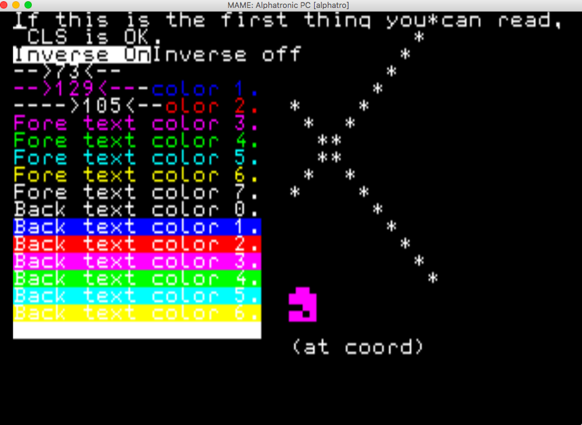

# Hardware summary

* Z80 @ 4 Mhz
* 64k RAM, 24k ROM + 4k chargen
* HD46505SP (aka mc6845) as CRTC

# Compilation

    zcc +alphatro world.c -create-app

The resulting .rom file can be loaded into mame and run as follows:

    mame64 alphatro -cartridge1 a.rom

# Screenshots

Running the VT52/generic console test program:

# Limitations

* The cursor is always displayed in the top left hand corner
* Although the machine has 64k RAM, only 16k cartridges can be generated until we can create disc images

# Links

* [Manual](http://www.retroarchive.org/hardware/Royal/royal_alphatronic_manual.pdf) - appendices have tech details
* [Mame Driver](https://github.com/mamedev/mame/blob/master/src/mame/drivers/alphatro.cpp)
* [Thread on bannister.org](https://forums.bannister.org/ubbthreads.php?ubb=showflat&Number=75540&page=1)