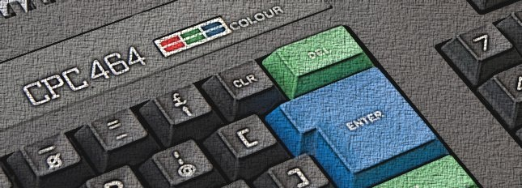

# Quick start


    zcc +cpc -lndos -lm -subtype=wav -create-app -o program adv_a.c

-or-

    zcc +cpc -lcpcfs -lmz -subtype=wav -create-app -o program adv_a.c

-or-

    zcc +cpc -clib=ansi -lcpcfs -lmz -subtype=wav -create-app -o program adv_a.c

Historically interrupts were disabled to improve the stability, now it is normally not necessary; by the way the old option can still be activated via the "-subtype=noint" parameter.

'-subtype=fastwav' can shorten the loading time by producing a non standard audio format.


# Misc notes on the CPC target

#### Loading Addresses

The code is compiled by default to address $1200, to run the code on a CPC you should do the following:

```

 | tape
 | ----
memory &11ff
load "",&1200
call &1200

```


If you produce code under $1200 and needs to get loaded then run from BASIC, the "memory" command is required; in example, to compile and run a program located at $400:

```
zcc +cpc -lcpcfs -lmz -zorg=1024 -create-app -o program adv_a.c
```

```
openout"d"
memory &3ff
closeout
load"mybin",&400
call &400
```

#### Floating Point Support

The CPC target supports a native maths library, this is selected using the -lmz switch when compiling.

The library that is linked in by default supports 3 models of CPC - CPC464, CPC664 and CPC6128. 

Should memory be in short supply and you wish to compile for a specific CPC then you can do the following:

```
zcc +cpc [...] -lmz -l6128_math
```

or -l464_math or -l664_math which will save about 600 bytes of memory.

The generic floating point functions are still available via the "-lm" flag.


#### Additional functions

The additional functions introduced with the developement of the native CPC library, are now available in all the implementations; these are:

```
void deg();
```

Switch the FP engine into degrees mode

```
void rad();
```
Switch the FP engine into radians mode

```
double pi();
```

Return the value of pi.

```
double pow10(int x);
```

Returns 10^x


#### File IO Library (fcntl driver)

Support for file IO on the CPC has been added. This uses the CAS_ interface
and as such as the limitation that only 2 files may be open at a time -
one for reading and one for writing. In addition due to the firmware
implementation of these routines, a 2k buffer is required for both input
and output. This buffer is statically built into the program.

The following routines are not supported by the CPC fcntl library:

```
ftell()
fgetpos()
fsetpos()
rewind()
fseek()
creat()
lseek()
mkdir()
getcwd()
rmdir()
getwd()
```

Moreover, open() only supports the O_RDONLY and O_WRONLY flags.

To link in the library supply the -lcpcfs flag to the compiler. If you do
not require file IO in your program then supply the -lndos flag which 
links in a dummy stub library that simply returns errors.


#### Application Creation

The appmake has been updated to support the CPC as a target. When compiling if you supply the -create-app flag then a file with the suffix .cpc is generated.  This file contains a CPC disc file header which can then be easily transferred onto a CPC disc using cpcfs or a similar tool.


# Putting your code into a disk image

This is an example on how you to integrate your favourite emulator tools with the z88dk features.
In this case we chose the XTI (Disk Image XTender) utility, which should be available at the following address:
ftp://ftp.lip6.fr/pub/amstrad/emu-uti/pcxti14.zip


*  Compile your program with the "-create-app" flag set

    zcc +cpc -lndos -create-app adv_a.c

It will create both a raw block (a.bin) and a special binary file called "a.cpc"


*  Create a blank disk image with the **xti** tool

    xti -newS tst.dsk


*  Insert the "special file" in the newly created disk image

    xti -incl tst.dsk

```
    C:\cpcemu>xti -incl tst.dsk
    Disk Image Extender v1.4 (c) 1998 Pierre Guerrier,
    DOS port by Ulrich Doewich
    Image is System, with 169 K free, 0 files over 0 entries.
    Include ? a.cpc
    Including file as A       CPC
    Include ? .
    
    C:\cpcemu>
```

*  Load and run the new program from within your favourite emulator, after having properly configured the virtual disk drives

    memory &11ff
    load "a.cpc",&1200
    call &1200


# Putting your code into a RAM snapshot

This note is still *partially* valid, but please note that the "-create-app" flag makes life easier.

```
	Compile the program (optionally you can set another address for ORG)
		zcc +cpc -zorg=24576 program.c
	Prepare an empty uncompressed snapshot with your preferred Amstrad emulator 
	(the snapshot format may be a bit different, but normally the locations are the same)
		memory &1fff  (BASIC command)
	Save the snapshot and exit from the emulator
	Insert the compiled code into the snapshot:
		sna_mng i a.bin loader.sna 24576 30000
	Re-run the emulator, load the modified snapshot and type:
		call &6000
```


# Tricks using the WinAPE emulator

When using the WinAPE Amstrad CPC emulator, if runned code is 0xED, 0xFF then it activates a Breakpoint and show the debugger.

'norecess' suggests the following:

	
	#define crASSERT( expression ) \
	    if ( !( expression ) ) \
	    { \
	        asm( "defb $ed, $ff" ); \
	    }
	
	#define crBREAK( ) \
	    asm( "defb $ed, $ff" );

# Links

[No cart](https://www.genesis8bit.fr/archives/index.php?news_id=744)

[Z88DK as described in CPCWIKI](http://www.cpcwiki.eu/index.php/Z88DK)

[Short tutorial about using the z88dk on Linux (RPI) to create Amstrad applications](http://scruss.com/blog/2012/09/29/sometimes-things-do-not-go-exactly-as-planned-c-development-for-amstrad-cpc-on-raspberry-pi/)

["entwickeln-mit-z88dk", tutorial in German](http://www.octoate.de/wp/articles/german/entwickeln-mit-z88dk/)

[Blue Angel 69 - CPC game written with z88dk](http://blueangel69.cpc-live.com/)

[Magical Drop CPC - game written with z88dk](http://www.cpcmania.com/NewGames/MagicalDropCPC/MagicalDropCPC.htm)

[Grimware - CPC insights](http://www.grimware.org/doku.php)

[CPC Sprite Library](http://www.amstrad.es/programacion/c/) (Amstrad CPC) cpcrslib is a C library containing routines and functions that allows the handling of sprites and tile-mapping on the Amstrad CPC. The library is written to be used with the z88dk compiler. cpcrslib also incorporates keyboard routines to redefine and to detect keys, as well as general routines to change to the screen mode or the colours.

[cpcrslib v.2 - Amstrad CPC Library for z88dk.](http://code.google.com/p/cpcrslib/)

[Crocolib](http://crococode.free.fr/pages/_crocolib.php) (Amstrad CPC/CPC+) Crocolib is a complete framework targeting Amstrad CPC computers, written in C using the z88dk C cross compiler. It allows the creation of rich programs featuring very low-level hardware support. Tools are also included to convert data to the target machine.

