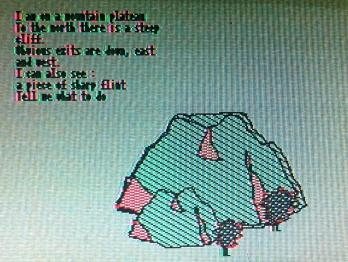

# Machine Specifications

* CPU: Z80 @ 3.579545 Mhz
* VDP: MC6847, 6k VRAM
* PSG: AY-3-8910
* RAM: 16k...64k?
* ROM: 16k

 

## Classic library support (`+mc1000`)

* [x] Native console output
* [x] Native console input
* [x] ANSI vt100 engine
* [x] Generic console
    * [x] Redefinable font
    * [x] UDG support
    * [x] Paper colour
    * [x] Ink colour
    * [x] Inverse attribute
    * [x] Bold attribute
    * [x] Underline attribute
* [x] Lores graphics
* [x] Hires graphics
* [x] PSG sound
* [ ] One bit sound
* [ ] Inkey driver
* [x] Hardware joystick
* [ ] File I/O
* [ ] Interrupts
* [ ] RS232

# Quick start

    zcc +mc1000 -create-app -Cz--audio program.c

-- or --

    zcc +mc1000 -clib=ansi -create-app -Cz--audio program.c

This will generate three files, **a.bin** (a pure binary block), **a.cas** (an intermediate file), and **a.wav**, ready to be loaded on the real hardware.

The example above is meant to be loaded with the "LOAD" command.  The GAMING mode is supported too:

    zcc +mc1000 -subtype=gaming -create-app -Cz--audio program.c

# Emulator notes

The last versions of the MESS emulator are quite valid, but the tape loading timing seems to be slightly different.
To save some time loading on MESS, add the "-Cz--fast" flag to the compiler command line.

The converted emulator can load the .bin file. To run enter `run`

# Generic console

The generic console supports hires (256x192), colour (128x192) and text (32x16) modes. In hires mode you should compile with a CRT_FONT option or garbage will be printed on screen. Upto 128 UDGs are supported. 

To switch to hires mode:

    int mode = 1;
    console_ioctl(IOCTL_GENCON_SET_MODE, &mode);

To switch to hires mode (with alternate colours):

    int mode = 1 + 32;
    console_ioctl(IOCTL_GENCON_SET_MODE, &mode);

To switch to colour mode:

    int mode = 2;
    console_ioctl(IOCTL_GENCON_SET_MODE, &mode);

To return to text mode (green/yellow):

    int mode = 0;
    console_ioctl(IOCTL_GENCON_SET_MODE, &mode);

or text mode in red/white:

    int mode = 32;
    console_ioctl(IOCTL_GENCON_SET_MODE, &mode);

# External Links

* [Conversion of the BrMC1000 emulator](https://github.com/suborb/MC1000Emulator)
* [MC-1000 technical documentation](http://files.datassette.org/manuais/manual_referenciamc1000.pdf)
