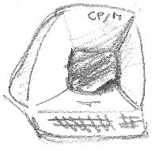

The CP/M platform is a surprisingly useful port when used in combination with [ZXCC](https://www.seasip.info/Unix/Zxcc/), the two together can easily test whether an algorithm works, or whether there's an issue in the compiled output code.

ZXCC is trivial to extend, and you can easily permit access to serial ports, host system calls, advanced paging techniques etc testing out many areas of your code.

##  Quick Start 
	
	zcc +cpm -lm -lndos -o adventure.com adv_a.c

	zcc +cpm -lm -o ddir.com ddir.c

The ndos.lib library is useful to save memory when file support is not necessary. 

Without specifying a `-o` option, a file called `a.com` is produced, this can be run with `zxcc` as follows:

	zxcc a.com

By default, z88dk will generate code suitable for running on a z80 based machine, to compile for an 8080 machine add the option `-clib=8080`:

	zcc +cpm -clib=8080 -lm -lndos -o adventure.com adv_a.c

## Creating a disc

appmake supports creating a number of CP/M disc formats that can be used directly by emulators or easily converted using 3rd party tools. Many of these can be produced as part of the compilation step using the `-subtype=XXXX -create-app` options.

To create a disc image with a binary, you can use the following command:

     appmake +cpmdisk -f [format] -b [binary file]

The file will be created on disc with a .COM extension.

The supported formats are displayed by specifying the `-h` option:

     appmake +cpmdisk -h

## Library Support

Besides the standard library routines, the **''bdos(int func,int arg)''** and the the **''bios(int func,int arg,int arg2)''** function calls allows direct access to the bios of the system.

## Generic console

A hardware agnostic generic console that maps into ADM-3A control codes is available. This permits portability of `<conio.h>` code across CP/M targets that do not have a specific implementation. To use it add the following command line parameters:

    --generic-console -pragma-define:CONSOLE_COLUMNS=X -pragma-define:CONSOLE_ROWS=Y

Where X and Y are replaced with the size of the screen. The maximum supported screen size is 80x25.

## Optimization

There are a couple of #pragma commands which might be used to cut down the size of the resultant executable:

**#pragma output nostreams**      - No stdio disc files

**#pragma output nofileio**       - No fileio at all

**#pragma output noprotectmsdos** - strip the [MS-DOS protection header](platform/cpm#program_boot_protection)

**#pragma output noredir**        - do not insert the file redirection option while parsing the command line arguments (useless if "nostreams" is set)

## Hardware specific extensions

Some hardware specific functions have been adapted to run on both native platorm and generic CP/M environment (the 'gfx' prefix is used for library modules including graphics extensions only).

* **-laussie** ([Aussie Byte](Platform---Aussie))
* **-lcpccpm** ([Amstrad CPC](Platform---Amstrad-CPC))
* **-lc128cpm**, **-lgfx128**, **-lgfx128hr**, **-lgfx128hr480** ([Commodore 128](Platform---Commodore-c128))
* `-subtype=einstein` ([Tatung Einstein](Platform---Tatung-Einstein))
* `-subtype=px4` ([Epson PX4 (HC-40)](Platform---Epson-px4))
* `-subtype=microbee` ([MicroBEE](Platform---Microbee))
* **-lnewbrain_cpm** ([Grundy NewBrain](Platform---Grundy-Newbrain))
* `-subtype=tiki100` ([Tiki-100 (formerly Kon-Tiki)](Platform---Tiki100))
* **-ltrs80_cpm**, **-lgfxtrs80**, **-lgfxeg2000** ([Tandy Radio Shack 80 and clones](Platform---TRS80))
* `-subtype=zxplus3` ([Sinclair ZX Spectrum](Platform---Sinclair-ZX-Spectrum))
* **-lgfxzcn** ([Amstrad NC-100/NC-200](Platform---Amstrad-NC)) 480x64 graphics on ZCN
* `-subtype=kaypro83` ([Kaypro 83](Platform---Kaypro)) 
* `-subtype=kaypro84` (Bondwell BW-12,[Kaypro 84](Platform---Kaypro))
* `-subtype=attache` ([Otrona Attachè](Platform---Otrona) 320x240 graphics)
* `-subtype=adam` ([Colecovision Adam](Platform--Colecovision-Adam) 256x192 graphics)
* `-subtype=nascom` ([Nascom](Platform---Nascom))
* `-subtype=excali64` ([BGR Excalibur 64](Platform---Excalibur64))
* `-subtype=rc700` ([Regnecentralen RC700](Platform-Regnecentralen-RC700))
* (untested) **-lgfxep**, **-lgfxephr** ([Enterprise 64 / 128](Platform---Enterprise64))
* (untested) **-lgfx9001**, **-lgfx9001krt** ([Robotron Z9001, KC85/1, KC87](Platform---Robotron-Z9001))
* `--vti -pragma-export:VTI_DISPLAY=0xc000` Support for display on the VTI graphics card. Change VTI_DISPLAY to the address configured with the hardware dip switches.
* `--vio` Support for generic console and lores graphics on the VIO graphics card.
* `--vdm` Support for generic console and very lores graphics on the Altair 8800 VDM-1 graphics card.

Additionally, -create-app will create discs for the following machines:

* `-subtype=svi` ([Spectravideo SVI](Platform---Spectravideo))
* `-subtype=qc10` (Epson QX-10/QC-10`
* `-subtype=osborne1` (Osborne 1)
* `-subtype=kayproii` ([Kaypro II](Platform---Kaypro))
* `-subtype=mz2500` ([Sharp MZ2500](Platform---Sharp-MZ2500))
* `-subtype=smc777` ([Sony SMC-70/SMC-777](Platform---SMC-777))
* `-subtype=msx` (MSX for use with MSXDOS)
* `-subtype=bic` (A5105/BIC)
* `-subtype=lynx` ([Camputers Lynx](Platform---Camputers-Lynx))
* `-subtype=x1` ([Sharp X1](Platform---Sharp-X1))
* `-subtype=z80pack` Z80pack emulator floppy format

The new library also has a CP/M target, which can be reached by supplying `-subtype=new` for sccz80, or `-subtype=sdcc_ix`, or `-subtype=sdcc_iy` for sdcc compiler, respectively.

## Program boot protection

The code generated for CP/M based computers is protecting by default the MS-DOS environment.

In a similar way we can extend the protection to the 8080 based systems (which would crash otherwise).

Just add to your source program:

    #pragma output protect8080

## CP/M related Links

http://www.seasip.info/Cpm/index.html

http://zxvgs.yarek.com/en-index.html   (ZXVGS is also natively supported)