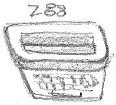

# Z88 Platform

## Introduction

The z88 operating system, OZ, provides a lot of functionality for programmers which permit multiple applications to co-exist and conserve resources (i.e. memory) as necessary. z88dk aims to hide away a lot of the details and provide a relatively simple solution to developing of applications.

For details of the functionality OZ exposes, it's advisable to read the [Z88 Developer Notes](http://www.worldofspectrum.org/z88forever/dn327/index.htm). The notes describe a lot of detail that is skipped over here.

## Maths Library

The z88's floating point routines are supported, to use them, add `-lmz` to the command line. **Note:** if you are using zsdcc to compile an application then
only `-lmath48` is available.

## BBC Basic Target

By default, z88dk generates binaries that can be LOADed into the BBC Basic application and run. Using this target is the easiest way to get an application up and running on the z88.

### Command Line

	
	zcc +z88 .....
e
## Z88 Application Target

Z88dk can be used to create a z88 [Applications](z88_applications) that can be run from the Main Menu. Both good, bad and ugly applications can be constructed.

### Command Line

	zcc +z88 -subtype=app -create-app ...

The output of this command will be a .epr file (suitable for insertion into Emulators) and .63 (.62, .61, .60) files representing the individual banks.

To generate files suitable for Installation with OZ4.5+ and OZ5 use -subtype=installer. Both 4 and 5 installer files will be created, (.app, .apX for OZ4.x and .a5p for OZ5).

## Z88 Packages

_Only useful for OZ3.x and OZ4.0_

Z88dk can create [Packages](z88_packages) (shared libraries) that allow code to be shared between applications. [ZSock](http://www.rst38.org.uk/zsock) was built using this technique to provide TCP/IP services for the z88.

### Command Line

As for applications, i.e.:

    zcc +z88 -create-app -subtype=app app.c

## Z88 Shell Target

The z88 shell is a unix-like shell providing command line file manipulation on the z88. Naturally, z88dk supports generating applications that can be run from the command line.

### Command Line

    zcc +z88 -subtype=z88shell -create-app

## ZSock Devices

ZSock devices can be compiled with z88dk, these are raw binary blobs that sit at address 8192 and cannot use a stdio resources.

### Command Line

    zcc +z88 -subtype=zsockdev

## Relocatable Code Snippets

Z80asm can include a relocator to the head of a generated binary. This will cause the code to be relocated to the address that it is loaded at and then run.

### Command Line

	
	zcc +z88 -subtype=reloc

## z88net library

### Command Line

	
	zcc +z88 -clib=net

### Links

[Compiled Z88dk demos in 'Z88 forever'](http://www.worldofspectrum.org/z88forever/rom-z88dkdemos.html)

[Gunther Strube / Interlogic - z80asm and more](http://www.worldofspectrum.org/z88forever/rom-workbench.html)
