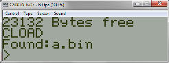

======= Canon X-07 =======

NOTE: This target port is highly experimental, any kind of feedback is welcome, please post your comment in the z88dk.org forum.

# Quick start

    zcc +x07 -create-app program.c

The binary converter (appmake) will create two files, "a.cas" (the BASIC loader) and "a_2.cas" (the M/C data).

    zcc +x07 -create-app -Cz--audio program.c

In this case also a wave audio file will be created.

# Emulator hints

- Start the emulator (e.g. the Takeda's "x07.exe", 20/05/2009 version.. the latest version doesn't seem to work well enough, you need to experiment).

- open the first tape file, containing the loader (a.cas)

- CLOAD

- close the cassette file

- RUN the loader

- open the second tape file, containing the program (a.cas)

