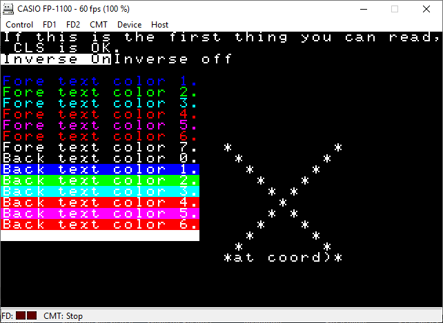

# Hardware summary

* Z80 @ 4 Mhz + uPD7801G @ 2MHz
* 64k RAM, 36k ROM + ~12k sub cpu ROM
* VDP: HD46505 (m6845 clone), 48K VRAM total via the uPD7801G 

# Compilation

    zcc +fp1100 world.c -create-app

This will create a .d88 image that's suitable for loading into FD1 of the Takeda emulator. Insert the disc, reset the machine and your app will boot.

# Generic console modes

* Mode 0 = 40 column text
* Mode 1 = 80 column text

# Screenshots

# Limitations

* Although the machine has 64k RAM, the ROM is copied into RAM so the maximum program size is around 20k   
* Anything graphical has to go via the sub cpu. Communication with it is a little slow so displaying anything on screen is sluggish
* Not all subcpu commands are known, so graphics are not available
* The keyboard makes an annoying beep for every keypress 

# CP/M

No specific libraries are at the moment available for the Casio FP-1100.   To transfer files on a disk image with cpmtools a specific disk definition must be provided in the 'diskdefs' file:

    # Casio FP-1100
    diskdef fp1100
      seclen 256
      cylinders 40
      sectrk 16
      heads 2
      blocksize 2048
      maxdir 128
      boottrk 4
      os 2.2
    end

WARNING:  With the suggested definition the file transfer commands will work but the target disk image will possibly loose the ability to boot.

# Links

* [Takeda Emulator](http://takeda-toshiya.my.coocan.jp/fp1100/)