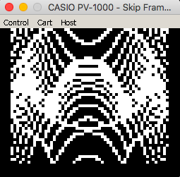
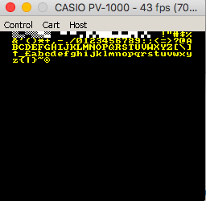

# Hardware summary

* Z80 @ 3.579Mhz
* 3k RAM, 0k ROM
* VDP: D65010G031
* Audio: On ports 0xf8, 0xf9, 0xfa - D65010G031 (not supported)
* Joysticks: 2x on 0xfd

## Compilation

    zcc +pv1000 world.c -create-app

The resulting .rom file can then be loaded into the emulator.

The default configuration is to create a 16k ROM. If your application is larger then you can supply `-subtype=32k` to create a 32k ROM.

## Features

The PV1000 port has the following features:

* VT52 console
* joystick() from `<games.h>`. Controller 0 is joystick 1, Controller 1 is joystick 2
* Lores graphics

## Tileset configuration

The PV-1000 has no ROM and hence all tiles need to be supplied in the user's ROM. The format used defines the RGB value for each of the pixels, as such each 8x8 tile will consume 32 bytes within the ROM. A maximum of 224 tiles can be configured in the ROM.

By default, a z88dk ROM builds with the following character set (starting at code 0xa and ending at 0x7f):

Byte codes 0x10 - 0x1f are used to implement lores graphics.

The colour information is embedded within the tileset, so changing the colours requires rebuilding the tileset, for this purpose the font2pv1000 is provided:

   Usage: font2pv1000 [options] input > output

    Convert a z88dk font/8x8 monochrome tileset to PV-1000 format

     -f|--fgcolour=value                  set the foreground colour for all tiles
     -b|--bgcolour=value                  set the background colour for all tiles
     -c|--charcode=value                  set the initial character code

To replicate the default font the command line would be:

    font2pv1000 -f 6 -b 0 -c 32 {z88dk}/libsrc/_DEVELOPMENT/font/font_8x8/font_8x8_cpc_system.bin > tileset.asm

If you then supply the option `-pragma-define:PV1000_CUSTOM_TILESET=1` to the compilation line your tileset will be included. Note that characters 0x0a - 0x1f cannot be changed using this method.

## Links

* [Technical Information](http://www43.tok2.com/home/cmpslv/Pv1000/EnrPV1.htm)
* [Emulator](http://takeda-toshiya.my.coocan.jp/pv1000/index.html)