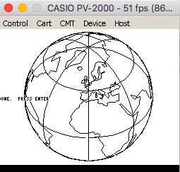

# Machine Specifications

* CPU: Z80 @ 3.579 Mhz
* VDP: TMS9918, 16k VRAM
* PSG: SN76489
* RAM: 4k 
* ROM: 16k

# Compilation

    zcc +pv2000 world.c -create-app

A 16k ROM file will be generated that can be inserted into the emulator.

# Support

The VDP used by the PV-2000 is the same as the one in the MSX, as such many MSX examples will work. However, the machine is not particularly well equipped with memory so care must be taken.

You can reduce RAM usage by making static data `const` where possible - this will keep it ROM rather than copying to RAM.

# Screenshots

graphics/globe running in an emulator:

# Links

* [Emulator](http://takeda-toshiya.my.coocan.jp/pv2000/index.html)
* [Technical Information](http://www43.tok2.com/home/cmpslv/Pv2000/EnrPV.htm)