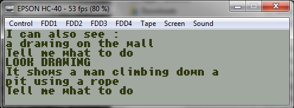

# Epson PX4 (HC-40)

Supported file formats include the normal CP/M ".COM" file (see the CP/M) section or the EPROM image.
The monochrome library is supported, as well as the optional VT-ANSI emulation at a 60x8 characters resolution.
The CP/M implementation of the time() function includes the automatic detection and support of the special Epson BIOS.

### Quick Start

COM file format:

    zcc +cpm -lpx4  -create-app -oname name.c

    zcc +cpm -lpx4  -create-app -oname name.c -pragma-need=ansiterminal -pragma-define:ansipixels=240 -pragma-define:ansicolumns=60

ROM file formats:

    zcc +cpm -subtype=px4  -create-app -oname name.c

    zcc +cpm -subtype=px4 -Cz--32k -create-app -oname name.c

    zcc +cpm -subtype=px4ansi  -create-app -oname name.c -pragma-define:ansicolumns=60

## The VT/ANSI console driver

The ANSI VT emulation can work in several column size variants:

''-pragma-define:ansicolumns=30''

''-pragma-define:ansicolumns=34''

''-pragma-define:ansicolumns=40''

''-pragma-define:ansicolumns=48''

''-pragma-define:ansicolumns=60''

''-pragma-define:ansicolumns=80''     (barely readable)

''-pragma-define:ansicolumns=120''    (almost useless)

## Emulator Links

The HC-40 Takeda's emulator can be used to test the programs by creating a 32K ROM image (use the "-Cz--32k" if necessary) and renaming it to "BASIC.ROM".
