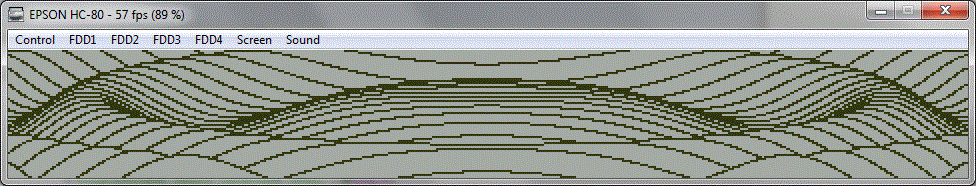

#  Epson PX8 (Geneva, HC-80, HC-88)

Supported file formats include the normal CP/M ".COM" file (see the CP/M) section or the EPROM image.
Graphics library is now mostly functional and special functions are available by interfacing to the powerful console provided by the PX8 and the 'slave CPU'.
The CP/M implementation of the time() function includes the automatic detection and support of the special Epson BIOS.

### Quick Start

COM file format (see CP/M section):

    zcc +cpm -create-app -oname name.c

ROM file formats:

    zcc +cpm -subtype=px8 -create-app -oname name.c

    zcc +cpm -subtype=px8ansi -clib=ansi -create-app -oname name.c

## Emulator Hints

The HC-80 Takeda's emulator can be used to test the programs by creating a 32K ROM image and renaming it to "BASIC.ROM".     In the latest versions smaller images are supported too.

## Links

[PX-8 page at z80.eu](http://www.z80.eu/epsonpx8.html)

[PX-8 page at xs4all.nl](http://fjkraan.home.xs4all.nl/comp/px8)

[PX-8 SW page](http://fjkraan.home.xs4all.nl/comp/px8/oldcomputersPxdock/)

