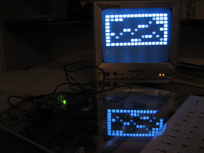

## Classic library support (`+gal`)

* [x] Native console output
* [x] Native console input
* [x] ANSI vt100 engine
* [x] Generic console
    * [x] Redefinable font (`-subtype=galaxyp`)
    * [x] UDG support (`-subtype=galaxyp`)
    * [ ] Paper colour
    * [ ] Ink colour
    * [x] Inverse attribute (`-subtype=galaxyp`)
    * [x] Bold attribute (`-subtype=galaxyp`)
    * [x] Underline attribute (`-subtype=galaxyp`)
* [x] Lores graphics
* [x] Hires graphics (`-subtype=galaxyp`)
* [x] PSG sound
* [x] One bit sound
* [x] Inkey driver
* [x] Hardware joystick
* [ ] File I/O
* [ ] Interrupts
* [ ] RS232

# Quick start

    zcc +gal -create-app -o adventure adv_a.c

The binary converter (appmake) will create a file named "adventure.gtp" and an audio WAV file.
"-Cz--fast" modifies the WAV file in a non standard, faster way.

The GTP file can be used directly on an emulator (i.e. MESS), or converted to WAV with the [Galaksija Tools](http://www.tablix.org/~avian/blog/articles/galaksija-tools/) by Tomaz Solc.

# Library support

## Console drivers

The Galaksija library supports native output, ANSI (vt100) and generic (VT52) output drivers.

## Galaksija Plus support

The hires screen of the Plus model is supported by both the generic console and the graphics library. The following screen modes are available:

* Mode 0: 32x16 text
* Mode 1: 256x208 monochrome graphics

Galaksija Plus support is enabled in the libraries by specifying the option `-subtype=galaxyp`

For text output in mode 1, a [custom font](https://github.com/z88dk/z88dk/wiki/Classic-GenericConsole#defining-a-custom-font) must be provided, otherwise garbage instead of characters will appear.

## Compact graphics library

For low memory compiles where the generic console isn't used, the original lores graphics library can be linked in using `-lgfxgaltext` 

## Audio output

[1-bit sound](https://www.z88dk.org/wiki/doku.php?id=library:sound) is provided via tape output. This is fully functional, although its usability is limited because the Galaksija turns off the screen while playing tape output sounds. Currently (as of 2022), 1-bit sound can only be tested on the real hardware, because both emulators and the ZX-Uno core do not reproduce tape output sound.

PSG sound for the galaxyp subtarget is functional, albeit imperfect. This can be tested in MAME on the galaxyp system, or on the ZX-Uno Galaksija core. The galaksija.net online emulator does not provide AY sound emulation yet.

# Emulator and FPGA notes

After attaching the tape file, type the command "OLD", in the Galaksija BASIC dialect it means "LOAD".
Start the virtual tape transfer, and just type "RUN" at the prompt when LOADing is finished.

## MAME
Attach the WAV tape file, type OLD and start the tape. You can now press Escape twice and then F10 to speed up emulation. Press F10 again to return to normal speed when loading is finished.

## GALe Online Emulator
Open [the online emulator](http://galaksija.net/?i=1) in your browser. Click "Tape" and then "File" to attach a GTP tape file, then load the tape as described above. Loading happens instantly, so you can immediately type RUN afterwards.

## ZX-Uno
On the [ZX-Uno](https://zxuno.speccy.org/), GTP files can be loaded from mass storage. Follow the instructions described [here](https://www.zxuno.com/forum/viewtopic.php?f=65&t=1942).

# Links

http://www.tablix.org/~avian/blog/archives/2008/12/galaksija_gets_a_c_compiler/