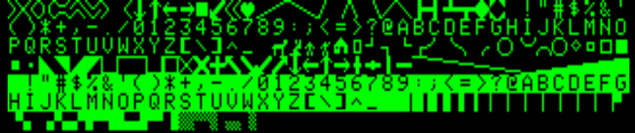

# Hardware summary

## Homelab 2

* Z80 @ 4Mhz
* 16k RAM
* 40x25 character display

## Classic library support (`+homelab2`)

* [ ] Native console output
* [ ] Native console input
* [ ] ANSI vt100 engine
* [x] Generic console
    * [ ] Redefinable font 
    * [ ] UDG support
    * [ ] Paper colour
    * [ ] Ink colour (Colour Ace only)
    * [x] Inverse attribute
    * [ ] Bold attribute
    * [ ] Underline attribute
* [x] Lores graphics
* [ ] Hires graphics
* [ ] PSG sound
* [ ] One bit sound
* [x] Inkey driver
* [ ] Hardware joystick
* [ ] File I/O
* [ ] Interrupts
* [ ] RS232

# Compilation

    zcc +homelab2 program.c -create-app

A .htp file will be generated suitable for loading into Mame.

Once loaded (via quick load in mame) enter the following command:

    CALL 17152

# Library notes

The right shift key is mapped as control and the left shift key as shift. The delete key is mapped as shift+0

The font is fixed in the machine ROM and only supports upper-case characters. Many graphical
characters are available within the character set.

# Links

* [Information](http://homelab.8bit.hu/)
