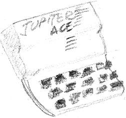

# Jupiter Ace Hardware summary

* z80 @ 3.25 Mhz
* 3k base memory, 16k 48k RAM packs available

## Classic library support (`+ace`)

* [x] Native console output
* [x] Native console input
* [x] ANSI vt100 engine
* [x] Generic console
    * [x] Redefinable font
    * [x] UDG support
    * [ ] Paper colour
    * [ ] Ink colour
    * [x] Inverse attribute
    * [ ] Bold attribute
    * [ ] Underline attribute
* [x] Lores graphics (64x48, 64x72)
* [ ] Hires graphics
* [ ] PSG sound
* [x] One bit sound
* [x] Inkey driver
* [ ] Hardware joystick
* [ ] File I/O
* [ ] Interrupts
* [ ] RS232

# Quick start

To compile a program (with 'a.bin' as the default program name), type:

    zcc +ace -create-app program.c

The program can then be loaded with the following command:

    0 0 bload a.bin

To insert the ANSI VT emulation, and change the default program name, type:

    zcc +ace -clib=ansi -create-app -Cz--audio -o program program.c

The '--audio' parameter adds the creation of a 'wav' file in addition to the 'tap' format.   Specifying also the '--fast' flag the audio file will be create in a sort of 'turbo' mode.

Setting '-subtype=rom" will provide a very primitive skeleton for a ROM replacement program, be aware that most of the I/O z88dk functions simply won't work, you need to provide your own.

# Console support

z88dk provides multiple console implementations for the Jupiter Ace - the ANSI/vt100 driver, the VT52/ZX Code driver and a native handler if memory space is particularly tight.

For all versions, redefining the font is possible using the -pragma-redirect:CRT_FONT= command line option. For available fonts see the appropriate section for the [ZX Spectrum](Platform---Sinclair-ZX-Spectrum).

# Graphics libraries

Two graphics libraries are provided:

    -lgfxace      64x48
    -lgfxaceudg   64x72, currently limited to 64x71 due to a bug

Both graphic modes coexist with the generic console, 64x48 uses UDGs/character codes 17 to 23. The 64x72 mode uses UDGs/character codes 0-31.

Experimental support for the ZX Printer is provided, we supposed it could be attached to the Jupiter ACE via a 3rd party adapter:

https://k1.spdns.de/Vintage/Sinclair/80/Jupiter%20Ace/Peripherals/Trumpcard%20(Innovonics)/
https://k1.spdns.de/Vintage/Sinclair/80/Jupiter%20Ace/Peripherals/Motherboard%20(Boldfield)/

To hardcopy the screen please call zx_hardcopy().   The UDG variant will save some memory by printing only the graphics elements, the standard variant will support all the standard text and graphics symbols, in direct and reversed mode.

# Appmake extras

The appmake tool can be run in "dumb" mode to generate the corresponding audio track of some external program.

    C:\>appmake +ace --dumb --audio -b program.tap
    
The optional "--fast" flag will produce a non-standard audio track which, even if faster, should be still loadable by the real computer.

# FORTH command syntax to LOAD/SAVE bytes

    s l bsave `<name>` saves l bytes from the memory starting at address s as `<name>` 
    s l bload `<name>` loades l bytes to the memory starting at address s as `<name>`. If s or l is zero will their value be taken from the file. 
    addr call will call Z80 machine code at addr, should be terminated with a jp (iy) Z80 instruction. 

The newer TAP format features an autorun mode, so che 'call' is given automatically.

# Emulators

This target has mostly been tested using the EightyOne emulator, however Mame is also supported. To increase the amount of RAM available, launch with, for example:

    mame jupace -ramsize 16K 

