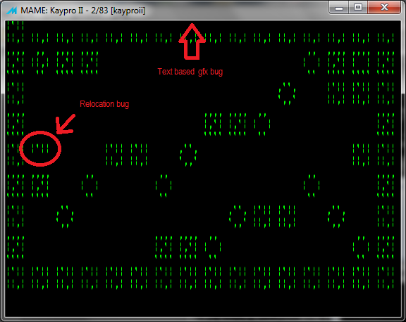
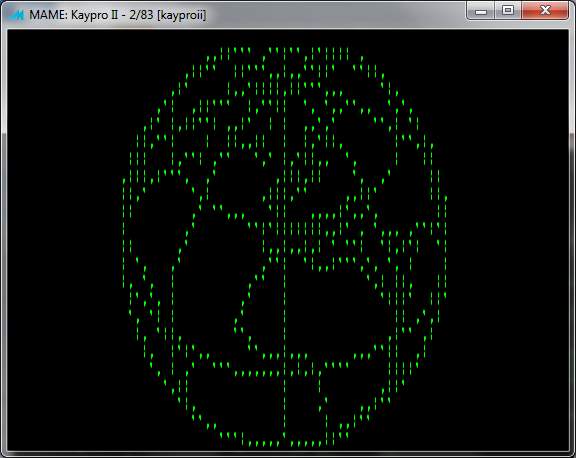

#  Kaypro

The Kaypro computers are CP/M compatible, so the [same base library](Platform---CPM) can be used, but extra functionalities are available.
Library extras include the graphics support for '84 models (160x100).

### Command Line

    zcc  +cpm -lm -lgfxkp -oPROGRAM.COM program.c

Graphics on the earlier '83 models is very limited and emulates an 80x50 resolution.  To access to the video page the "startup=2" option is needed together with '-lgfxkp83';  this relocating option reduces the max program size to about 27K.

### Emulator hints

Please be aware that [MAME](http://www.mamedev.org/) is not yet working correctly and the graphics will be occasionally garbled.   It is *not* a bug in z88dk, but rather a limit in the accuracy on how MESS currently deals with text attributes when emulating all the late Kaypro models.

#### ImageDisk and CPMTOOLS

We suggest to use the [ImageDisk](http://www.classiccmp.org/dunfield/img/index.htm) and edit an existing [200K disk image](http://www.retroarchive.org/maslin/disks/kaypro/kii-blnk.td0) (a single side disk is be usable on all the Kaypro models after that the machine specific OS has been loaded).

[CPMTOOLS](http://www.moria.de/~michael/cpmtools/) will be also necessary to alter the disk image.   A valid entry is already present in the "diskdefs" file but eventual OS boot tracks on the disk image will be corrupted in the editing process.

First of all use TD02IMD to convert from the TeleDisk to the ImageDisk format:

    TD02IMD kii-blnk

Then, convert the IMD disk image to an editable RAW file (a.img):

    IMDU /B kii-blnk.imd a.img

You should now be able to use CPMTOOLS, to add your program file:

    cpmcp -f kpii a.img a.com 0:A.COM

MAME is not able to read RAW disk images, so we encode it back to IMD:

    bin2imd  a.img a.imd /1 DM=5 N=40 SS=512 SM=0-9

The command line options to boot CP/M and use the created disk image is something like:

    mame kaypro484 -flop1 cpmboot.td0 -flop2 a.imd

### Screenshots

