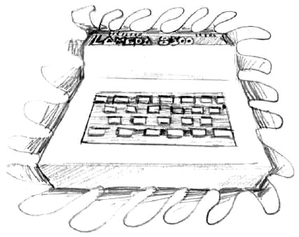

# Lambda 8300 / Power 3000

The Lambda 8300 is an improved chinese clone of the [ZX81](platform/zx81).

This same product was probably always made in Hong Kong and sold locally and around the world with several different names:

 - Lambda 8300  (England, Scandinavia)

 - Lambda 3000  (Denmark)

 - DEF 3000  (France)

 - PC 2000   (Scandinavia)

 - Marathon 32K  (Scandinavia)

 - IQ 8300   (Germany)

 - PC 8300   (Canada)

 - Creon Enterprises Power 3000  (Germany)

 - Unisonic Futura 8300  (USA)

 - Your Computer Basic 2000 / 3000  (France, Germany, Scandinavia)

# Quick start

zcc  +lambda -lzx81_math -create-app program.c

--or--

zcc +lambda -lm -create-app program.c

The latter option will use the ROM for Floating Point, which will produce small but slower and less accurate code.

# Compiler hints

The programs will work in SLOW mode by default; to run your program in FAST mode, the "-subtype=fast" flag is required.  By default the compiler inserts new interrupt handlers, protecting the registers needed by the z88dk programs while the screen is being refreshed; the FAST mode does not require such handler, so the output program gets slightly smaller.

### Startup modes

Using directly the startup modes is not normally necessary: the -subtype=____ and -clib=____ do it transparently; for advanced developers it may be useful to know that the same 'zx81_crt0.asm' is used for the LAMBDA, passing startup values > 100.

### Links

[Historien bag Lambda computeren (DK)](http://www.2kb.dk/lambda_historie.html)

