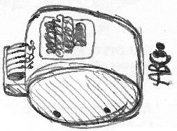

# Quick start

    zcc +abc80 -lm -o adventure -create-app adv_a.c

This command will build two files: "adventure.bas" and "adventure.bac", choose the one suitable for your emulator.

    zcc +abc80 -lm  -subtype=wav -o adventure -create-app adv_a.c

This will also create a WAV audio version

    zcc +abc80 -lm -subtype=hex -create-app -zorg=49200 -o adventure adv_a.c

This will build "adventure.ihx", an Intel-HEX encoded binary file.   It can be passed as a command line parameter to the ABC80SIM emulator and run directly with the command "A=CALL(49200)".

## Advanced options

    zcc +abc80 -zorg=50000 -create-app program.c

The **-zorg** oprion permits to specify the location of the compiled program.
The BASIC loader will put it into the new position

## Hints for emulators

#### WINABC80

This is one of the earlier emulators for windows.   Compile a ".BAC" program, start the emulator and "CONFIGURE" the programs path (a trailing backslash is mandatory).

To run the program:

    RUN "A"

..."A" is the BAC program name.

The BAC format is a BASIC program with the machine code inserted in DATA program lines.   You must wait a little for the program to be copied in memory.

## Graphics

The pseudo graphics mode is supported.
You first need to issue a **clg ()** command to set up the graphics page.

## Links

[ABC80 club (Sweden)](http://abc.se/index.html)

[ABC80 Emulators](http://www.abc80.org/pub/)
