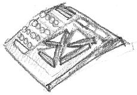

# Quick start

    zcc +msx -create-app adv_a.c

This will genetrate two files, **a.bin** (a pure binary block to be run at $9c40, sometimes requiring extra data blocks) and **a.cas**, a fully packaged binary tape image suitable for the MSX emulators.

    zcc +msx -create-app -subtype=wav adv_a.c

This will create also 'a.wav', ready to be transferred on a tape.

For the above examples the BASIC command is  BLOAD "CAS:",R

    zcc +msx -subtype=msxdos -oadva.com -lm adv_a.c

This will genetrate a file, **adva.com** which is located at $100, as required by MSXDOS.

### ROM mode

This is an experimental mode to create ROM cartridges, add "-subtype=rom".
Please be aware that not all the functions will work in ROM mode.

# Disk subtype notes

The bin2msx tool is no longer necessary

Here's a step - by - step example on how to compile and run the **adv_a** game:

*  compile the adv_a game

	zcc +msx -create-app -subtype=disk adv_a.c

It generates two files, a.bin, (pure binary file) and a.msx (binary file with some header stuff).

*  get 'dsktool' by Ricardo Bittencourt and a working disk image.  You can get it [here](http://www.salle.url.edu/~is05562/dsktool.zip) or [here](http://www.geocities.com/SiliconValley/8752/msx/dlprogs/dsktool.zip). 

*  put "a.msx" in the disk image

	dsktool A test.dsk a.msx

*  run an MSX emulator and choose to boot as MSX1, then put the disk image in the 'virtual' drive 1.

*  load and run the game

	bload "a.msx",r

# External Links

*  [Como programar para o MSX usando a linguagem C](http://fernando-aires.blogspot.it/2012/05/como-programar-para-o-msx-usando.html)

*  [MSX用クロス開発のすすめ（z88dk）, cross-development Recommendations for MSX and z88dk (Japanese)](http://juangotoh.hatenablog.com/entry/2015/10/29/231107)

*  [MSX Info pages](http://msx.hansotten.com/), maintained by Hans Otten

*  [MSX Assembly page](http://map.grauw.nl/), maintained by Laurens Holst (AKA "Grauw")

