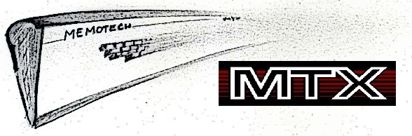

# Quick start

### MTX 500 mode (32K):

    zcc +mtx -create-app -oadventure.bin adv_a.c

This memory model works with the MTX512 too, but before loading the user must type:

    POKE 64122,0 
    NEW

### MTX 512 mode (64K and more):

    zcc +mtx -create-app -startup=2 -oadventure.bin adv_a.c

### Extra options

The binary converter (appmake) will create a file named "adventure.wav" (along with binary file in MtxEmu format, used also in older MESS versions).

Other options for appmake include a 'turboload' mode (-Cz ––fast) and the MacTX MTB binary format (-Cz ––mtb).
To automatically exclude the wav format and change the output file extension to ".mtx", it is possible to use the "subtype=mtx" option or to pass the directive directly to appmake (-Cz ––mtx).

### ROM mode

This is untested, add "-subtype=rom".

# Supported libraries

Most of the [monochrome gaphics](Library---monographics) lib and most of the [MSX](Platform---MSX) stuff are supported, but still experimental.

# Emulator hints

### MESS v0.118b (Aug 11 2007)

This old version of the MESS emulator wasn't yet ready to fully support the WAV tape format but it is able to patch the BASIC LOAD command and directly import a file, provided that the file name is copied in the MESS folder and that it has the same name of the MTX program to be loaded.
The default configuration in z88dk creates both the WAV file and the binary program block.
This is an example command sequence to build and run the ANSI demo in 64 columns (default) mode.

    zcc +mtx  -lndos -create-app -oANSITEST.o -clib=ansi ansitest.c
    copy ANSITEST /mess0118/ANSITEST
    (run messgui.exe in MTX512 mode)
    POKE 64122,0
    NEW
    LOAD "A"
    RUN

### Recent MESS versions (now grouped into MAME)

(at the moment a bug in the loader in the MTX emulation prevents MAME from loading the WAV files, but the file was tested on the real hardware)

    zcc +mtx  -lndos -create-app -oANSITEST.o -clib=ansi ansitest.c
    copy ANSITEST.wav /mame/ANSITEST.wav
    (move into the 'mame' folder)
    mame mtx512 -cass1 ANSITEST.wav
    POKE 64122,0
    NEW
    LOAD ""
    (enable "play" on the virtual cassette recorder)
    RUN

### MEMU MTX emulator

This is a very comfortable solution:

    zcc +mtx  -subtype=mtx -lndos -create-app -oansitest.o -clib=ansi ansitest.c
    copy ansitest.mtx /memu/ansitest.mtx
    memu -v ansitest.mtx
    POKE 64122,0
    NEW
    LOAD ""
    RUN

# Appmake extras

The appmake tool can be run in "dumb" mode to generate the corresponding audio track of some external program.

Example:

    C:\>appmake +mtx --dumb --audio -b ASTROPAC
    
    Info: Program Name found in header:  ASTROPAC
    
    Stklim: $f8f2
    System Variables block length ........... 601 byte(s)
    $FACC (prg block length) ................ 993 byte(s)
    $FA81 (CALCST): $c001
    $FA7B (VARNAM): $c000
    Variables block length .................. 1 byte(s)
    Extra data: 8576 byte(s), creating one more block

The optional "---fast" flag will produce a non-standard audio track which, even if faster, should be still loadable by the real computer.

# Links

http://primrosebank.net/computers/mtx/tools/PD/mtxtools_z88dk.htm

http://www.mtxworld.dk/main.php

http://www.nyangau.org/memu/memu.htm

