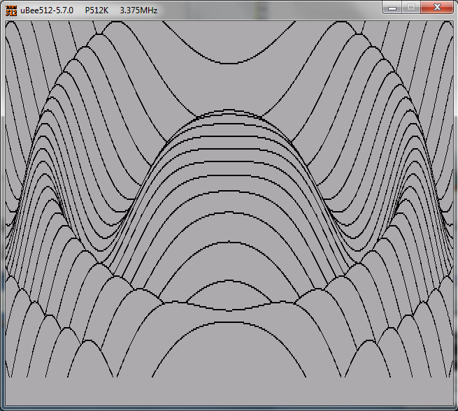

The MicroBEE is a CP/M compatible platform, so the [same base library](Platform---CPM) can be used, but extra functionalities are available.
Library extras include the 160x100 low resolution graphics, the sound support for the 1-bit sound, and joystick (real and emulated via keyboard scanning).

### Command Line

#### CP/M mode:

    zcc  +cpm -lm -create-app -lmicrobee -D__BEE__ -oPROGRAM program.c

CP/M mode, VT-ANSI color terminal emulation:

    zcc  +cpm -clib=ansi -lm -create-app -lmicrobee -D__BEE__ -oPROGRAM program.c

CP/M mode, 40 columns VT-ANSI color terminal emulation:

    zcc  +cpm -clib=ansi40 -lm -create-app -lmicrobee -D__BEE__ -oPROGRAM program.c

#### LOADM mode:

The following commands will create a file with the ".BEE" extension.
Adding the '-subtype=wav' or '-subtype=wav300' options will, as an alternative, produce a WAV audio file compatible to the cassette player formats.  The earlier 16K models support 300 baud only.

    zcc  +bee -lm -create-app -oPROGRAM program.c

As above in 80x25 mode (VT ansi emulation):

    zcc  +bee -clib=ansi -lm -create-app -oPROGRAM program.c

As above in 40 columns mode:

    zcc  +bee -clib=ansi40 -lm -create-app -oPROGRAM program.c

### Graphics Library

The MicroBee port supports three graphics variants.   For the low resolution at 160x75 include the following library:

    *-lgfxbee

On the Premimium models, full graphics expansion for 16 PCG pages, 640x275:

    *-lgfxbee640

On the Premimium models, standard 16K video memory for 8 PCG pages, 512x256 (faster and smaller) and 320x275:

    *-lgfxbee512
    *-lgfxbee320

    

### Audio options

To enable the audio format output and create a WAV file in place of the ".BEE" binary one, use one of the following options:

    * **-subtype=wav**         <- 1200 baud, valid for most of the Microbee models but failing on the earlier ones
    * **-subtype=wav300**      <- 300 baud, works also on the 16K model

The audio format can be slightly adjusted:

    * **-Cz--loud**  to increase the generated audio level
    * **-Cz--fast**  to slightly force the audio frequencies and tone duration for a faster transfer

### Emulator hints

A good emulator is UBEE512, available in the [Microbee Software Preservation Project](http://http://www.microbee-mspp.org.au/repository)

To run the ".BEE" native files:
    RUNM "program.bee"

#### CPMTOOLS

For the CP/M format we suggest to use the [CPMTOOLS](http://www.moria.de/~michael/cpmtools/) **compiled with the LibDsk option** and edit an existing 84 tracks disk image.

An already built and configured version is available in the [Microbee Software Preservation Project](http://http://www.microbee-mspp.org.au/repository)

First of all edit its "diskdefs" file and add a section:

	# Microbee 3.5" PJB DS84 (3.5" DS DD 80T 10x512 s/t)
	diskdef ds84
	  seclen 512
	  cylinders 80
	  sectrk 10
	  heads 2
	  blocksize 4096
	  maxdir 128
	  skew 3
	  skewstart 2
	  datasect 1
	  testside 1
	  boottrk 2
	  os 2.2
	end

To transfer a program on a disk image erase the previous copy and refresh it, i.e.:
    cpmrm -T dsk -f ds84 boot.dsk 0:a.com
    cpmcp -T dsk -f ds84 boot.dsk a.com 0:a.com

The resulting disk image can be associated to the emulator as a command line option:
    ubee512 -a boot.dsk

Other disk images may have been created in RAW format (no libdsk header).

Many other formats are avaiable, in the mentioned pre-configured cpmtools variant.   Example for a 409600 bytes long boot disk:

	# Microbee Nanowasp (DS DD 40T 10x512 s/t)
	# It probably can't be used to read/write files on a real floppy disk.
	
	diskdef nw40
	  seclen 512
	  cylinders 80
	  sectrk 10
	  heads 1
	  sidedness 3
	  blocksize 2048
	  maxdir 128
	  skew 3
	  skewstart 2
	  datasect 1
	  testside 1
	  boottrk 2
	  os 2.2
	end

### Links

[Microbee Documentation](http://microbee.uber-leet.com/index.php?page=microbee_documentation)
