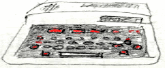

# Hardware Summary

* NEC µPD780 (Z80 Clone) @ 3.8 Mhz
* MC6847 (PC-6001,Trek) or extended clones (Other models)
* 16/32k RAM
* AY-3-8910
* Variable amounts of ROM + chargen ROM
* 2 joystick ports

The Japanese series of PC-6001 computers includes the following systems:

* NEC Trek
* PC-6001
* PC-6001 MK II
* PC-6601

# Quick start

    zcc +pc6001 -create-app -lm program.c

-- or --

    zcc +pc6001 -clib=ansi -subtype=32k -oprogram -create-app -lm program.c

The following "subtype" options are supported:

    (no parameter) or 16k  ->  N60 BASIC (16K)
    32k                    ->  N60 BASIC (32K)
    n60m                   ->  N60m BASIC (32K)
    rom                    ->  Cartridge, max 16K, not all the libraries will work

Except for ROM mode, a file named 'program.cas' will be created.

Alternatively an audio file can be created:

    zcc +pc6001 -create-app -lm -Cz--audio program.c

-- or --

    zcc +pc6001 -create-app -lm -Cz--audio -Cz--fast program.c

The resulting .wav file could be loaded into the real hardware.

To load the program do the following:

	- Answer '2' to the "How Many Pages ?" question (mandatory for 32K modes).
	- Load the 'program.cas' file (can be renamed to 'program.p6' if your emulator requires it).
	- Issue the 'cload' BASIC statement.
	- Issue the 'run' command: the machine code block will be loaded and run.
	
If your program terminates and you wish to run it again, you can change the BASIC program line by modifying the two last digits of the location for EXEC from '0F' to '37.

This wil bypass the loader and enter in the program directly.

# Creating a ROM

The machines support a 16k ROM slot. Particularly when targeting the 16k models, creating a ROM cartridge can allow use of a high resolution screen.

The -subtype=rom option supports extra options to pass to appmake:

To produce a file in Intel Hex format (cannot be mixed with chipsize):
`-Cz--ihex` 

To fill the whole ROM file
`-Cz"--romsize 16384"`

To split the ROM file in two smaller ones, etc..
`-Cz"--romsize 16384 --chipsize 8192"`

# Screen modes and graphics

The console subsystem for the PC6001 is completely decoupled from the ROM, this allows z88dk to transparently support multiple screen modes.

Screen modes can be changed using the following code:

    #include <sys/ioctl.h>

    int mode = 1;
    console_ioctl(IOCTL_GENCON_SET_MODE, &mode);

The following modes are supported:

* Mode 0 - 32x16 text, supports coloured block graphics with a resolution of 64x48
* Mode 1 - 256x192, monochrome
* Mode 2 - 128x192, colour

With Mode 1 and Mode 2 you will need to define a [font](https://github.com/z88dk/z88dk/wiki/Classic-GenericConsole#defining-a-custom-font) that can be used to print on console. Mode 1 and 2 support UDGs of course.

To change the pixel colour you can call `textcolor()` with the desired colour.

Of course, supported multiple screen modes does have an overhead, as a result if you don't use either mode 1 or mode2, then you can exclude their code from being included using the following pragmas: `-pragma-define:CLIB_DISABLE_MODE0=1` and `-pragma-define:CLIB_DISABLE_MODE1=1`
	
# Input

The keyboard doesn’t support simultaneous keypresses and can sometimes lag. As a result if you’re writing games then it’s best to use the joystick() function call. 

# Emulator Hints

* "Virtual NEC Trek" is good and easy to use.
* As is the Takeda emulator
* IP6WIN: If in trouble (japanese characters being typed), press F6.
* Some emulator (and the untested P6DatRec tool) need the '.cas' file to be renamed to '.p6'
	