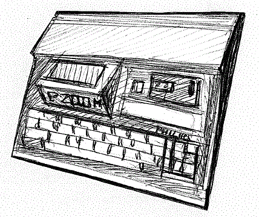

The Philips P2000 was a computer equipped with a microcassette tape storage system.

While the P2000C was mostly a CP/M system (see the proper section), the P2000T and P2000M were mostly used in conjunction with a BASIC language cartridge, most probably developed by Microsoft.

The P2000T display output was built around the SAA5050 video chip, originally designed to be embedded in the TV sets to provide the TeleText service, and was able to show coloured semi-graphics block and text.

The P2000M had an MC6845 video chip to display 80 columns monochrome text

# Quick start

	zcc +p2000 -create-app -lm program.c

--or--

	zcc +p2000 -subtype=ansi -create-app -lm program.c

# Emulator hints

The p2000 option in the appmake tool is meant for the [m2000 emulator](http://www.komkon.org/~dekogel/m2000.html) written in 1996 by Marcel de Kogel.

This emulator has been recently ported to the Allegro 5 library.   [This latest update ](http://www.freewebs.com/stefanob/emulators.htm)does not add extra functionality but the "window stretch" feature and the extra compatibility gain.

