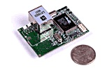

#  Rabbit Control Module 2000, 3000, 4000

This port is mostly from Erik Brage.
It has been currently tested only on Linux environments only.

Note that no new information has been entered on the page since 2007.

## Introduction

The **//Rabbit Control Modules//** are near-Z80 compatible boards still produced.
The boards were manufactured by a California based company called Z-World (www.zworld.com).
Notes on the processors themselves were in www.rabbitsemiconductor.com.

Rabbit was swallowed by Digi Embedded Solutions (www.digi.com) around 2010.
All data should still be available, but may require some digging.
Google may also fare better than the site search/index.

## Using Z88DK

If you have a Unix/Linux system you can compile the utilities in [z88dk/support/rcmx000](https://raw.githubusercontent.com/z88dk/z88dk/master/support/rcmx000/) with the make command.

### Example programs

The example programs are in [z88dk/examples/rcmx000](https://raw.githubusercontent.com/z88dk/z88dk/master/examples/rcmx000/).
A Makefile is provided for the Unix users.

### The download utility (boot)

You should be able to run the [boot](https://raw.githubusercontent.com/z88dk/z88dk/master/support/rcmx000/boot.c?view=markup) program, either directly or by including this also into your PATH.

'boot' on its own on a command line will give a short hint of its usage.
The lines run_example: and run_baudmeas in the Makefile should also give you a hint on how to use this tool.

### Obtaining your baudrate

Since the Rabbit serial boot loader derives its clock speed from the CPU clock it is necessary to measure the baud rate in order to set it to some other speed than the hw supported bootstrap speed of 2400 baud.  The bootstrap baudrate is always the same since it is derived from other means.

What needs to be set is the baudrate divisor, which will be different for different clocks.

The [baudmeas.c](https://raw.githubusercontent.com/z88dk/z88dk/master/support/rcmx000/baudmeas.c?view=markup) and [baudmeas.asm](https://raw.githubusercontent.com/z88dk/z88dk/master/support/rcmx000/baudmeas.asm?view=markup) routines will do this for you, replace the ttyXXX in the Makefile and run 'make run_baudmeas', *NOTE* This will download several kBytes of data at 2400 baud so it will take about 19-20 seconds to complete.   Be Patient!!!   The good news is that this needs to be run only once for each new target!

If it takes longer than that, you might want to check your cabling the power supply to the rabbit board, if you are using the correct serial port etc.   It has also proved necessary in some cases to initialize the serial port, via the 'minicom' program once after each reboot.

If all goes well you should see a few lines of text and after that a number will be presented to you, it will be 120 for clocks of 9.216 MHz and 192 for clocks of 14.745600 MHz etc.

### Example programs

Now that you know your baudrate divisor you can patch that into the Makefile at the run_example line.

Run this example via the 'make run_example' command line. The [example.c](https://raw.githubusercontent.com/z88dk/z88dk/master/examples/rcmx000/example.c?view=markup) program will ask you to enter a few characters and then `<enter>`

The example.c program will then echo the characters one-by-one including the newline character, thus demonstrating rudimentary stdio capabilities.

Another example program, valid only for the Rabbit 2000 boards, is the [twinkle2000.c](https://raw.githubusercontent.com/z88dk/z88dk/master/examples/rcmx000/twinkle2000.c?view=markup) It will set the output bits of port "A" on the processor to flash on and off each second (using the RTC to get the timing).

The final example program will flash the diodes on the Rabbit 3000 dev boards, located on port PGx, surprisingly named twinkle3000.c ;-)

## Hardware notes

### Rabbit development boards

There are a number of evaluation and developement boards available.
If you need info, lookup www.rabbitsemiconductor.com

### Download cable

The download cable converts between the hosts rs232 line to logic levels suitable for the Rabbit boards.

**Build your own stuff**

Just by taking a Core module and some 0.1" adapter wings it is quite simple for the average home-electronic-hobbyist.

Just solder together the adapter wings that convert from the Core modules 1.0 mm spacing to 0.1" suitable for a breadbord.

The only pins on the breadboard that need connecting for the Core module to start is the VCC and GND pins (and the programming cable of course ;-) )

Beware!! the voltage required is different for different Core modules.
Some, like the RCM2000 series requires 5V and others, like the RCM3000 requires 3.3V, if you fry something, don't blame us !!!

The download cable is not rocket-science either, it is possible to use some simple logic converter, like a MAX232, the most troublesome part might be to find a 1mm spaced 10-pin connector.

To test the module you can run the example.c program provided in the examples/rcmx000/ directory.   If you want something more visible, it is easy to connect a LED to one of the port pins, using a suitable current limiting resistor of about 330 Ohm

## Todo's

**Warning:  This section might be partially outdated since the Rabbit platform support is being improved.**

#### Rabbit specific mnemonic support

Only the changes absolutely necessary for the compiler to produce valid assembler output is currently implemented.
For instance, the ioi and ioe mnemonics necessary to program the Rabbit's I/O must be written using DEFB directives, look at the example codes and also the file "bootstrap.asm" for ideas.

Also the interrupt handling mnemonics etc are not handled in the assembler.

#### Native multiplication etc. support

The Rabbit has a number of nice features not found in the Z80 series, (at least not in the offical version), such as multiplication.  This is not still used since it requires alterations to the compiler.

#### Persistent storage (flash)

When using the almost-native compiler, Dynamic-C, for the Rabbit boards, it automatically stores any program written into the on-board flash so that if the rabbit is disconnected from the programming cable it will start to execute that code by itself when power is applied.   No code to handle the flash has so far been written.

#### >64k memory model

The Rabbit processors are capable of adressing 1M of total memory using an efficient bank-switching scheme.  This is not used currently and the programs are limited to max 64k.
See the www.rabbitsemiconductor.com site for more documentation on the segment registers.

#### Drivers

Only rudimentary support for stdio has been implemented so far; in order to use any other cool features, such as ethernet, PWM modulation or just simple bit-banging I/O, driver code has to be written. The #asm directive of the z88dk can be used for writing to registers setting up interrupts etc.

#### Debugging

Always a hot issue, the best solution is to implement the NoICE protocol ( http://www.noicedebugger.com ) to enable assembler, or at least hex-monitor debugging.
This is not so much work, but one also might want C-level debugging which is a larger project.

#### Support for other host-OS than Linux

It should not be that hard to make this run on any machine with a decent C-compiler and a serial port, the code for downloading via serial line is not so large.  One needs to be able to change the baudrate on-the-fly and also to control the DTR line directly since it resets the target.

