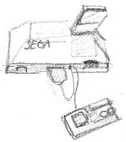

## Hardware specs

* Z80 @ 3.58Mhz
* ~16k RAM
* 16k VRAM (VDP like)
* 8k Bios ROM
* SN76489 PSG

## Classic library support (`+coleco`)

* [ ] Native console output
* [ ] Native console input
* [x] ANSI vt100 engine
* [x] Generic console
    * [x] Redefinable font
    * [x] UDG support
    * [x] Paper colour
    * [x] Ink colour
    * [x] Inverse attribute
    * [x] Bold attribute
    * [x] Underline attribute
* [ ] Lores graphics
* [x] Hires graphics
* [x] PSG sound
* [ ] One bit sound
* [ ] Inkey driver
* [ ] Hardware joystick
* [ ] File I/O
* [x] Interrupts
* [ ] RS232

## Quick Start

    zcc +sms -create-app -o program.bin program.c

    zcc +sms -create-app -lgamegear -o program.bin program.c

'program.sms' will be built

## Generic console

The generic console only supports the 3 modes in common with the [TMS99x8](Classic-TMS9918) chip.

## Emulators

* [Emulicious](https://emulicious.net)
* MAME/MESS
* [MEDNAFEN](https://mednafen.github.io/)

### Example usage

    mednafen -force_module sms program.sms
    mednafen -force_module gg  program.sms
    mame sms1 program.sms
    mame gamegear program.sms

## Links

["stevepro studios" - z88dk Programming related articles](http://steveproxna.blogspot.it/search/label/z88dk)

[King Kong game](http://hirudov.com/sega/KingKongSMS.php)

[Thread about using sprites on SMS and z88dk](http://www.mastersystem-france.com/t1686p30-programmation-master-system-en-assembleur-variante-en-c) (French)

[Haroldo-OK website, some game for the SMS is written with z88dk](http://www.haroldo-ok.com/)

[SMSBomberman preview (YouTube video)](https://www.youtube.com/watch?v=akYolXhhL1Q)

