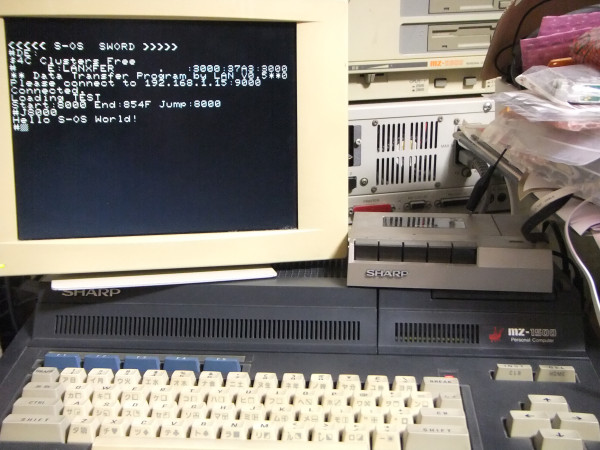

======= S-OS (The Sentinel) =======

S-OS is a simple but highly portable monitor with minimal console functionalities and a simple file access interface, enough to support text based interactive fiction games.
It was thought for systems having little or no ROM memory on lower positions accordig to what was known as the "Clean Computer" philosophy.

It was presented in the "Oh!X" magazine, in a section called "The Sentinel" in 1986 and in the following years it was ported to many Japanese z80 based computers.   

======= Quick start =======

    zcc +sos -lndos -oadva -create-app adv_a.c

-- or --

    zcc +sos -lgendos -lmalloc -DAMALLOC -oadva -create-app adv_a.c

You'll get a raw data file (adva.bin) and the same program with an S-OS style header (adva.obj).

Otherwise the "Sharp MZ tape format" can be chosen:

    zcc +sos -subtype=mz -lndos -oadva -create-app adv_a.c

After the program being loaded (#L adva.obj), the user can pass the parameters in the "Jump" call (#J 3000 `<parm1>` `<parm2>`, etc).

The program location can be changed with the "-zorg=" option

======= Existing S-OS versions =======

Wikipedia lists the following machines being supported:

Sharp MZ-80K/C/1200

Sharp MZ-700 / 1500

Sharp MZ-80B / 2000 / 2200

Sharp MZ-2500/2861(MZ-2500 mode)

Sharp X1/C/D/Cs/Ck/F/G/Twin (two different implementations)

Sharp X1turbo/II/III/Z/ZII/ZIII 

NEC PC-8001/8801 

Sony SMC-777C

Toshiba PASOPIA

Fujitsu FM-7 / 77 (Z80 extension card)

Sharp X68000 (emulated Z80)

PC-286 (emulated Z80)

MSX 2 / 2+ / turboR

Casio FP-1000 / 1100 

Windows 32 bit (emulated Z80)

Sharp calculators PC-G850/S/V/VS

# S-OS quick guide

#### Directory

#D [`<device name>`:]

#### Change default device (S=startup, A=tape..)

#DV `<device name>`:

#### Jump to address (and run program)

#J `<address>`

#### Load the program

#L `<filename>`[:`<address>`] 

#### Load and run the program at once

#(space)program.obj

#### Enter the mahine specific monitor

#M

#### Delete the file

#K `<file name>` 

#### Save a memory block to file

#S `<filename>`: `<start address>`: `<end address>`[: `<execution address>`]

#### Exit from S-OS and reboot

#!

### Links

Google translator might be your friend, here..

http://www.retropc.net/ohishi/s-os/    (http://www.retropc.net/ohishi/s-os/z88dk.htm)

http://homepage2.nifty.com/akikawa/sword/index.html

http://ja.wikipedia.org/wiki/Oh!X

http://www16.ocn.ne.jp/~ver0/g800/#sos

