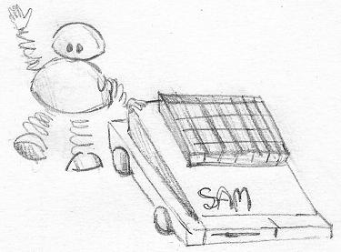

# Hardware

* Z80B @ 6Mhz
* 256/512kb RAM + extensions
* SAA1099 sound generator

## Classic library support (`+sam`)

* [ ] Native console output
* [ ] Native console input
* [x] ANSI vt100 engine
* [x] Generic console
    * [x] Redefinable font
    * [x] UDG support
    * [x] Paper colour
    * [x] Ink colour (8 bit colour mod)
    * [x] Inverse attribute
    * [x] Bold attribute
    * [x] Underline attribute
* [ ] Lores graphics
* [x] Hires graphics
* [ ] PSG sound
* [x] One bit sound
* [ ] Inkey driver
* [ ] Hardware joystick
* [ ] File I/O
* [x] Interrupts
* [ ] RS232

_This platform is currently getting some long overdue love, the state of the repo and this page may be out of sync_

# Quick start

    zcc +sam -lm application.c -startup=3 -create-app

A .MGT disc image will be created suitable for insertion into an emulator
or writing to a physical disc.

To add the required SAMDOS file to disc, obtain a copy of it, name
it auto.bin and use the command line:

    zcc +sam -lm application.c -startup=3 -create-app -Cz--bootfile=auto.bin

# Memory models

-startup=3: Loads the program to C+D, screen into A+B
-startup=2: Will load the program to A+B, screen into C+D
-startup=1: Uses MODE 1 from a BASIC environment

It is intended that banked calls will be available.

# Screen modes

All 4 screen modes on the SAM are supported, to switch between them
use the following code:

    int  mode = 2;
    console_ioctl(IOCTL_GENCON_SET_MODE,&mode);

The screen modes are presented as they are for SAM Basic, that is
with mode=1 representing the +zx compatible mode and 4 being the
high colour screen mode.

_An alternative method of setting the screen mode will be added_

# Graphics support

Pixel based operations and primitive drawing is supported.

# Emulator notes

Use the [SimCoupé](http://www.simcoupe.org/) emulator or the [latest development builds](https://github.com/simonowen/simcoupe), press F4 and you can import any binary in the file system to any given BASIC address of the SAM Coupé.  For example, use 32768 as the import address and when returning to BASIC you can just CALL 32768 to run the code.

# Real Hardware

You can use the *dskman* utility to save your files to a dsk-image which can be written out to a DD floppy and read by a real SAM Coupé.  

