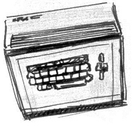

# Machine Specifications

* CPU: Z80 @ 3.579 Mhz
* VDP: TMS9918, 16k VRAM
* PSG: SN76489
* RAM: 1k (SG-1000), 2k (SC-3000) 
* ROM: 0k

The BASIC ROMs that are available supply more RAM and hence make RAM based programs possible.

# Quick start (BASIC)

    zcc +sc3000 -create-app -Cz--audio -oadventure adv_a.c

The binary converter (appmake) will create a file named "adventure.wav" (along with a totally usupported 'TAP' file).
Such file can be used on an emulator or loaded on the real hardware.
Optionally the loading speed can be tweaked with the '-Cz––fast' parameter (you use it at your own risk !).

### SF-7000 disk drive extension

    zcc +sc3000 -create-app -subtype=sf7000 -Cz--audio -oadventure -zorg=40000 adv_a.c

In this case we are preparing an object file for the SF-7000 extension, positioned at location 40000

### ROM mode option

    zcc +sc3000 -subtype=rom -omyrom.sc program.c

The ROM should also be compatible with the Sega SG-1000.

# Supported libraries

Most of the [monochrome graphics](library/monographics) lib and most of the [MSX](library/msx) functions are supported. Due to the different BASIC ROMs available, the library does not depend on any ROM routines.

# Emulator hints

### MAME (formerly MESS)

    mame sc3000 -cass1 a.wav -cart1 basic31.sc

.. LOAD, play tape, RUN

### Takeda Emulator

Create a ROM and then insert it.

# Links

* [Takeda Emulator](http://takeda-toshiya.my.coocan.jp)
* [Technical information - SG-1000](http://www43.tok2.com/home/cmpslv/Sg1000/EnrSG.htm)
* [Technical information - SC-3000](http://www43.tok2.com/home/cmpslv/Sc3000/EnrSC.htm)
