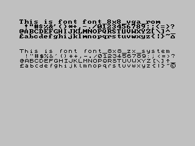

#  ZX Spectrum  Platform


## Hardware

* Z80 @ 3.54Mhz
* 48/128k RAM
* AY-3-891x (128k models only)


## Classic library support (`+zx`)

* [x] Native console output
* [x] Native console input
* [x] ANSI vt100 engine
* [x] Generic console
    * [x] Redefinable font
    * [x] UDG support
    * [x] Paper colour
    * [x] Ink colour (8 bit colour mod)
    * [x] Inverse attribute
    * [x] Bold attribute
    * [x] Underline attribute
* [ ] Lores graphics
* [x] Hires graphics
* [x] PSG sound
* [x] One bit sound
* [x] Inkey driver
* [x] Hardware joystick
* [x] File I/O
* [x] Interrupts
* [x] RS232

# Compilation

    zcc +zx -lndos -create-app adv_a.c

A .tap file will be produced suitable for use in emulator.

## Audio file generation

To get an audio file ready for the real hardware use the following command:
    zcc  +zx -clib=ansi -lm -create-app -subtype=wav program.c

Same as above but in turbo tape mode:
    zcc  +zx -clib=ansi -lm -create-app -subtype=turbo program.c

## Creating a bootable +3 disc

    zcc +zx -lndos -create-app adv_a.c -subtype=plus3

This command will create a bootable +3 disc suitable for autoloading from the main menu.

## Making a ROM

    zcc  +zx -subtype=rom -lndos -lm -create-app program.c

This command will compile the program at location '0', inserting a simplified interrupt handler (for the timer) and putting the system and the global variables just after the screen memory, appmake will be invoked to provide a 16K data block, fixed size. The image is suitable for burning onto an cartridge for use with Interface2.

Under some condition, with lots of preset data is provided, an option permits to compress the default values before storing them in the ROM:   -pragma-define:CRT_MODEL=2

## +3 Locomotive CP/M

    zcc  +cpm -startup=3 -lzxcpm -lm -create-app program.c

This command will compile the program in [CP/M](Platform---CPM) mode permitting the use of some of the ZX Spectrum sound and graphics extensions.

# 128k program generation

The classic +zx supports using the 128k banks for either code or data. When placing code, there is an assumed split of the memory space. If we take the default configuration where z88dk compiles to address `$8000`:

```
8000 - bfff = common page - contains library support routines
c000 - ffff = banks are paged in here
```

To place functions into banks, you should use the #pragma bank NN directive, where NN is a decimal number between 0 and 7.

Take care when placing data/code into banks - some of the banks are already used in the regular 48k address space.

z88dk supports generating .TAP files container banked data in addition to +3 disc images.

# Library support

## Console driver modes

### The standard ZX Spectrum console driver

The ZX console driver extends the [Generic Console](Classic-GenericConsole) and adds the following codes:

```
1,64	  - Switch to 64 column mode
1,32	  - Switch to 32 column mode
2,hh,ll   - Set the address of the 32 column font. ll is low byte, hh = high
	    byte. By default this points to the ROM font at 15616
18,x	  - Turn flash on/off (x=49/48 ('1'/'0')
19,x	  - Turn on/off bright 
```

All the commands, except for the font address can be embedded in strings using either octal or hexadecimal representation. Address changes can be sent either using fputc() or using printf with the address as parameters.

Characters greater than 127 are interpreted as udgs in 32 column mode.

It is recommended that the utility functions in `<conio.h>` are used to change text colours etc. Colours are indexed as per the colours in `<conio.h>`, to switch to native colour indices you can add the following option to the compile: `-pragma-define:CLIB_CONIO_NATIVE_COLOUR=1`

The screen scrolls when line 24 is "hit", the routine used is in the 48k ROM.

#### Fonts

By default the screen driver uses the ZX font for 32 column display and a custom one for 64 column
display. These can be easily changed at command line using a pragma directive:

    -pragma-redirect=CRT_FONT=<some label>

Or for the 64 column font:

    -pragma-redirect=CRT_FONT_64=<some label>

Some extra fonts are included within the classic library ZX library and can be activated using the
following pragma directives:

    -pragma-redirect=CRT_FONT=_font_8x8_bbc_system
    -pragma-redirect=CRT_FONT=_font_8x8_clairsys
    -pragma-redirect=CRT_FONT=_font_8x8_clairsys_bold

Alternatively, the font can be switched at runtime using the 0x02 escape code detailed earlier - to change the 32 column font, switch to 32 column mode and
similarly switch to 64 column mode to change the 64 column font.

The available fonts can be seen in the screenshots below:





### The ROM driver

The classic library can alternatively use the rst 16 routine within the ZX ROM. This is a compile time option and can be selected by adding the following to the command line:

    -pragma-redirect:fputc_cons=fputc_cons_rom_rst

The routine disables the scroll? feature and naturally supports all of the standard ZX control codes. ASCII value 0x0a (10) is mapped through to 0x0d (13) for line return compatibility. In this mode, only the standard 24/26 UDGs are supported.

### The FZX driver

Alternatively FZX fonts can be used as the console output, to enable them compile with the flag:

    -pragma-need=fzxterminal

The font can be configured with the following pragma:

    -pragma-redirect:CRT_FONT_FZX=_ff..

Where the font name is the same as defined by newlib.

Scrolling is handled by the screen routine in ROM3 once more.

### The VT/ANSI console driver

The ANSI driver provides a VT100 emulation, accepting escape codes that are compatible across the platforms that support the ANSI driver and of course unix terminals. It can be enabled by supply the option `-clib=ansi` to your compilation line.

The conio.h variant provided by z88dk is tightly interconnected to this driver and provides useful extra features like cursor positioning and detection of the current txt resolution.

The number of columns used by the ansi driver can be configured at completive using the option `-pragma-define:ansicolumns=XX`, where XX is one the following values:

     24, 28, 32, 36, 40, 42, 51, 64, 80, 85, 128, ROM24, ROM28, ROM32 and ROM36.

For example, the following command will compile the ansitest program with 64 columns:

    zcc +zx ansitest.c -create-app -lndos -clib=ansi -pragma-define:ansicolumns=64

You can switch to using the ROM font by specifying the following options to the compile line:

    -pragma-define:ansifont=15616 -pragma-define:ansifont_is_packed=0


## Math Libraries

The ROM calculator is supported by use of the `-lmzx` library. A more compact version of the library is available with `-lmzx_tiny` however this version lacks support for conversion to and from `long` variable types and parsing of scientific notation.

It should be noted that the ZX Maths libraries are of a lower precision than both _genmath_ and _math48_ and are also less performant. As a trade off, the amount of memory used is much reduced.


## File I/O

You can choose to link with a single library that implements file I/O functionality. 

### Spectrum +3 or Residos

    zcc +zx file.c -lp3

or:

    zcc +zx -DRESIDOS file.c -lp3

### Microdrive Support

Interface 1 can be supported by both the [generic basic driver](Platform-ZX-Basic-Driver) and a lowlevel library that will talk to the Interface 1 directly.


    zcc +zx file.c -lzxmdv

When using zxmdv.lib you'll have a very powerful tool, because the library talks to the Interface 1 at a very low level, permitting a true random access, and a real rename functionality (the only one we're aware of being able to rename files as big as the whole cartridge).
The library has been tested on the real hardware.

The number of contemporairly open file is limited only by the tape and the memory available space, but to achieve this the _malloc_ functions is used (see documentation for malloc).

The files created via the **open** function are of the so-called "PRINT" type, which means that you can create and edit them also with the BASIC OPEN command.


### ZX Basic Abstraction

To support the many disc systems that are available for the Spectrum, a [generic basic driver](Platform-ZX-Basic-Driver) can be linked in. You will have to implement the BASIC program yourself and adapt to your disc system.

## ZX Library Features

### Calling Basic

Basic routines can be called using the routines in the `[<spectrum.h>]`(zxbasic) header file. 

### Interface 1 (`<zxinterface1.h`> `-lzxmdv`)

Low level access to microdrives is available by linking to the `zxmdv` library. The library requires a working `malloc() heap.`

### Data Structures

All the Interface 1 data structures used for operations on "streams" begin in the same way.

The common heading is the defined separately:


```c
    struct BASE_CHAN {
            u16_t   errptr1;        /* first pointer to main ERROR-1     */
            u16_t   errptr2;        /* second pointer to main ERROR-1    */
            u8_t    id_char;        /* inverted or regular "M"/"N" char  */
            u16_t   out;            /* pointer to the output routine     */
            u16_t   in;             /* pointer to the input routine      */
            u16_t   len;            /* length of channel                 */
    }; 
```
### ZX Microdrive

This group of functions mainly work by calling directly the low level portion of the ROM routines (which are automatically localized for the three existing firmware versions) to overcome some limitations and bugs.
The sector-seek loop has been totally recreated to avoid the BASIC interpreter imposing itself when an I/O error occurs.

The buffers aren't stored before the BASIC program area anymore (they are part of the C data structure) and the number of files being opened at once is limited by the tape and memory space only.

The sectors can be identified both as a unique block in the whole tape and as a specific record in a file.  They can be loaded, created or modified an then saved on the same or on a different sector.

The core element to access to a sector is the "channel definition", which include the stream properties and the sector buffer and some trailing data permitting advanced file operations (lseek, etc):


```c
    // M_CHAN is 603 bytes long
    struct M_CHAN {

            // base channel descriptor
            struct  BASE_CHAN base;

            // "M" channel specific stuff
            u16_t   bytecount;      /* (IX+$0B) Count bytes in record */
            u8_t    record;
            char    name[10];       /* file name */
            u8_t    flag;
            u8_t    drive;          /* drive number (0-7)*/
            u16_t   map;            /* Address of MAP for this microdrive.*/
            char    hdpreamble[12]; /* 12 bytes of header preamble */
            u8_t    hdflag;
            u8_t    sector;         /* sector number */
            u16_t   unused;
            char    hdname[10];     /* cartridge name */
            u8_t    hdchk;          /* Header checksum */
            char    dpreamble[12];  /* 12 bytes of data block preamble */
            u8_t    recflg;         /* bit 1 set for EOF, bit 2 set for PRINT file type */
            u8_t    recnum;         /* Record number in the range 0-255 */
            u16_t   reclen;         /* (IX+$45) Number of databytes in record 0-512 */
            char    recname[10];    /* file name */
            u8_t    recchk;         /* Record  description checksum */
            char    data[512];      /* the 512 bytes of data. */
            //char    datahd[10];   /* first 9 bytes of the 512 bytes of data. */
            //char  data[502]       /* real program */
            u8_t    datachk;        /* Checksum of preceding 512 bytes */

            /* These values are added for the file handling
               the ROM shouldn't overwrite those fileds */
            long    position;       /** NEW** - current position in file */
            int     flags;
            mode_t  mode;
        };
```
#### Functions - Diagnostics

`int if1_from_mdv()`

Returns true if the current program has been loaded from microdrive

`int if1_installed()`

Returns true if the system variables are already present

`int zx_interface1()`

Returns true if the Interface 1 is present

#### Functions - Microdrives

`int if1_load_record (int drive, char *filename, int record, struct M_CHAN *buffer)`

Load a sector identified by file name and record number, returning the current sector number, or '-1' if any error.

*An M_CHAN buffer structure pointing to a valid memory space must be passed.*

`int if1_load_sector (int drive, int sector, struct M_CHAN *buffer)`

Load a sector identified by the specified sector number returning the sector number being loaded, or '-1' if any error.

*An M_CHAN buffer structure pointing to a valid memory space must be passed.*

`int if1_write_sector (int drive, int sector, struct M_CHAN *buffer)`

Write the sector present in "buffer", returning '0' if everything goes fine, '-1' on error.

*An M_CHAN buffer structure pointing to a valid memory space and initialized with the proper values must be passed.*

`int if1_write_record (int drive, struct M_CHAN *buffer)`

Add a record containing additional data in "buffer", returning '0' if everything goes fine, '-1' on error.

*An M_CHAN buffer structure pointing to a valid memory space and initialized with the proper values must be passed.*

`int if1_setname(char* name, char *location)`

Put a 10 characters file name at the specified location; return with the file name length

`char *if1_getname(char *location)`

Pick the file name at the given location and convert it into the C standard string format.

`int if1_remove_file(int drive, char *filename)`

Delete a file

`int if1_touch_file(int drive, char *filename)`

Create a file if it doesn't exist

`int if1_init_file (int drive, char *filename, struct *M_CHAN buffer)`

Create a file and return a file handle.

*An M_CHAN buffer structure pointing to a valid memory space must be passed.*

`void if1_update_map (int drive, char *mdvmap)`

Load the map values for the specified drive

`int if1_find_sector (int drive)`

Find a free sector

`int if1_find_sector_map (char *mdvmap)`

Find a free sector in the specified map

### Opus Discovery (`<zxopus.h>`)

Support for the Opus Discovery is built into the zx library.

#### Functions - Joystick

`void set_kempston (int mode)`

Sets the kempston emulation (1=on, 0=off)

`int get_kempston ()`

Gets the kempston emulation status (1=on, 0=off)

#### Functions - Disk

`int opus_getblocks (int drive)`

Gets the number of sectors

`int opus_getblocksize (int drive)`

Gets the sector size

#### Functions - Parallel Port

`void opus_lptwrite (unsigned char databyte)`

Sends a character to parallel port

`unsigned char opus_lptread ()`

Reads a character from the parallel port

### TRDOS/Betadisk support

### ZXMMC Support

### Currah uSpeech Support

The Currah uSpeech is supported using the `[<zxcurrah.h>]`(zxcurrah) header file.

### Low resolution (32x48 or 64x48) Graphics

A low resolution colour graphics mode is available using the `[<zxlowgfx.h]`(zxlowgfx) header file. This feature is unfortunately not fully
librarified and the header file contains the implementation.

### SP1 Sprite Library

The [sp1](sp1) sprite library is available in the classic library.

### Mouse Support

Direct access to both Kempston and AMX mouse hardware is defined in the `<spectrum.h>`  header file. 


## The 'appmake' tool

### Appmake Extras

The appmake tool can be run in “dumb” mode to generate the corresponding audio track of some external program. 

In example:

	appmake +zx -b cassette.tap --audio --fast --dumb

Builds the audio track for the given '.tap' file.
The optional ”fast” flag will produce a non-standard audio track which, even if faster, should be still loadable by the real computer. 

An advanced feature can glue together binary blocks to get a ready made package; in example:

	appmake +zx -b program.bin --org 32752 --screen screen.scr --fast --extreme -o program.tap


The screen can be passed in 'tap' or 'tzx' format too.


### Links

[Death Star game, ZX Interface 2 ROM version](http://www.fruitcake.plus.com/Sinclair/Interface2/Cartridges/Interface2_RC_New_3rdParty_DeathStar.htm)

[Black Star game, a Space Invaders clone + sources](https://www.usebox.net/jjm/blackstar/)

[Introducción a Z88DK (Spanish)](http://wiki.speccy.org/cursos/z88dk/contenidos)