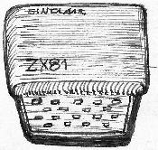
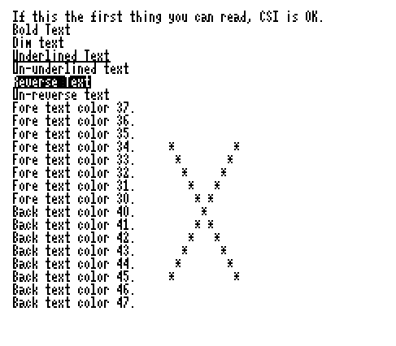

The Sinclair ZX81 is one of the smallest (in terms of power) platforms supported by the Z88DK.

Starting from z88dk v1.8 the actual port has been greatly improved.

# Quick start

zcc  +zx81 -lzx81_math -create-app program.c

--or--

zcc +zx81 -lm -create-app program.c

The latter option will use the ROM for Floating Point, which will produce small but slower and less accurate code.

# Compiler hints

The programs will work in SLOW mode by default; to run your program in FAST mode, the "-subtype=fast" flag is required.  By default the compiler inserts new interrupt handlers, protecting the registers needed by the z88dk programs while the screen is being refreshed, the subtype option helps choosing the desired one:

The following SUBTYPE options (use ”-subtype=xxxx”) are available: 

*  default (or unspecified): "-startup=2" mode, the common SLOW text mode, used also by the Memotech and G007 High Resolution Graphics drivers

*  fast: no handler

*  wrx, wrx64, _wrx, _wrx64: High Resolution Graphics modes, Wilf Rigter's mod

*  gray: two 64 line GFX pages being interlaced in WRX mode

*  chroma, _chroma, chroma64, _chroma64, chromag: similar to WRX and gray libs above + colour attributes area

*  arx, arx64, _arx, _arx64: High Resolution Graphics modes, Andy Rea's mod

The following CLIB options (use "-clib=xxxx") are available:

*  (default): lo rez graphics, default clib

*  udg: mid rez graphics (64x72), default clib.  Requires a mod permitting to redefine the ZX81 font.

*  ansi: ANSI VT emulation in WRX mode, 192 lines HRG lib is included, also good in chroma mode

*  arx, arx64: default clib, 192/64 lines HRG in ARX mode

*  wrx, wrx64: default clib, 192/64 lines HRG in WRX mode, also good in chroma mode

*  wrxansi, wrx64ansi: ansi VT emulation, 192/64 lines HRG in WRX mode, also good in chroma mode

*  mt, mt64: default clib, MemoTech HRG modes

*  g007: default clib, G007 HRG mode (requires the HRG being set up from BASIC:  CLS 2 / SLOW 4)

The default math library does not work due to the fact the IY register is used so specific libraries are provided:

*  zx81_math: bigger but much faster library, all the functions are provided by z88dk

*  m81: much smaller and slower library, all the computations happen in ROM

*  m81_tiny: even smaller lib, some formatting/precision setting trick is excluded

I.E. include "-lm81" in your command line.

Programs cannot easily be run over the first 16K memory limit: the RAMTOP is not positioned automatically over it.  There is also a further problem when running in HRG mode, a special character vector declared in the startup code need to be kept in that limit too.

Z88DK is capable of running in graphics mode with a small hardware modification to the memory expansion, known as the Wilf Rigter's WRX mode.
There are many ways to modify your memory circuitry to make the High Resolution work; here is a link to the original [article](http://www.user.dccnet.com/wrigter/index_files/BMP2P.htm), explaining (at the end) how to do it easily with the original 16K RAMPACK expansion.

The High Resolution can be activated by passing a value greater than 2 to the "startup" parameter, in example:

    zcc +zx81 -subtype=wrx -clib=ansi -lm81 -create-app program.c

..will enable the 256x192 graphics in WRX mode and the ANSI VT emulation.

    zcc +zx81 -clib=mt -lm81 -create-app program.c

..will enable the graphics in Memotech mode (no text support, sorry).

    zcc +zx81 -clib=g007 -lm81 -create-app program.c

..will enable the graphics in G007 mode (no text support, sorry).

If you are testing your program with the EightyOne emulator please be aware that at the moment only the earlier versions do correctly emulate the G007 and the MemoTech HRG boards.  Version 0.42 (TestZ) is a good option for the Memotech board; the 1.0 (Test a) can still support the G007 but already fails with Memotech.

See also the [HRG section](library/zx81#high_resolution_library_related_functions) of the [ZX81 library description page](library/zx81). 
It contaings important informations on how to manage the memory locations for the HRG page.

### Startup modes

Using directly the startup modes is not normally necessary: the -subtype=____ and -clib=____ do it transparently;
by the way such reference list can be useful for advanced tricks.

 1.  FAST mode, no video output while the program runs
 2.  SLOW mode, no high resolution, or combined with gfx81mt192.lib or gfx81mt64.lib (Memotech), or gfx81g007.lib
 3.  256x192 WRX HRG, when program ends press SPACE to go back to text mode.
 4.  256x192 WRX HRG, text mode is restored immediately when progam ends.
 5.  256x64 WRX HRG (faster), when program ends press SPACE to go back to text mode.
 6.  256x64 WRX HRG (faster), text mode is restored immediately when progam ends.
 7.  256x64 Grayscale HRG, (see the [gray lib](library/graylib) section), this trick has heavy limits.
 8.  ..
 9.  ..
 10.  ..
 11.  ..
 12.  ..
 13.  256x192 ARX HRG, when program ends press SPACE to go back to text mode.
 14.  256x192 ARX HRG, text mode is restored immediately when progam ends.
 15.  256x64 ARX HRG (faster), when program ends press SPACE to go back to text mode.
 16.  256x64 ARX HRG (faster), text mode is restored immediately when progam ends.
 17.  ..
 18.  ..
 19.  ..
 20.  ..
 21.  ..
 22.  ..
 23.  256x192 WRX HRG + CHROMA81 ATTR, when program ends press SPACE to go back to text mode.
 24.  256x192 WRX HRG + CHROMA81 ATTR, text mode is restored immediately when progam ends.
 25.  256x64 WRX HRG + CHROMA81 ATTR (faster), when program ends press SPACE to go back to text mode.
 26.  256x64 WRX HRG + CHROMA81 ATTR (faster), text mode is restored immediately when progam ends.

Depending on the selected mode the "gfx81hr192/gfx81arx192" or the "gfx81hr64/gfx81arx64" graphics library can be used in place of the standard "gfx81" one.
If you desire to keep the standard text handling, you can use the "copytxt" function to mix the text with graphics.

### Speed measurements

Depending on the display mode specified (and thus the interrupt handler routine being activated) the ZX81 speed varies. 
The "bogomips" tool gives the following results, it is supposed the ZX81 in fast mode runs as fast as the ZX Spectrum:

 | SLOW mode   | (startup=2)           | 2200          | 
 | ---------   | -----------           | ----          | 
 | FAST mode   | (startup=1)           | Can't compute | 
 | WRX192      | (startup=3 or 4)      | 1100          | 
 | WRX64       | (startup=5 or 6)      | 2550          | 
 | ARX192      | (startup=13 or 14)    | 900           | 
 | ARX64       | (startup=15 or 16)    | 2400          | 
 | blank()     | all WRX and ARX modes | 3100          | 
 | ZX Spectrum | (for comparison)      | 7700          | 

### HRG Hardware hints

[ARX816 related article](http://homepage.ntlworld.com/deborah.clayton1/zx81+2.html)

The Alan's ARX816 HRG mode is based on a RAM expansion overlapping the ROM locations, in such a way to make the ROM accessible when the instructions have to be executed and the RAM when the data is being read/written.

The Wilf's WRX HRG mode uses a different trick.. the historical tweak is done with germanium diodes: *"The RAMPACK is modified to enable the data output at RFSH time by cutting the RD and RFSH lines at the edge connector and installing 2 only 1N34A Germanium diodes and a 4.7K pull-up resistor. Modify at your own risk!"*

Matthias Swatosh describes it: //"With this modification the refresh-signal to the ram-pack will be always high or disabled. The read-signal to the ram-pack is now
activ low either if the CPU generated a read or a refresh. This makes the ram-pack send the memory data to the bus when a refresh cycle happens. For normal operation of the computer or
the ram-pack this is regardles. The hrg-software on the other hand just needs these data to generate a graphic-video."//

He also suggests, since the Germanium diodes are now quite rare, to use "Schottky" diodes (a Wilf's late suggestion was the 1N5817) and to raise the resistor's value to 5.6K.

A variant of this scheme is described by Martin van der Zwan in his "The International ZX81 Magazine", issue two, October 1996.  Pitcure follows, but you should refer to the original article for details.

### UDG Mid Resolution mode hints

The mid resolution library is linked when the "-clib=udg" option is specified at compile time.
It will require an optional character redefinition mod or board for the ZX81.

The Y axis resolution is slightly improved, by refining the battenberg (checquered) font and squeezing 6 position in a char instead of 4 and thus permitting a pseudo-graphics resolution of 64x72 points.  Sadly with this trick text and graphics can't be mixed;  clg() will load the necessary "graphics font", to restore the text mode, use the following instructions:

    #asm
    ld      a,$1e
    ld      i,a
    #endasm

By default the RAM for the redefined font is expected to be at position $3000 (good, in example for an expanded dk'Tronics board), but it can be redefined.
The way to define a different default value in a C program is to use a #pragma directive, i.e. to load the battenberg font at position $8400 as for the QuickSilva expansion :

    #pragma output hrgpage=132

Such predefined value can by the way be changed also by the user, after loading the program, by POKEing at address 16518.

[More on the ZX81 character expansions](http://problemkaputt.de/zxdocs.htm#zx81videononstandardudgchrsexpansions)

### Repositioning SP in TEXT mode

Text only applications can move the Stack Pointer on a higher location if a 32K expansion is present.
This can be useful for recursive and in general stack demanding applications.

Just add the following line in your C program:

    #pragma output STACKPTR=49151

-- or use the equivalent option at compile time:

    -pragma-define:STACKPTR=49151

The original SP value will be restored on exit.

### The VT/ANSI console driver

In High Resolution mode it is possible to have a full featured VT/ANSI emulator, with extra ASCII characters and visual attributes.
When the 256x192 mode is used it can have exactly the same resolution as the ZX Spectrum (with the exception of the colors).
The conio.h variant provided by z88dk is tightly interconnected to this driver and provides useful extra features like cursor positioning and detection of the current txt resolution.

#### How to change the font size in the VT/ANSI emulation library

The selection of columns is now a link time option, for example with ansi test you can compile as follows:

   zcc +zx81 ansitest.c -create-app -lndos -subtype=_wrx64 -clib=wrxansi -pragma-define:ansicolumns=64

Valid columns in WRX and ARX mode are:

    24, 28, 32, 36, 40, 42, 51, 64, 80, 85, 128.

When possible the library will be built with a "packed" font to save memory.

If you have 32K or more you can move the "graphics" page on the upper half, e.g.:

    -pragma-define:hrgpage=36096

If you need to save further space, you can rebuild the graphics libraries to use the standard ROM font (note that no undercase letters will be displayed in that case: a converter will re-map the missing symbols).
THIS LAST OPTION IS FOR EXPERT USERS ONLY and requires the ROMFONT option set for "ansi/zx81/f_ansi_char.asm".

# Appmake extras

The appmake tool can be run in "dumb" mode to generate the corresponding audio track of some external program.

    C:\>appmake +zx81 --dumb --audio -b MAZOGS.P
    
The optional "--fast" flag will produce a non-standard audio track which, even if faster, should be still loadable by the real computer.

# Supported clones

All the ZX81 clones are compatible to the z88dk generated code, including the Ringo R-470.

The "Lambda 8300" family can achieve the ZX81 compatibility with a ROM retrofit.

# Links

[Tutorial from the 'zx81.de' team](http://www.sinclairzxworld.com/viewtopic.php?f=6&t=1043)

