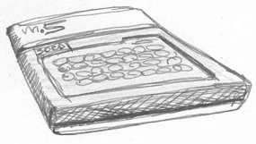

AKA Gold Star Electronics FC-150 (Famicom-150).

The stdio library has been tested with the "Integer BASIC" cartridge extension.

# Quick start

    zcc  +m5 -lm -create-app -Cz--audio program.c

This will create both a 'CAS' and a WAV file, for emulators or the real hardware.
To load and run the program use the SORD BASIC 'TAPE' command.
To load a program with no BASIC cartridge is possible, the IPL ROM expects the tape to be played, no extra commands are necessary.

# Hints on emulators

The Takeda's emulator supports the WAV files only and features an accelerated load process.
Choose the file to be loaded in the 'tape' menu, then play the file.   No return message is provided when the loading phase is completed, but it is expected to last a couple of seconds:  keep an eye on the frame counter and the CPU percentage in the title bar and wait it to be reasonably stable to be sure the file was transferred, then go back to the 'tape' menu and close the file to permit the program to start.

# Old hints for the emulator by Joseba Epalza.

zcc  +m5 -lm -zorg 29696 program.c

This will create a binary file.

To upload something on the emulator use the "inject utility" from the /support/generic folder.

	- run the emulator
	- press F3 to save a clean RAM image
	- exit from emulator (ESC)
	- rename dump.ram to dump.img
	- compile a program  (zcc +m5 hello.c)
	- "inject" the program into the RAM dump (inject a.bin dump.img 1024 dump.ram)
	- run the emulator
	- press F4 to load the modified RAM dump
	- type "call 29696" and enjoy !

