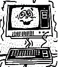

## Introduction

The TRS 80 microcomputer was born in the USA in 1977.

It has many features in common with the British NASCOM computers and the Swedish ABC 80, expecially related to the way the Video and the Tape transfers are managed.

Many companies all around the world produced [clones of such system](http://www.trs-80.com/wordpress/trs-80-computer-line/clones/); most of them will work with the current z88dk port.

## Building applications

The output code can be optionally relocated, but its default position is at $5200, which fits in most of the hardware and software configurations.

### Quick Start

The following command will build a .CMD system file, ready for almost all the existing emulators:

    zcc  +trs80 -lndos -lm -create-app -subtype=disk program.c

The following command will build a .CAS file in 'system' binary format:

    zcc  +trs80 -lndos -lm -create-app program.c

Same as above but in WAV format too:

    zcc  +trs80 -lndos -lm -create-app -subtype=wav program.c

To load such program from tape first type 'SYSTEM' to exit BASIC, then at the '*?' prompt enter the program name (or its first letter) and press PLAY.

When the program is in memory, type '/' to run it.

To speed-up the loading a bit in WAV mode you can modify the appmake options, just edit {z88dk}/lib/config/trs80.cfg and insert the '-Cz--fast' parameter in the wav subtype section.   If necessary the volume can be raised too, with the "-Cz--loud" option.

## Extra Support Tools

#### cmd2cas

This is a GNU licensed program able to get a TRS-80 compatible cassette file.

It is no longer necessary, appmake now embeds the same functionality.

## Links

http://en.wikipedia.org/wiki/TRS_80

http://ht.homeserver.hu/html/english.html

http://www.classic-computers.org.nz/system-80/
