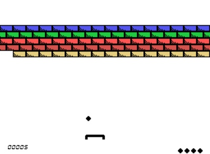
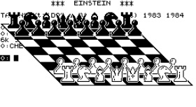

#  Tatung Einstein

The Tatung Einstein is a CP/M compatible platform, so the [same base library](Platform---CPM) can be used, but extra functionalities are available.




The Einstein video generated by a TMS9929A VDP, as a result the MSX libraries available.

### Command Line

    zcc  +cpm -lm -subtype=einstein -oPROGRAM.COM program.c -create-app

A .dsk image file will be created that can be loaded as the second disc in emulators. For example:

   mame einstein -flop1 dos80.dsk -flop2 PROGRAM.dsk

When the Einstein boots enter:

```
1:APP.COM
```

And your program will start. 

Alternatively, you can omit -create-app and use the [EDIP program](http://www.einstein.talktalk.net/edip.html) to create a bootable disc image.

Be sure to create upper case files to make them readable by the Einstein operating system.

### TK02 80 column card

The TK02 is supported via switching to mode 10 using `console_ioctl`, you'll need to start Mame as follows:

```
mame einstein -pipe tk02 -flop1 SYSTEM80.DSK
```

### Emulators

* Mame

### Web links

* https://web.archive.org/web/20121212082438/http://www.einstein.talktalk.net
* http://www.tatungeinstein.co.uk/