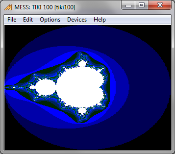

#  TIKI-100

The Tiki-100 is a CP/M compatible platform, so the [same base library](platform/cpm) can be used, but extra functionalities are available.
Library extras include the sound support for the Yamaha PSG chip and the BW graphics, at the incredible resolution of 1024x256.

Target specific tricks permit to draw in 4 or 16 color mode as well.

### Command Line

    zcc  +cpm -startup=2 -lm -ltiki100 -oPROGRAM.COM program.c

The "startup=2" option should be omitted if the graphics library is not used and when the resulting program size is > than 16K (more detail on how to enable the graphics lib follows).

### Graphics library hints

The actual BW graphics lib relies on the z88dk codebase and for technical reasons it is not possible to get it working correctly unless it is located over 32768.   The variables used by this library needed to be moved too.
C programs smaller than 30∼32K (including all the examples provided) won't work unless the code is big enough or the "-startup=2" relocation option is chosen (this latter option will work on max 16K big programs).

The graphics lib provides its own relocatable global variable declarations, so it is necessary to disable the default ones by:

    #pragma output nogfxglobals

- or -

    #include `<tiki100.h>`

The "-startup=2" option works sometimes as a quick workaround.

Obviously advanced programmers can find their way to deal with this limit, i.e. since the graphics data can be kept in the lower memory block splash pictures and extra graphics elements could be put on top.

### Emulator hints

Currently the best TIKI-100 emulator we know is [MAME](http://www.mamedev.org/).
Another good option is the [Djupdal's Tiki-100 emulator](http://www.djupdal.org/tiki/emulator/), even if it is currently less accurate (i.e. it lacks the sound support).

Both the emulators support the floppy disk images, so it is possible to edit a disk image and put the z88dk generated programs on it with a tool.    Please bear in mind the sectors in the floppy images are sorted logically, no sector skew needs to be considered (programs like 22DISK did this job already when the images were transferred from the original disks).

#### CPMTOOLS

We suggest to use the [CPMTOOLS](http://www.moria.de/~michael/cpmtools/) and edit an existing 200K or 400K disk image (the former KON-TIKI system versions don't support 400K disks).

First of all edit its "diskdefs" file and add a section:

	diskdef tiki400
	  seclen 512
	  tracks 80
	  sectrk 10
	  blocksize 2048
	  maxdir 128
	  skew 0
	  boottrk 2
	  os 2.2
	end

	diskdef tiki200
	  seclen 512
	  tracks 40
	  sectrk 10
	  blocksize 1024
	  maxdir 128
	  skew 0
	  boottrk 2
	  os 2.2
	end

To transfer a program on a disk image erase the previous copy and refresh it, i.e.:
    cpmrm -f tiki400 tikitpas.dsk 0:program.com
    cpmcp -f tiki400 tikitpas.dsk program.com 0:program.com

#### TikiDisk

A specific command line tool is also available ([tikidisk, by Asbjørn Djupdal](http://www.djupdal.org/tiki/emulator/)).

Supposing we are editing a disk image named "brage.dsk":

    tikidisk brage.dsk a a.com    <-- Add the 'a.com' file to the disk image (overwrite the existing copy if present)

