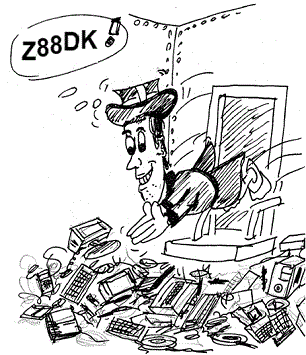

# Not Yet Supported Targets

In this page we're listing those z80 targets platforms which might be included in future.

Links are provided to help in studying them.

### Research Machines

##### 380Z

COS (Cassette Operating System) support is missing, but this machine can be used with the generic CP/M port.

##### LINK 480Z

ROS (Resident Operating System) was mostly compatible to COS, a resident BASIC interpreter was available as well as CP/M on the expanded systems.

Graphic modes: 640 x 192 monochrome, 320 x 192 (4 colours), 160 x 95 (8 colours)

### AC1 Amateur Computer

Self-built computer project invented by a HAM radio group in Berlin.

[www.ac1-info.de](http://www.ac1-info.de/)

### ACCESS / ACTRIX

Transportable computer (like OSBORNE, KAYPRO and OTRONA)

http://www.old-computers.com/museum/computer.asp?st=1&c=359
https://en.wikipedia.org/wiki/Actrix_(computer)

### Amstrad

Units sold (PCW series): > 8 Million

##### PCW 10

Great Graphical OS: 'Roseanne'

##### PCW 16

Great Graphical OS: 'Roseanne'

##### PCW 8256 / 8512, PCW 9256 / 9512 / 10

CP/M OS,  High Resolution Graphics capabilities

##### PDA 600

A pen-pad computer.  [Old rusty page with little technical insights](http://homepage.bg.bib.de/~bibhot/pda600/)

< 1 million units sold.

### Argo (USSR)

The MESS emulator emulates it, another Russian computer with the same name existed but it was a zx Spectrum clone.

### M.A.I. Basic Four series

[M.A.I. S10 Basic Four](http://www.obsoletecomputermuseum.org/mai/)

### BCS 3

[Eckard Shiller's BCS microcomputers](http://hc-ddr.hucki.net/wiki/doku.php/homecomputer:bcs3)

### Bondwell

They are CP/M systems. Support for their Speech Synthetizer could be nice, though.

##### FX-9000P

### Compucorp 600 Series

Proprietary operating system

### Datec

#### Electronic Notebook

NSC-800.   Battery powered, raised membrane keyboard with audio feedback (numpad and 11PF keys), 2 LCD text lines (40 columns), barcode reader, rs232, BASIC interpreter.
48K->504K RAM

### Epson

##### QX-10

Already supported as a CP/M system but deserving specific extras
High rez vector graphics engine (μPD7220).

### Erik

This is a z80 based clone of the "Specialist" russian computer (in turn built around the 8080 CPU).

[The Erik computer on the Micko's WIP blog](http://micko-wip.blogspot.it/2008_03_01_archive.html)

### Fujitsu

##### FM-16 Beta

Already supported as a CP/M system but deserving specific extras

##### Micro 16s

Already supported as a CP/M system but deserving specific extras

### GSX-80 - CP/M Graphics Extension

[GSX described in Wikipedia](http://en.wikipedia.org/wiki/Graphical_Environment_Manager#GSX)

recently written drivers and APIs for FORTRAN:  https://www.mh-aerotools.de/hp/

Few CP/M systems, were able to support graphics.
In the GSX documentation a GDOS software substrate is mentioned, but it leads to confusion because the same name was often used.

GSX (Graphics System eXtension) is a set of 32 "system calls" that get added to the BDOS and BIOS calls of a CP/M system, thus "extending" it (like CP/NET extends CP/M to provide Local Area Network capabilities).
It was available for CP/M (both 2.2 and 3.1), CP/M-86 (2.2 and 3.1), and MS-DOS and sort of portable, depending on the device drivers affinity.  The skeleton driver was built around the "Tektronix 4010" graphics terminal showing that any CP/M computer could virtually be capable of graphics if improved.   GSX eventually evolved into a GUI called GEM.

[GSX Programmer's Guide](http://bitsavers.trailing-edge.com/pdf/digitalResearch/gsx/GSX-80_Graphics_Extension_Programmers_Guide_Nov82.pdf)

[GSX described in the John Elliott's web site](http://www.seasip.info/Cpm/gsx.html)

[At bottom of this page in z80.de, GSX unofficial disassembly + others](http://www.cpm.z80.de/roche)

##### Epson QC-10 / QX-10 / QX-16

Already supported as a CP/M system but deserving specific extras
High rez vector graphics engine (μPD7220).

##### Fujitsu Micro 16s

[QX-10 CP/M Plus Supplied by MML Systems Ltd, supports GSX](http://fjkraan.home.xs4all.nl/comp/qx10/diskimages/README_qx10cpmplus.TXT)

### Jonos Anaheim
CP/M portable systems

#### Janos Escort C1100

#### Janos Escort C2100

##### Kyber Minus

[Kyber Minus presented in computerhistory.it](http://www.computerhistory.it/index.php?option=com_content&view=article&id=299&Itemid=170)

##### Dual Z80 "Lynx"

μPD7220 based video hardware.
[Japanese website describing the Lynx](http://www.chiaki.cc/Lynx/)

### Micro Source

#### M6000P
Transportable CP/M system with a 9" display (80x24 characters) and an ancient boot procedure via MONITOR commands.

### NANO

#### SKS 2500
German portable computer, 1982
http://www.old-computers.com/museum/computer.asp?c=211&st=1

#### SKS 2502 Nano

#### SKS 252 Pico

##### Ontel Amigo / Cortex C/WP

[An article..  yes it is greek !](http://www.retrovisions.gr/inv/topic/2481-%CF%80%CE%B1%CF%81%CE%BF%CF%85%CF%83%CE%AF%CE%B1%CF%83%CE%B7ontel-amigo-cwp-cortex/)
[The C/WP at old-computers.com](http://www.old-computers.com/museum/computer.asp?c=899&st=1)

##### SEMI TECH - Pied Piper
http://www.old-computers.com/museum/computer.asp?st=1&c=193

##### SMC CompuCase

Z80 or 8085 ??

CP/M computer in a briefcase.
40x12 plasma screen

##### Sperry Univac UTS series

##### Televideo TS-803

[A YouTube Video showing the GSX-80 capabilities](http://www.youtube.com/watch?v=otf6H8sGldA)

##### Televideo Teletote I

[TPC1, Teletote I, TS-80x and Televideos' BIOS source](http://bitsavers.informatik.uni-stuttgart.de/bits/Televideo/TPC-1/TPC1_CBIOS_Extr/TPCIDATA.MAC)

##### Televideo TPC-1

[TPC1 shown in an online museum](http://home.total.net/~hrothgar/museum/TPC1/index.html)

##### Visual Technology 1050

[The Visual 1050 at old-computers.com](http://www.old-computers.com/museum/computer.asp?st=1&c=842)

##### Amstrad 6128+

[Amstrad models and emulator drivers overview](http://www.seasip.demon.co.uk/Cpm/gsxint.html)

##### Amstrad PCW series

[A GSX setup tutorial in french for the PCW series](http://cpcrulez.fr/applications_CPM_introduction_a_GSX_CC.htm)

[MALLARD BASIC (for the PCW-8000 series) page, on its bottom GSX stuff is attached](http://www.fvempel.nl/basic.html)

### Husky Hunter

[Wikipedia page about the Husky Hunter](http://en.wikipedia.org/wiki/Husky_(computer))

[Some Husky 2 tech infos](http://www.seasip.info/VintagePC/husky2.html)

### Misc HomeBrew Z80 projects

[Link to www.z80.info](http://www.z80.info/homebrew.htm)

[digitarworld.uw.hu: a recent project, emulated by MESS](http://digitarworld.uw.hu)

_No way to load software onto the machine using Mame_

### Self Built ISA board for the IBM PC

[Gyro adds a homebrew Z-80 to his 486 PC..](http://www.cryogenius.com/hardware/z80board/)

### Luxor

The ABC800 support is still at an earlier stage.  Target specific extensions could be interesting.

##### ABC802

##### ABC806

### Mael Idea

They were mostly CP/M systems, but the model 1080 had a resident program only.

[A page related to the Idea computer at computerhistory.it](http://www.computerhistory.it/index.php?option=com_content&view=article&id=354&Itemid=172)

### Micro Office 100 / RoadRunner

http://vintage-laptops.com/?page_id=48&lang=en

### NEC

Already supported as CP/M and S-OS systems but deserving specific extras 

[NEC systems overview](https://classictech.wordpress.com/computer-companies/nec-home-electronics-usa-elk-grove-village-ill/)

[NEC systems overview, Retro Computer People, JP](http://www.geocities.jp/retro_zzz/machines/nec/index.html)
[PC-8801 on Wikipedia](http://en.wikipedia.org/wiki/PC-8801)

##### NEC Compo BS/80

Made in 1978, 7K RAM

##### PC-8001

##### PC-9801 family

##### PC-8005

    A great CP/M based portable

##### PC-8401 / PC-8500

    LCD Display, CP/M portable

    The PC-8300 is a Kyocera project, rebranded also by Olivetti and Tandy Radio Shack, the CPU shoulud be 8085 compatible (not Z80).

http://www.old-computers.com/museum/computer.asp?c=350
This document about the display of the PC-8201 could be valid also for the PC-8401: https://www.masswerk.at/rc2016/01/04.html

### Micronique Victor / Hector

Two series were made, tbe "Victor II" had more memory and better graphics.

### Micronic 1000

Micronic 1000 is a handheld terminal with infrared port and a small LCD display, 8 lines by 20 characters (160x64 dots) based on an Hitachi HD61830 controller.
Micronic was the UK subsidiary of Swedish Datronic AB; eventually Tandy acquired it.

### MYCOM Z80-A

Japan Electronics College MYCOMZ-80A. MC6845 based.

Blocked on understanding tape format.

### Nuova Elettronica Z80NE

[Z80NE WebSite](http://www.z80ne.com/)

### SORD

Some SORD systems had CP/M optionally but had their own "Sord DOS" too (the M5 is already supported by z88dk).

##### M-100ACE

##### M-170

##### M203 / M223

##### M23

Supported via the CP/M target port but featuring math and graphics extras

##### M243

As above

##### IS 11

Peaturing the PIPS spreadsheed as operating system, optional ROM could be added.

### Tesla SAPI 1Z

[SAPI models description at www.oldcomputers.wz.cz](http://www.oldcomputers.wz.cz/pocitace/JPR-1/JPR-1.html)

...Lots of infos at sapi.cz, [this is relevant](http://www.sapi.cz/sapi/doku2/mikrobasic.php)

##### Orion

##### Orion PRO

### Conitec Datensysteme - PROF 80 / 180

This one was compatible with the TRS80, but it'd be nice to add support for its GRIP (Graphical IO-Processor)

### Robotron / VEB Mikroelektronik

Robotron produced computers in the eastern Germany.   Their systems were powered by a Z80 CPU clone called U880.

The [The Java KC-Emulator](http://www.jens-mueller.org/jkcemu/) is probably the more stable and advanced tool, at the moment.     The website includes also lots of information.

The [KCemu emulator](http://kcemu.sourceforge.net/) in another powerful and advanced emulation suite, even if at the moment it is a step backwards compared to the one written in Java.   Moreover the Windows port is still slightly unstable.

[Ulrich Zander](http://www.sax.de/~zander/index2h.html) hobby pages.   Lots of technical information and software.

##### K1520-Computer Standard

Most of such systems were from Robotron, but some are from different manufacturers.

[list of computers of the K1520 standard family](http://www.robotrontechnik.de/index.htm?/html/computer/k1520.htm)

##### BIC A5105

The "A 5105" mounts a uPD7220 clone, called U82720.  It normally had floppy disks and a CP/M like OS

[A5105 page](http://www.robotrontechnik.de/html/computer/a5105.htm)

[PC1715 page](http://www.robotrontechnik.de/html/computer/pc1715.htm) (a slightly compatible system)

##### Computerserie Mansfeld MPC (Mansfeld Prozess Controller)

CP/M compatible, low and high resolution graphics might be supported

[MPC related page](http://www.robotrontechnik.de/html/computer/mpc.htm)

##### UDOS Operating System

[UDOS related page, German](http://www.robotrontechnik.de/index.htm?/html/software/udos.htm)

### Samsung

##### SPC-1500

Very close to the Sharp X1 rather than to the SPC-1000

[Korean website about SPC-1500](https://no-ssl.namu.wiki/w/SPC-1500) (if in trouble, use Google Translator)

### S-100 cards

There's plenty of them, probably all the Z80 cards support CP/M, but there's space for native support here and there.

A lot of expansions existed (video boards, I/O stuff, etc..): a possible approach is to provide tiny lib modules to link-in in a customized way.

### Sanyo

##### PHC-10, PHC-20, PCH-25

    PCH-10: (Built-in 1-line LCD screen)
    PCH-20: 4K of RAM, Tiny BASIC, 32-character by 16-line text display, 64- by 64-pixel graphics.
    PCH-25: 16K of RAM, GFX 64 x 48 (8 colors) / 192 x 128 (4 colors) / 256 x 192 (4 colors)

(the Hino Electronics [CEFUCOM 21](http://www.1000bit.it/scheda.asp?id=1767) looks like a PCH relative)

##### MBC-200

Weird dual Z80 CPU system.

##### MBC-1200 / 1250

CP/M systems w/460x400 graphics capabilities.

They featured two z80 CPUs, the latter meant for graphics operations.

### Seiko MAP-1010

[Japanese page about MAP-1010](http://www.geocities.jp/ahirudanna/zatsubun02.html)

### Sharp

##### PC-1600, PC-1600K

    SC7852 / 3,58 MHz / Z80A compatible
    LH5803 / 1,30 MHz / for compatibility with PC-1500
    LU57813P / 0,3 MHz / auxiliary CPU
    32x156 pixel graphics

##### Sharp MZ-80B (MZ-2000)

Already supported as CP/M and S-OS systems but deserving specific extras.

The Sharp MZ80B is also partially supported natively using appmake extras to convert the monitor calls.  This would work only after loading a monitor, though.

[MZ-80B series on Wikipedia](http://en.wikipedia.org/wiki/Sharp_MZ#MZ-80B_group)

#####  MZ-1500/2500 and MZ-2800 series

Already supported as CP/M and S-OS systems but deserving specific extras.

See above.

#####  MZ-3500

Dual z80 system.  uPD7220 graphics controller.
Already supported as a CP/M system but deserving specific extras.

### Sunrise

#### C8/16
NSC800A, 40x8 characters LCD display, microcassette.

#### FP8/16
Dual CPU, 8088 + Z80, 5.25 FDD, 

### Texas Instruments

##### TI 73

##### TI Avigo 10 PDA

[Wikipedia page about the Avigo 10](http://en.wikipedia.org/wiki/Avigo)

### Telcon Zorba

a.k.a.  Modular Computer Zorba
http://www.classiccmp.org/dunfield/zorba/index.htm

### Teleram

https://www.1000bit.it/js/web/viewer.html?file=%2Fad%2Fbro%2Fteleram%2Fteleram%2D3000portablecomputer%2Epdf#zoom=page-fit

Teleram produced 3 CP/M compatible models:  3000, 4000 and 5000 respecively with 4, 8 and 16 rows LCD display.
The display text oriented, 80 columns.

### Toshiba Pasopia / T100

There were two models : the PA7010 with the T-BASIC built-in, and the PA7012 with the OA-BASIC built-in.

The optional 40-character by 8-line LCD display and battery-backed 16K and 32K RAM cartridges made the T100 a semi-portable system (the power cord was still necessary).

Already supported as CP/M and S-OS systems but deserving specific extras.

### Universal Data - UDI 500

Two 3.5 inches drives, 40x8 LCD display, little information available.

### Video Technology

##### Genius Leader toys
##### Laser CompuMate 1..4

##### Laser PC4

### Xerox

#### 1810

NSC800 (Z80 clone), CP/M.  The 1810 has an 80-character, three-line liquid crystal display with graphics ability as well as a built-in speaker phone, tape recorder, teletypewriter, text editor and a four-function calculator.
When connected to the 1850 base station, it could run programs written for MS-DOS.

## Very small systems 

The platforms listed here could be supported in expanded versions only.

### Soviet computer replica
https://github.com/thatoddmailbox/computer-emu
https://thatoddmailbox.github.io/2019/02/04/computer

### Babbage-2nd

The "Babbage-2nd" is a single-board Z80 computer designed by Mr. Aihara Takafumi.
It is described in his book about IC circuits published by Gijutsu Hyoron Sha in 1986.

### Elettra Computer System

This was a kit computer which was part of an electronics course sent via regular postal services.
In Italy the course came by "Scuola Radio Elettra", in France it was known as "Eurotechnique".

### General Processor - Child Z

[Child Z at computerhistory.it](http://www.computerhistory.it/index.php?option=com_content&view=article&id=46&Itemid=90)

### LLC-1 / LLC-2

[A WEB page about the LLC-2](http://buebchen.jimdo.com/8-bit-selbstbau/llc2/)

### Dataman Designs MENTA

40 keys keyboard, rs232, tape and TV interfaces but only 1K RAM (hopefully expandable)

[MENTA page in old-computers.com](http://old-computers.com/MUSEUM/computer.asp?st=1&c=1277)

### MultiTech - Micro-Professor MPF-I

[MPF-I on Wikipedia](http://en.wikipedia.org/wiki/Micro-Professor_MPF-I)
20 'characters' on 7 segments LED display, 8K ROM monitor, 4K RAM, 49 keys keyboard

### Martin Research

##### Mike 8 Computer

1977, Base Configuration: Z80 CPU, 4K RAM, 1K ROM, LED readout, integral hex keypad, EROM programmer, power supply

### Practice Z80

### Protec Pro-80

### Savia 84

[Savia 84 details](http://www.nostalcomp.cz/savia.php)

### SGS-ATES - Nanocomputer Z80

### SLC-1

### Talking Electronics TEC-1

[TEC-1 on Wikipedia](http://en.wikipedia.org/wiki/TEC-1)

### YS-6464A

Shinko Sangyo YS-6464A

### SHARP SM-B-80T

Tiny z80 board, max 3K (4k?) ram, built in Tape interface

[http://www.retropc.net/ohishi/museum/80t.htm](http://www.retropc.net/ohishi/museum/80t.htm)

### Robotron - VEB Mikroelektronik

##### Lern computer family

[LC-80](http://hc-ddr.hucki.net/wiki/doku.php/lc80)

##### Poly-Computer 880

VEB Polytechnik

##### VCS-80

### Z80 Trainer - SEL / DAG

### Z80 Evaluation Boards

There is plenty of them (more or less historical).
[List of Boards, Modules and Sub-Systems at www.z80.info](http://www.z80.info/z80bms.htm)

## Z80 add-on boards / Mixed CPU systems

### Computer Designed Systems - Adviser Micro Plus

### Apple II

(i.e. Microsoft SoftCard)

Already supported as CP/M but deserving specific extras (graphics, native access to the z80 CPU..)

Possibly the Korean Sambo (Trigem) Busicom (SE-6003) is a clone of such configuration.

### Applix 1616

The main CPU is a Motorola 68000 but the disk controller CPU can be activated to run software.

### Atari 1600

Already supported as a CP/M machine but deserving specific extras

### BBC Micro

Already supported as CP/M but deserving specific extras

### Commodore 64

Already supported as CP/M but deserving specific extras

[Article about the C64 CP/M cartridge](http://www.mos6502.com/commodore-tech-corner/running-cpm-on-the-c64)

### Data Tecnology Industries / GNAT

Important Options: 6502 coprocessor (Apple II emulation), enhanced video board

### Digital

##### DECMATE II / III

##### Rainbow 100+

### Epson

##### QX-16

Not to be confused with the PX-16 (which in turn is a NEC V20 MSDOS only system), the QX-16 features both a Z80 and an 8088 CPU.   Graphics is based on the uPD7220 GCD chip (see the RSX section).

### Fujitsu FM-7 / FM-8 / FM-77

Already supported as CP/M and S-OS systems but deserving specific extras.

### Micro Solutions

Z80 coprocessor ISA card for the IBM PC

### NCR Decision Mate V

This is, in its base version, a CP/M system.   By the way many extensions are available: more RAM, 8086 or Motorola CPUa and high rez vector graphics engine (μPD7220).

[Italian article about the DecisionMate V](http://www.thecorememory.com/dmv.pdf)

### P8000 compact build from EAW
East Germany 1998. Multiple CPU, the first is a Zilog Z80 derivate (U880) and the second is a Zilog Z8001 derivate (U8001).
You can connect up to 8 serial terminals and its runs a multiuser UNIX compatible system named WEGA.

Here some details:
CPU 1:  8-bit 4MHz U880 (Zilog Z80 clone)
CPU 2:  16-bit 4MHz U8001 (Zilog Z8001 clone)
RAM:   4 MB
Floppy disk:   2 x 5,25″ 320k
HDD: 2 x 50MB MFM harddisk
Screen: up to 8 serial terminals 80×25 chars monochrome (green)
OS:  OS/M, IS/M and UDOS on the 8Bit U880 CPU
        WEGA (Unix) on the 16bit U8001 CPU
build in: 1989
price:  172.000 Mark

### Microlog

Baby Blue Z80 coprocessor card for the IBM PC
[Baby Blue II](http://www.retrocmp.de/hardware/babyblue2/babyblue2.htm)

### NorthStar Advantage

This one had an optional i8088 add-in board and nice CP/M graphics extensions.
GDOS is mentioned: is it the same of the GSX ?  Doesn't seem so.

[NorthStar Graphics CP/M](https://archive.org/stream/bitsavers_northstaravantageGraphicsCPMPreface1982partial_4535300/North_Star_Advantage_Graphics_CPM_Preface_1982_partial#page/n0/mode/2up)

[NorthStar Addendum to Graphics CPM Preface](https://archive.org/details/bitsavers_northstaradumtoGraphicsCPMPreface_1780469)

### SMT Goupil

#### Goupil G3
this computer came with 3 cpu options,  6809, z80, or 8088

### Sord M68

### Vector Graphics

#### Vector 4
Z80C (CP/M) + 8088 CPU, high rez graphics.

#### Vector ZCB

https://opencores.org/projects/vg_z80_sbc
http://www.retroarchive.org/cpm/cdrom/SIMTEL/SIGM/VOLS000/VOL026/VEGAS.ASM

### Xerox 1850

Z80 & 8088 dual CPU, CP/M

## Gaming consoles

Being ROM based the gaming consoles need a slightly different software architecture; part of the z88dk functions need a valid RAM work area space.

#### Bally family

#### Coleco ColecoVision

The Colecovision is supported

of the same family:
* Chuang Zao Zhe (50, Dina, Professional Arcade)
* Spectravideo SVI 603 - Coleco game adapter

## VideoGame cabinets

The Tetris game written with the z88dk for the 'Pacman' cabinet shows it can be done.
There's plenty of pieces of history which can be insanely twisted,  out there.. 

## Various

#### CIDCO MailStation (AKA Mivo)

[CIDCO MailStation on Wikipedia](http://en.wikipedia.org/wiki/Cidco_MailStation)

[A WEB page related to the CIDCO MailStartion insights and firmware replacement](http://www.fybertech.net/mailstation/)

Probably > 120000 units sold.

