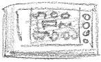

# Xircom REX 6000 / DataSlim  hints & tools

## Quick start

    zcc +rex -create-app -lm hello.c

If we want to generate a library file, then:

    zcc +rex -subtype=lib -create-app -lm libcode.c

Note that in this latter case the main program entry must be "LibMain()".

The command optionally uses a file called game.res which contains resources for the addin - icon, application name and a comment, an example is below:

	
	APPNAME Hello World
	COMMENT Made with z88dk
	ICON
	XXXXXXXXXXXXXXXXXXXXXXXXXXXXXXXXXXXX....
	X...................................X...
	X....................................X..
	X.....................................X.
	X......................................X
	X......X..X.XXXX.X....X.....XX.........X
	X......X..X.X....X....X....X..X........X
	X......X..X.X....X....X....X..X........X
	X......XXXX.XXX..X....X....X..X........X
	X......X..X.X....X....X....X..X........X
	X......X..X.X....X....X....X..X........X
	X......X..X.XXXX.XXXX.XXXX..XX.........X
	X......................................X
	X......................................X
	X......................................X
	X......................................X
	X......X..X..XX..XXX..X...XXX..........X
	X......X..X.X..X.X..X.X...X..X.........X
	X......X..X.X..X.X..X.X...X..X.........X
	X......X..X.X..X.XXX..X...X..X.........X
	X......XXXX.X..X.X..X.X...X..X.........X
	X......XXXX.X..X.X..X.X...X..X.........X
	X.......XX...XX..X..X.XXX.XXX..........X
	X......................................X
	X......................................X
	X......................................X
	X......................................X
	X......................................X
	X......................................X
	X......................................X
	X......................................X
	XXXXXXXXXXXXXXXXXXXXXXXXXXXXXXXXXXXXXXXX
	
## Emulators

Mame has some support, but the hacked DS2 emulator may be better bet (if it can be found)

## Links

* [Wikipedia about the REX 6000, a good overview](http://en.wikipedia.org/wiki/REX_6000)
* [REX 6000 related page](http://www.ipd.bth.se/ska/sim_home/rex.html)
* [connected to the above link.. extra tools page](http://www.bth.se/people/ska/sim_home/rex_utils.html)
* [REX 6000 historical page](http://www.oocities.org/wh_hsn/rex6k/rex_6000_intro.htm)
* [A REXDK (derived from an earlier z88dk version) tutorial in Japanese](http://www.asahi-net.or.jp/~qn6omrtm/ds2new/dev/make_rex/index.htm)
