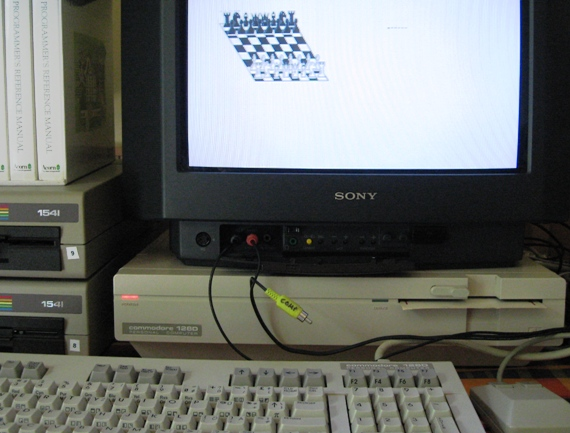
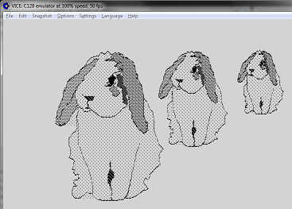

z88dk is able to generate code for the Commodore 128's Z80 CPU.
Two versions of the library are provided for both "native" mode and CP/M.

## Target specific functions

In addition to the z88dk "standard" functionalities the "SG Tools" library by Steve Goldsmith is included.

Even if with the obvious limits of the lack of an Operating System, the developer now has the possibility to use it in "native mode", not needing to run CP/M and loading the program from tape or from a 1541 disk drive.

## Tape file build

NOTE: a bug in the emulator will prevent this method to work with VICE version 3.x 

	zcc +c128 -create-app program.c

The default program name is "A", so a file named "A.T64" will be created.
Attach the file image to your favourite emulator (or convert it to WAV).

Load the M/C block:
	LOAD

Load the BASIC kickstarter (but a simple SYS jump could also work):
	LOAD

..run the thing !
	RUN

The code is built by default at $3000, different locations can be specified (e.g. '-zorg=16384).

Specific audio conversion tools can be used to transfer the ".T64" file (e.g. [WAV-PRG](https://sourceforge.net/projects/wav-prg/)).

## Disk file build

Roadmap to compile a program and run it onto the VICE emulator.

Create a blank disk image (mydisk.d64), x128 is buggy so to succeed you could use an external tool, such as "cc1541" (a disk image creator, while "c1541" is a disk image editor).

Then do the following steps:

	zcc +c128 -create-app -subtype=disk program.c 	-> compile the program using the default output name ("A")
	
	c1541 mydisk.d64
		write a.ldr 	-> insert the BASIC loader (if new disk)
		write a 	-> insert the MC program
		exit

	x128 mydisk.d64 	-> run the emulator
		load "a.ldr",8 	-> load the BASIC loader
		run

The code is built by default at $3000, different locations can be specified (e.g. '-zorg=16384).

A good alternative to c1541 is "DirMaster":  http://style64.org/dirmaster

## Using CP/M

The CP/M target support can be extended with C128 specific functions, grouped in the "c128cpm" library (add "-lc128cpm" to your compilation command line).   "c128cpm" also contains a port of the SG Tools, permitting to use sound, tweaked text, graphics resolutions and more.

z88dk style graphics libraries can be including by adding "-lgfx128", "-lgfx128hr" or "-gfx128hr480" (this last video mode is still untested and not supported by the current VICE emulator version).

The above options are also listed in the [CP/M section](Platform---CPM#hardware-specific-extensions) in this Wiki.

A good option to transfer a CP/M program is the "[ctools04.zip](http://zimmers.net/anonftp/pub/cbm/crossplatform/converters/unix/ctools04.zip)" program by Jochen Metzinger.

### graphics

Graphics support libraries are available for three different resolution modes:  lorez (gfx128), hirez (gfx128hr) and ultra-hirez (gfx128hr480)

 

