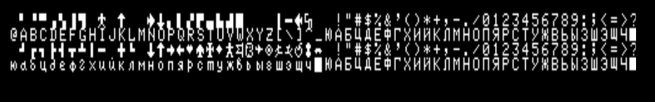

Hardware summary

* MHB 8080A  @ ~2Mhz
* ~54k contiguous RAM
* Character mapped display

## Classic library support (`+mikro80`)

* [x] Native console output
* [x] Native console input
* [ ] ANSI vt100 engine
* [x] Generic console
    * [ ] Redefinable font 
    * [ ] UDG support
    * [ ] Paper colour
    * [ ] Ink colour
    * [ ] Inverse attribute
    * [ ] Bold attribute
    * [ ] Underline attribute
* [x] Lores graphics
* [ ] Hires graphics
* [ ] PSG sound
* [ ] One bit sound
* [ ] Inkey driver
* [ ] Hardware joystick
* [ ] File I/O
* [ ] Interrupts
* [ ] RS232

_This machine is being brought up_

# Compilation

    zcc +mikro80 program.c -create-app

A .rk8 file is produced suitable for loading as a tape file into, for example Mame.

To load type:

    I

When loaded, the start + end addresses will be displayed on screen. To start the program type:

    G 0000

## Keyboard handling

By default, the port uses the firmware keyboard routines. This can be quite slow at recognising keypresses so you may end up with a better experience if you enabled the inkey terminal handling by supplying the option `--hardware-keyboard`

The delete/backspace key is mapped to the home key.

## Character Set

The font is fixed in ROM and contains the following characters:

# Links

