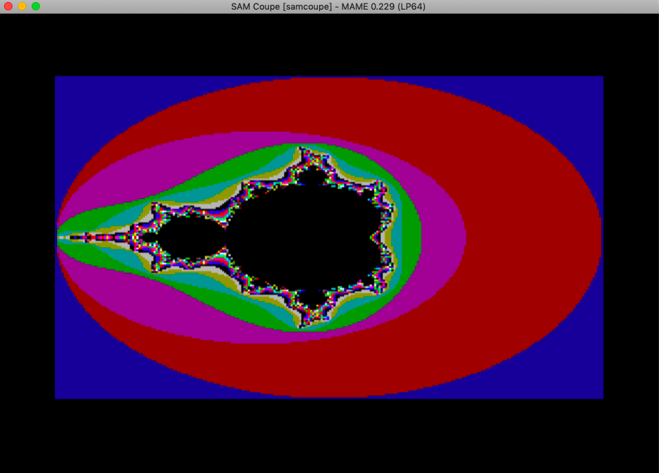

# SAM Coupé


# Hardware

* Z80B @ 6Mhz
* 256/512kb RAM + 1-4Mb external expansion
* SAA1099 sound generator


## Classic library support (`+sam`)

* [x] Native console output
* [x] Native console input
* [x] ANSI vt100 engine
* [x] Generic console
    * [x] Redefinable font
    * [x] UDG support
    * [x] Paper colour
    * [x] Ink colour
    * [x] Inverse attribute
    * [x] Bold attribute
    * [x] Underline attribute
* [ ] Lores graphics
* [x] Hires graphics
* [x] PSG sound (etracker player available)
* [x] One bit sound
* [x] Inkey driver
* [x] Hardware joystick
* [ ] File I/O
* [x] Interrupts
* [ ] RS232


# Quick start

    zcc +sam -lm application.c -create-app

A .MGT disc image will be created suitable for insertion into an emulator or writing to a physical disc. The disc will autoboot and the application will start automatically.

The process will automatically insert a version of SAMDOS onto the disc, to override
it with an alternate DOS file such as MasterDOS/B-DOS the `-Cz--dosfile` option can be used:

    zcc +sam -lm application.c -create-app -Cz--dosfile=/path/to/dosfile


# Memory models

* `-subtype=allram` (default) Loads the program to A+B+C+D, screen paged on demand into C+D
* `-subtype=highram` Loads the program to C+D, screen into A+B
* `-subtype=basic` Uses MODE 1 from a BASIC environment (this subtype has much reduced functionality and use isn't recommended).

# Screen modes

The SAM Coupé hardware under z88dk provides the following screen modes:

| Screen Mode | Colours | Text Resolution | Graphics Resolution | Memory Used | Notes |
|-|-|-|-|-|-|
| 1 | 16 | 32x24/64x32 | 256x192 | 6.75k | Lowers the effect clock speed to ~3.5MHz. Colour resolution is 32x24 with ZX 'BRIGHT' colours simulated by upper palette entries|
| 2 | 16 | 32x24 | 256x192 | 12k | Colour resolution is 32x192 |
| 3 | 4 | 64x24  | 512x192 | 24k | Colour resolution is 512x192 |
| 4 | 16| 32x24 | 256x192 | 24k | Colour resolution is 256x192 |

All 4 screen modes on the SAM are supported by z88dk, to switch to mode 2 for example, use the following code snippet:

    #include <sys/ioctl.h>
    
    int  mode = 2;
    console_ioctl(IOCTL_GENCON_SET_MODE,&mode);

The screen modes are presented as they are for SAM Basic, that is with mode=1 representing the +zx compatible mode and 4 being the high colour screen mode.

### Startup mode

The pragma `-pragma-define:CLIB_DEFAULT_SCREEN_MODE=XX` (where XX is one of: 1,2,3,4,-1) can be used to configure the startup mode. By default the target will startup in mode 4, but if XX=-1 then the screen mode isn't changed.

## Screen Fonts

Alternative SAM Coupé fonts can be loaded using .asm files as per the guide in the [Generic Console](https://github.com/z88dk/z88dk/wiki/Classic-GenericConsole) instructions, CH8 format is the same format as used on the SAM (768 bytes for ASCII set, 1096 bytes for extended set).

## Palette/CLUT mapping

The SAM Coupé has a user definable palette and thus palette mapping does not take place for gencon modes 3 and 4.

The default palette in modes 1,2 & 4 matches the +zx, and can be seen in the coloured mandelbrot below:



Mode 3 also currently has the ZX palette so will usually require pot position 3 to be reassigned to bright white (value 127) to match the default on the SAM Coupé.

Palette changes can be made through the following functions:

    #include <arch/sam.h>

    // Set single pot
    sam_set_palette(unsigned char index, unsigned char value);
    
    // Set full palette at once with array of data from entry 0 to entry 15
    sam_load_palette(unsigned char *data)
        
## Graphics support

Graphic support is available in all 4 modes. The current `textcolor()` value is applied to the plotted pixels. This is particular useful in mode 3/4 where there is no attribute clash. Pixel based operations, primitive drawing, stencils and profiles are supported. The bk* routines for saving and restoring background are not currently available.

# Hardware support 

The file [<arch/sam.h>](https://github.com/z88dk/z88dk/blob/master/include/arch/sam.h) defines additional functions and features for controlling the hardware of the target.

## Interrupts

The line and frame interrupts are distinguished and ISRs can be registered for each trigger using the following two functions:

    #include <arch/sam.h>
    add_raster_int(func);
    sam_install_line_isr(func);

In the default allram subtype, NMI handlers can be registered with:

    #include <interrupt.h>
    nmi_install_isr(func)

## Audio support

The beeper is supported via the functions in `<games.h>`, E-tracker module support is available via `<psg/etracker.h>`

Note that E-tracker tunes must be loaded without the player code which is usually attached to the start of the file, this can be done in an editor by finding the string 'ETracker (C) BY ESI', moving 10 bytes back and removing everything before that point.

The +sam target also includes AY emulation and WYZ tracker support is available, this can help when creating portable games however it does come with approximately 8k cost in terms of memory usage.

## The stack

In the default `allram` subtype, an area for the stack is reserved in segments A+B, by default 1024 bytes are made available, this can increased or decreased using the option `-pragma-define:CRT_STACK_SIZE=nnnn` where `nnnn` is the required size.

# Real Hardware

You can use the *dskman* utility to save your files to a dsk-image which can be written out to a DD floppy and read by a real SAM Coupé.  

# Porting code from Sam C

[Sam C](https://www.worldofsam.org/products/sam-c) was the Small C compiler available for the SAM Coupé in 1995.

To aid conversion the libraries and functions provided in Sam C are listed here in the [SAM Coupé Library Reference](https://github.com/z88dk/z88dk/wiki/SAM-Coup%C3%A9-Library-Reference)

# Emulation

The currently maintained [SimCoupé](https://github.com/simonowen/simcoupe/releases/) can easily be used when called with the `-autoload` command.

A very basic workflow could look like this:
```
@echo off
REM
REM Windows Batch file for launching ZCC to compile SAM Coupé executables
REM and lauch them in SimCoupe via an MGT disk image.

REM NOTE: Filename without .c extension

set FILE=helloworld
set EMUPATH="C:\Program Files (x86)\SimCoupe\simcoupe.exe"

echo Compiling %FILE%.c... 
zcc +sam %FILE%.c -lm -v -o %FILE% -create-app
IF NOT %ERRORLEVEL% == 0  GOTO FAIL

echo Launching %FILE%.mgt with SimCoupe...
call %EMUPATH% %FILE%.mgt -autoload 1> nul 2> nul
IF NOT %ERRORLEVEL% == 0  GOTO FAIL

GOTO END

:FAIL
Echo  ^^ %FILE% failed, press a key.
pause 1> nul 2> nul
:END
```
