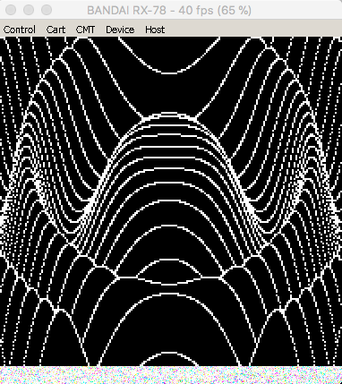
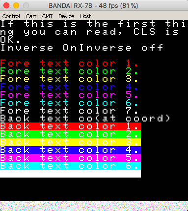

# Hardware summary

* SHARP LH0080A @ 4.090909 MHz
* 8k Monitor ROM
* 15k? RAM @0xb000
* 30k? VRAM (6 bit planes, 3 foreground, 3 background) 192x184 pixels (W x H)
* Audio: SN76489 on ports 0xff @ 3.579545 MHz
* 24k? ROM cartridges @0x2000

# Compilation

    zcc +rx78 adv_a.c -create-app

Will create a 24k ROM file that can be inserted using the menu with the Takeda emulator.

# Graphics

The display on the RX-78 is mirrored to convention, that is bit 0 in a display byte is the left-most pixel displayed. To simplify cross machine compatibility the generic console mirrors bytes so fonts and UDGs don't need to be changed.

The default font used by the generic console is the font that's contained in the IPL rom file. Not all of the characters will print as expected!

_Note_ if you use the ROM font then `cvpeek()` won't work for non-UDGs. 

# Screenshots

# Links

* [Takeda Emulator](http://takeda-toshiya.my.coocan.jp/rx78/index.html)
* [Translated Takeda analysis document](http://interbutt.com/mess/rx78tech.html)
