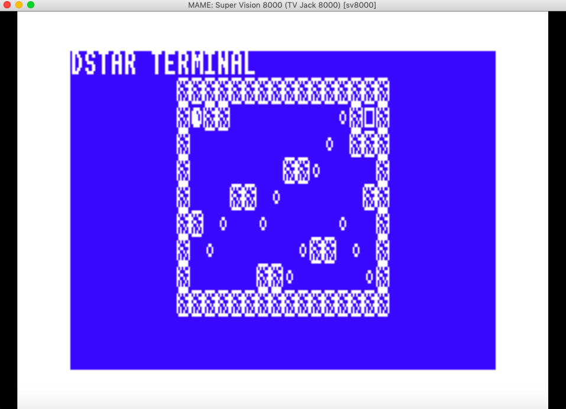

# Hardware summary

* Z80 @ 3.57 Mhz
* 1k RAM
* MC6847 with 3k VRAM
* AY-3-8190
* Cartridge size limited to 4k

## Classic library support

* [ ] Native console output
* [ ] Native console input
* [ ] ANSI vt100 engine
* [x] Generic console
    * [x] Redefinable font 
    * [x] UDG support
* [x] Lores graphics (32x16)
* [x] Hires graphics (256x96)
* [x] PSG sound
* [ ] One bit sound
* [ ] Inkey driver
* [x] Hardware joystick
* [ ] File I/O
* [x] Interrupts
* [ ] RS232

# Compilation

    zcc +sv8000 program.c -create-app

Will create a 4k ROM suitable for loading into Mame. Large cartridges can be created using `-subtype=32k` however loading them isn't support by the Mame emulator

# Screenmodes and graphics

The target supports two screen modes:

* Mode 0 text based, 32x16, graphics 32x16, only character codes 32 - 95 are available
* Mode 1 graphical, 32x12, graphics 256x96, supports redefining fonts and UDGs

The screen mode can be changed with the following code:

    #include <sys/ioctl.h>

    int mode = 1;
    console_ioctl(IOCTL_GENCON_SET_MODE, &mode);

Of course, supported multiple screen modes does have an overhead, especially on a machine with restricted memory such as this. If you don't use a mode, it can be excluded from the final binary using the following pragmas:` -pragma-define:CLIB_DISABLE_MODE0=1` and `-pragma-define:CLIB_DISABLE_MODE1=1`

# Screenshots

The terminal version of DStar running:

    zcc +sv8000 dstar_gencon.c -DUSE_JOYSTICK -DUSE_UDGS -DSWITCH_MODE=1 -pragma-redirect:CRT_FONT=_font_8x8_bbc_system -create-app

# Limitations

* 4k isn't much space
* The joystick supports the directions and # as the fire button

# Links

* Mame emulator