# The portable version of the 'Death Star' game

Click here to view the source code of [dstar.c](https://raw.githubusercontent.com/z88dk/z88dk/masterexamples/dstar.c) or its [header file](https://raw.githubusercontent.com/z88dk/z88dk/masterexamples/dstar.h)

## TI Calculators

Sound over infrared port is supported

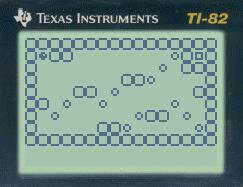
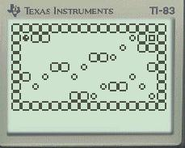
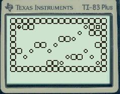
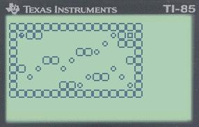 (default sprite size)
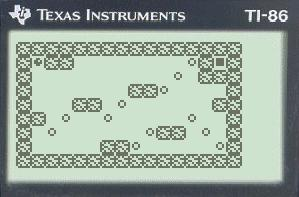 (sprite size = 8)

## Luxor ABC 80

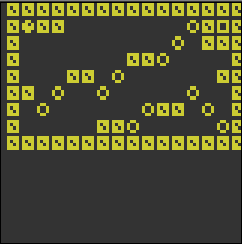

## Sorcerer Exidy

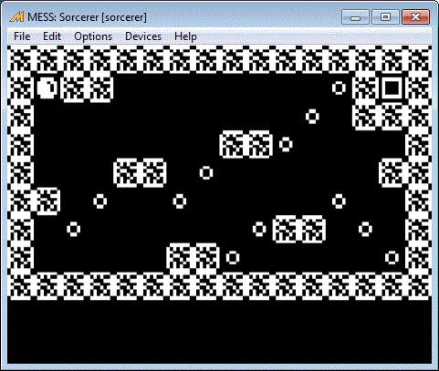

## ZX Spectrum

Sound is supported

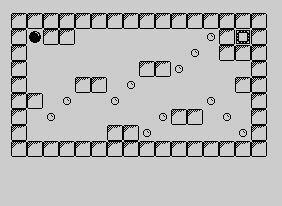

TS2068: 

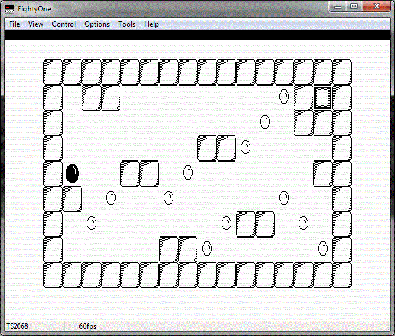

## MSX and Spectravideo SVI

Sound is supported

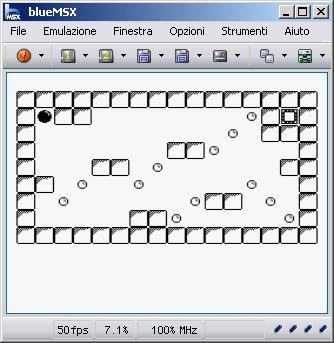

## Mattel Aquarius

Sound is supported

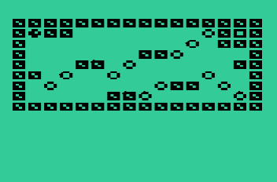

## Sharp OZ 7XX

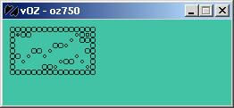 (default sprite size)

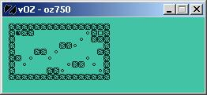 (spritesize=8)

## EACA Colour Genie EG2000

Sound is supported (HT1080 1-bit mode)

## Tandy Radio Shack TRS80

Sound is supported on the HT1080 clone

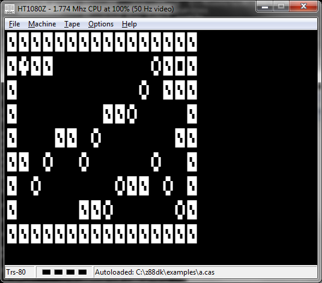

## Galaksija

Sound is supported on both the Galaksija and the "Galaksija Plus" if memory is enough.

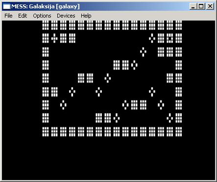

## Video Technology VZ-200 (AKA Laser-200)

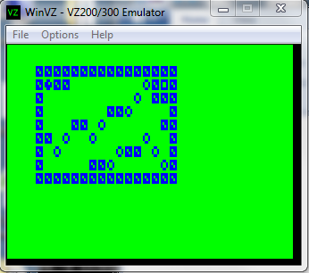

