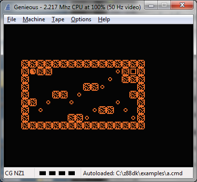

# The portable version of the 'Death Star' game

Click here to view the source code of [dstar.c](https://raw.githubusercontent.com/z88dk/z88dk/masterexamples/dstar.c) or its [header file](https://raw.githubusercontent.com/z88dk/z88dk/masterexamples/dstar.h)

## TI Calculators

Sound over infrared port is supported

 (default sprite size)
 (sprite size = 8)

## Luxor ABC 80

## Sorcerer Exidy

## ZX Spectrum

Sound is supported

TS2068: 

## MSX and Spectravideo SVI

Sound is supported

## Mattel Aquarius

Sound is supported

## Sharp OZ 7XX

 (default sprite size)

 (spritesize=8)

## EACA Colour Genie EG2000

Sound is supported (HT1080 1-bit mode)

## Tandy Radio Shack TRS80

Sound is supported on the HT1080 clone

## Galaksija

Sound is supported on both the Galaksija and the "Galaksija Plus" if memory is enough.

## Video Technology VZ-200 (AKA Laser-200)

