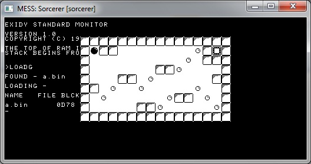

======= Sorcerer Exidy =======

Known clones:  Personal Systems Consulting PS-80,  Dynasty smart-ALEC II

The Sorcerer Exidy has been tested on the MESS emulator by transferring the programs in WAV file format.

The example above is taken by a specific version capable of reprogramming a part of the text font.

A low resolution version of the game can also be obtained by using the standard graphics functions.   On the "Sorcerer" the resolution is 128x60.

# Quick start

    zcc +srr -lm -create-app dstar.c -Cz--audio

The program can then be loaded by the 'monitor' with the following command (UPPERCASE):

    LOADG

# Appmake extras

The appmake tool can be run in "dumb" mode to generate the corresponding audio track of some external program.
Note that in the sorcerer case the binary 'format' is probably not used by different programs than z88dk, since it is being invented here.

    C:\>appmake +srr --dumb --audio -b program.srr
    
The optional "--300bps" flag will make a 300 baud audio track compatible with the Kansas City Standard, (monitor command SE T=1).

