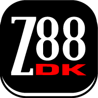

~~NOTOC~~

z88dk is a collection of software development tools that targets z80 machines.  It consists of a C compiler, a set of libraries implementing the C standard library, an assembler / linker and a variety of utilities for profiling and generating executables in a number of formats.  Development in C, assembly language or a mixture of the two is directly supported.

The name z88dk originates from the time when the project was founded and targetted only the Cambridge z88 portable.  Today z88dk directly supports [more than fifty z80 targets](targets) with the level of library support for each target varying with interest shown by users.  It is possible to add new targets with relative ease.

z88dk is known to run on a wide variety of platforms.  Binary releases are available for Win32 and MacOS X and packages are available for many Linux distributions.

There are a few things that make z88dk unique:

*  It comes with built-in support for [more than fifty z80 targets](targets).  This includes customized libraries and crts so that programs can be compiled for the supported machines out-of-the-box.

*  The libraries are extensive.  The aim is not only compliance with a large subset of C11 but also to supply useful specialized non-standard libraries.

*  The majority of the libraries are written in assembly language.  This makes them fast and small.  C compiled code is in general three to five times larger and slower than hand-assembled code.  By supplying libraries written in assembler, executables generated by z88dk are both faster and smaller than those generated by other C compilers.  Make use of the libraries to gain these advantages!

[About the z88dk logo](z88dk logo)

# License

** [The Clarified Artistic License](license) **

The intent behind adoption of this license:

1. Any modifications to z88dk eg in the form of new targets, toolchain improvements, bug fixes, extra functionality etc should be fed back to the project so that every user can benefit.

2. You can use the compiler to generate products which are sold commercially and distributed for profit.

3. We totally indemnify ourselves against any damage caused by deployment of the kit or any product generated by the kit. We don't guarantee that the software is fit for any purpose in any way whatsoever.

Some modules have been imported into the project from other sources.  They may be covered under other licenses that are documented with their source code.  However in all cases, there is no restriction on generating software that can be sold commercially for profit.

# Documentation

 1.  **[Installation](installation)**

    * [Latest Stable Release](installation#latest_stable_release)
    * [Nightly Built Packages](installation#nightly_built_packages)
    * [Environment Variables](installation#environment_variables)
    * [Navigating z88dk's Directory Structure](installation#navigating_z88dk_s_directory_tree)
    * [Compiling z88dk from C Source](installation#compiling_the_z88dk_binaries)
    * [Link to the git repository](https://github.com/z88dk/z88dk/)
 2.  **An Introduction to Using z88dk**

    * 
    * Environment
    * [The Compiler Front End: ZCC](zcc)
    * The Assembler and Linker: Z80ASM ([z80asm.txt](https://raw.githubusercontent.com/z88dk/z88dk/masterdoc/z80asm.txt))
    * [The Peep-Hole Optimizer](copt)
    * [Various Tools Included with z88dk](tools)
    * [MAKEing the z80 Libraries](libsrc)
 3.  **C Programming with z88dk**

    * Basic Types (char, int, long, far *, float, double)
    * [Suite deficiencies: Multi-Dim Arrays etc..](programming/deficient)
    * [Debugging Tips](debugging)
    * [Optimization hints](optimization)

======= Library Documentation =======
 1.  **Platform Independent Library Functions**

    * 
    * [Abstract Data Types](library/adt) ([adt.h](https://raw.githubusercontent.com/z88dk/z88dk/master/include/adt.h))
    * [Algorithm](library/algorithm) ([algorithm.h](https://raw.githubusercontent.com/z88dk/z88dk/master/include/algorithm.h))
    * [conio.h (MS-DOS compatibility)](library/conio) ([conio.h](https://raw.githubusercontent.com/z88dk/z88dk/master/include/conio.h))
    * [Debug](library/debug) ([debug.h](https://raw.githubusercontent.com/z88dk/z88dk/master/include/debug.h))
    * [Fast 3D rotation library](library/lib3d) ([lib3d.h](https://raw.githubusercontent.com/z88dk/z88dk/master/include/lib3d.h))
    * [Input](library/input) ([input.h](https://raw.githubusercontent.com/z88dk/z88dk/master/include/input.h))
    * [Interrupts](library/interrupts) ([im2.h](https://raw.githubusercontent.com/z88dk/z88dk/master/include/im2.h))
    * [Maths](library/maths) ([maths.h](https://raw.githubusercontent.com/z88dk/z88dk/master/include/maths.h),[float.h](https://raw.githubusercontent.com/z88dk/z88dk/master/include/float.h))
    * [Memory Allocation](library/memory allocation) ([malloc.h](https://raw.githubusercontent.com/z88dk/z88dk/master/include/malloc.h), [balloc.h](https://raw.githubusercontent.com/z88dk/z88dk/master/include/balloc.h))
    * [microc.h (Micro C compatibility)](library/microc) ([microc.h](https://raw.githubusercontent.com/z88dk/z88dk/master/include/microc.h))
    * [Monochrome Graphics](library/monographics) ([graphics.h](https://raw.githubusercontent.com/z88dk/z88dk/master/include/graphics.h))
      * [Turbo C BGI emulation functions](library/bgi) ([bgi.h](https://raw.githubusercontent.com/z88dk/z88dk/master/include/bgi.h))
      * [GUI functions (windowing)](library/wingui) ([gui.h](https://raw.githubusercontent.com/z88dk/z88dk/master/include/gui.h))
      * [Xlib emulation](library/xlib) ([X.h](https://raw.githubusercontent.com/z88dk/z88dk/master/include/X11/X.h),[Xlib.h](https://raw.githubusercontent.com/z88dk/z88dk/master/include/X11/Xlib.h),[Xos.h](https://raw.githubusercontent.com/z88dk/z88dk/master/include/X11/Xos.h),[Xutil.h ](https://raw.githubusercontent.com/z88dk/z88dk/master/include/X11/Xutil.h),[Xz88dk.h](https://raw.githubusercontent.com/z88dk/z88dk/master/include/X11/Xz88dk.h))
    * [RS232 Serial](library/serial) ([rs232.h](https://raw.githubusercontent.com/z88dk/z88dk/master/include/rs232.h))
    * [Sound](library/sound) ([sound.h](https://raw.githubusercontent.com/z88dk/z88dk/master/include/sound.h))
    * [Programmable Sound Generator (PSG)](library/psg) ([psg.h](https://raw.githubusercontent.com/z88dk/z88dk/master/include/psg.h))
    * [Sprites](library/sprites)
      * Hardware
        * Amstrad CPC+
        * MSX1
      * Software
        * [SP1](library/sprites/sp1) ([sp1.h](https://raw.githubusercontent.com/z88dk/z88dk/master/include/spectrum-sp1.h))
        * [Monochrome graphics sprite library](library/sprites/monosprites) ([games.h](https://raw.githubusercontent.com/z88dk/z88dk/master/include/games.h))
    * [Low Level file I/O](library/fcntl) ([fcntl.h](https://raw.githubusercontent.com/z88dk/z88dk/master/include/fcntl.h))
    * [Standard I/O](library/stdio) ([stdio.h](https://raw.githubusercontent.com/z88dk/z88dk/master/include/stdio.h))
    * [New Standard I/O](library/new_stdio)
    * [Standard Library](library/stdlib) ([stdlib.h](https://raw.githubusercontent.com/z88dk/z88dk/master/include/stdlib.h))
    * [String Functions](library/string) ([string.h](https://raw.githubusercontent.com/z88dk/z88dk/master/include/string.h))
    * [Time, clock and date functions](library/time) ([time.h](https://raw.githubusercontent.com/z88dk/z88dk/master/include/time.h))
 2.  **Platform Dependent Library Functions**

    * 
    * [Luxor ABC 80](library/abc80) ([abc80.h](https://raw.githubusercontent.com/z88dk/z88dk/master/include/abc80.h))
    * [Luxor ABC 800](library/abc800) ([abc800.h](https://raw.githubusercontent.com/z88dk/z88dk/master/include/abc800.h))
    * [Enterprise 64/128](library/enterprise) ([enterprise.h](https://raw.githubusercontent.com/z88dk/z88dk/master/include/enterprise.h))
    * [CP/M](library/cpm) ([cpm.h](https://raw.githubusercontent.com/z88dk/z88dk/master/include/cpm.h))
    * [Commodore 128](library/c128)
      * [SG Tools library by Steve Goldsmith](library/c128/sgtools)
    * [MSX](library/msx) ([msx.h](https://raw.githubusercontent.com/z88dk/z88dk/master/include/msx.h))
      * ['gfx' library by Rafael de Oliveira Jannone](library/msx/gfx) ([msx/gfx.h](https://raw.githubusercontent.com/z88dk/z88dk/master/include/msx/gfx.h))
    * [Grundy NewBrain](library/newbrain) ([newbrain.h](https://raw.githubusercontent.com/z88dk/z88dk/master/include/newbrain.h))
    * [Sinclair ZX 81](library/zx81) ([zx81.h](https://raw.githubusercontent.com/z88dk/z88dk/master/include/zx81.h))
      * [Gray scale LCD library](library/graylib) ([gray.h](https://raw.githubusercontent.com/z88dk/z88dk/master/include/gray.h))
    * [Sinclair ZX Spectrum](library/zxspectrum) ([spectrum.h](https://raw.githubusercontent.com/z88dk/z88dk/master/include/spectrum.h))
      * [Low resolution color graphics](library/zxspectrum/zxlowgfx) ([zxlowgfx.h](https://raw.githubusercontent.com/z88dk/z88dk/master/include/zxlowgfx.h))
      * [Currah uSpeech support](library/zxspectrum/currah) ([zxcurrah.h](https://raw.githubusercontent.com/z88dk/z88dk/master/include/zxcurrah.h))
      * [Opus Discovery](library/zxspectrum/zxopus) ([zxopus.h](https://raw.githubusercontent.com/z88dk/z88dk/master/include/zxopus.h)) 
      * [ZX Interface 1](library/zxspectrum/zxinterface1) ([zxinterface1.h](https://raw.githubusercontent.com/z88dk/z88dk/master/include/zxinterface1.h))
      * [The ZXVGS system](platform/zxvgs) ([zxvgs.h](https://raw.githubusercontent.com/z88dk/z88dk/master/include/zxvgs.h))
      * [Available fcntl drivers](library/zxspectrum/fcntl)
    * [Sharp X1](library/x1) ([x1.h](https://raw.githubusercontent.com/z88dk/z88dk/master/include/x1.h))
    * [S-OS](library/sos) ([sos.h](https://raw.githubusercontent.com/z88dk/z88dk/master/include/sos.h))
    * [Sharp OZ700 family, functions from the OZ development kit](library/sharpoz)
    * [TI calculators](TI calculators) ([ti.h](https://raw.githubusercontent.com/z88dk/z88dk/master/include/ti.h))
      * [Gray scale LCD library](library/graylib) ([gray.h](https://raw.githubusercontent.com/z88dk/z88dk/master/include/gray.h))
    * [Z88](library/z88) ([z88.h](https://raw.githubusercontent.com/z88dk/z88dk/master/include/z88.h))
    * [VZ 200](library/vz200) ([vz.h](https://raw.githubusercontent.com/z88dk/z88dk/master/include/vz.h))
 3.  **Third Party Libraries**

    * {{extlib.gif|}}
    * (now integrated) [ZX7, an optimal LZ77/LZSS data compressor](http://www.worldofspectrum.org/infoseekid.cgi?id=0027996) ([ZX7.txt](ftp///ftp.worldofspectrum.org/pub/sinclair/games-info/z/ZX7.txt))
    * [Sprite Library and more for Amstrad CPC](http://www.amstrad.es/programacion/c/) ([cpcrslib v.2](http://code.google.com/p/cpcrslib/))
    * [Crocolib, very low-level hardware support for Amstrad CPC/CPC+](http://crococode.free.fr/pages/_crocolib.php)
    * [BIFROST* ENGINE, Rainbow Graphics (Multicolor tiles) for the ZX Spectrum](http://www.worldofspectrum.org/infoseekid.cgi?id=0027405) ([BIFROSTENGINEV1.2.txt](ftp///ftp.worldofspectrum.org/pub/sinclair/games-info/b/BIFROSTENGINEV1.2.txt))
    * [NIRVANA multicolor engine for the ZX Spectrum](http://www.zxshed.co.uk/sinclairfaq/index.php5?title=NIRVANA_Engine)

======= Advanced Topics =======
 1.  **Mixing C and z80 Assembler**

    * 
    * Start-Up Code
    * [The Inline Assembler](usage/inlineasm)
    * [The Stack Frame (Parameter Passing)](usage/stackframe)
    * [Translation of C Names to ASM Names (Accessing C Variables from z80 Asm)](usage/symnames)
    * [Pragma Directives](usage/pragmas)
    * [Sharing Code by Creating Libraries](usage/creating_libaries)
 2.  **Miscellaneous**

    * 
    * [Adding a New z80 Target](porting/retargeting)
    * [Handling More Than 64k](advanced/farmem)
    * [Importing routines written in 8080 assembly mnemonics](advanced/8080toz80)
    * [Using CP/M libraries in REL format with z88dk](advanced/relformat)
      * [Linking external libraries](advanced/cpmlink/libraries)
      * [Linking Basic, Fortran, Pascal Programs with z88dk](advanced/cpmlink/programs)

======= Examples =======

      * 
      * [Code Snippets](examples/snippets)
      * [Completed Projects with Screenshots](examples/projects)

======= Development Branch =======

* {{:dev-branch.gif|}}

The C libraries, assembler and compiler in z88dk are currently seeing significant updates.

Among the changes are:

*  z80asm, z88dk's assembler / linker, has been updated to support sections.

*  zcc, z88dk's project builder, has been modified to allow C compilation using one of two selectable C compilers: z88dk's native sccz80 and sdcc-z80.

*  A new c library is being completely rewritten in assembly language to be as fully C11 compliant as is reasonable.

The new clib will exist in parallel with the current clib and selection of one or the other will be made with a compile line switch.

You can read more about it and find details on how to try it [here](temp/front).

======= Supported Targets =======

      * [Overview](targets)
      * 
      * [Amstrad CPC](Platform-AmstradCPC)
      * [Amstrad NC portable computers family](platform/amstradnc)
      * [Knight 2000 (Aussie Byte)](platform/aussie)
      * [Cambridge Z88](platform/z88)
      * [Canon X-07](platform/x07)
      * [Commodore 128](platform/c128)
      * [CP/M](platform/cpm)
      * [Tatung Einstein](platform/einstein)
      * [EACA Colour Genie EG2000](platform/eg2000)
      * [Epson PX4 (HC-40)](platform/px4)
      * [Epson PX8 (HC-80)](platform/px8)
      * [Enterprise 64 / 128](platform/enterprise)
      * [Grundy NewBrain](platform/newbrain)
      * [Jupiter ACE](platform/jupiterace)
      * [Luxor ABC 80](platform/abc80)
      * [Luxor ABC 800](platform/abc800)
      * [Camputers Lynx](platform/lynx)
      * [Mattel Aquarius](platform/aquarius)
      * [Galaksija](platform/galaksija)
      * [Lambda 8300 / Power 3000](platform/lambda)
      * [CCE MC-1000](platform/mc1000)
      * [MSX](platform/msx)
      * [Memotech MTX](platform/mtx)
      * [MK2 Z80 board project by Derek Baker at allthingsmicro.com](https://www.allthingsmicro.com/index.php/tutorials/creating-a-z80-development-environment)
      * [MK3 Z80 board project by Stefano Bianchini](http://www.zilog80.eu/), based on MK2
      * [MicroBee](platform/microbee)
      * [NASCOM 1 and NASCOM 2](platform/nascom)
      * [PAC-MAN arcade game hardware](platform/pacman)
      * [Philips P2000](platform/p2000)
      * [Philips Videopac C7420](platform/c7420)
      * [Philips VG-5000](platform/vg5000)
      * [NEC PC-6001](platform/pc6001)
      * [rc2014 z80 hobby board](https://groups.google.com/forum/#!topic/rc2014-z80/cGiPYtc4O8o)
      * [Rabbit Control Modules 2000, 3000, 4000](platform/rcm)
      * [Robotron Z1013](platform/z1013)
      * [Robotron Z9001, KC85/1, KC87](platform/z9001)
      * [VEB Mikroelektronik HC-900, KC85/2..KC85/5](platform/kc) (formerly Robotron)
      * [S1MP3 MP3 Players](http://wiki.s1mp3.org/Loadram)
      * [SAM Coupe](platform/samcoupe)
      * [Sega Master System](platform/sms)
      * [S-OS (The Sentinel) - Japanese OS](platform/sos)
      * [Sega SC-3000](platform/sc3000)
      * [Sharp MZ family](platform/sharpmz)
      * [Sharp X1](platform/x1)
      * [Sharp OZ-700 handheld family](platform/sharpoz)
      * [Sorcerer Exidy](platform/sorcerer)
      * [Sinclair ZX 80](platform/zx80)
      * [Sinclair ZX 81](platform/zx81)
      * [Sinclair ZX Spectrum](platform/zx)
      * [Sord M5](platform/sordm5)
      * [Spectravideo SVI](platform/spectravideo)
      * [(Peters Plus) Sprinter](platform/sprinter)
      * [Timex TS2068 (ZX Spectrum clone)](platform/ts2068)
      * [Texas Instruments, TI82 -> TI86 calculators](platform/ticalc)
      * [Tiki-100 (formerly Kon-Tiki)](platform/tiki100)
      * [TRS-80 (Tandy Radio Shack and clones)](platform/trs80)
      * [V6Z80P, "Old School Computer Architecture"](platform/osca)
      * [VZ 200 / Laser 200](platform/vz200)
      * [Xircom REX 6000](platform/xircomrex)
      * [YAZ180 hobby board](https://www.hackster.io/feilipu/yet-another-z180-yaz180-project-864253)

======= Unsupported Targets =======

      * [Hard to support](platform/unsupported)
      * [Not yet supported](platform/missing)
      
# Links

*  [z88dk Sourceforge Page](http://sourceforge.net/projects/z88dk)

*  [ZSock](http://www.rst38.org.uk/zsock/) (z88) The z88 TCP/IP stack - the reason why z88dk was started in the first place

*  [z88 forever](http://www.worldofspectrum.org/z88forever/) (z88) The site for everything z88 related 

*  [Graham's Rex 6000 Notes](http://www.cobb.uk.net/Rex/) (REX) Graham has written some extremely nice REX libraries

*  [z88dk with Borland C IDE](http://8bit.yarek.pl/tool/pc.borlandide/) (REX) A site telling you how to use z88dk with the Borland 3.1 IDE.

*  [T80 Z80 CPU Core](http://www.opencores.org/project,t80,overview) (embedded) Daniel Wallner's Z80 core which is supported by z88dk 

*  [eZ-Stunt](http://web.archive.org/web/20080705154048/http://www.circuitcellar.com/zilogdtd2000/second.htm) (embedded) Uses z88dk to target a z80s183 to do, well, [take a look!](http://web.archive.org/web/20100308063032/http://www.circuitcellar.com/zilogdtd2000/abstract/eZstunt.htm)  [(+schematics)](http://www.geocities.ws/robert_lacoste/download/ups0003.PDF)

*  [Spectranet](http://spectrum.alioth.net/doc/index.php/Spectranet) (ZX Spectrum) A project based around the W5100 IC to add ethernet capability to spectrums.  Software is targetted at asm, basic and C programmers using a socket API.

*  [ Music projects based on z88dk (??)](http://www.andykellett.com/category/software/z88dk/ )

*  [Entwickeln mit z88dk](http://www.octoate.de/wp/articles/german/entwickeln-mit-z88dk/)

*  [ z88dk related articles and game announcements for the Amstrad CPC](http://www.octoate.de/wp/tag/z88dk/ ) (flip also to [older pages](http://www.octoate.de/wp/tag/z88dk/page/4/))

*  [The unbelievable ZX Spectrum titles list](http://www.worldofspectrum.org/infoseekpub.cgi?regexp=^The+Mojon+Twins$) by ["The Mojon Twins"](http://www.mojontwins.com/?s=z88dk) (C sources are available)

*  [The Mojon Twins Dome](http://www.mojontwins.com/), z88dk being used in a great way "

*  ["Ubhres Productions" titles list](http://www.worldofspectrum.org/infoseekpub.cgi?regexp=^Ubhres+Productions$) (C sources are available)

*  ["Digital Prawn" titles list](http://www.worldofspectrum.org/infoseekpub.cgi?regexp=^Digital+Prawn$) (C sources are available)

*  [Minimalistic tutorial at AllThingsMicro](http://www.allthingsmicro.com/tutorials/creating-a-z80-development-environment), part of a [self-built z80 board](http://www.allthingsmicro.com/projects/build-a-z80-based-computer) project 

*  [Yet Another tutorial on the z88dk and the ZX Spectrum for Linux](http://wischner.blogspot.it/)

*  [Tutorial about using z88dk on CygWin to develop for the Sega Master System](http://steveproxna.blogspot.it/2014/09/z88dk-and-programming-setup.html) at "stevepro studios"

*  [Curso de Z88DK de MagazineZX (z88dk course in Spanish)](http://wiki.speccy.org/cursos/z88dk/indice)

*  [Lattice Tri-Speed Ethernet Media Access Controller (TSMAC) IP demo](http://www.latticesemi.com/~/media/LatticeSemi/Documents/ApplicationNotes/L/NZ/LatticeXPTri-SpeedEthernetMACDemo.PDF) Copyright 2006 Lattice Semiconductors, it includes a tutorial on how to use z88dk and uIP with their hardware

*  [ZALT, a Z80 computer prototype](https://jacobielectronix.wordpress.com/category/zalt), it also aims to provide a specific [z88dk extension](https://github.com/obiwanjacobi/Zalt/tree/master/Source/z88dk_target)

# z88dk related articles in online magazines

*  [futurice](http://futurice.com/blog/build-environment-like-its-1986)

*  [Magazine ZX (Spanish)](http://www.speccy.org/magazinezx/)

*  [CPC Forever (German)](ftp///ftp.cmo.de/pub/Computer/Amstrad_CPC/CPC-Magazine/Deutschland/CPC-Forever/)

*  [Sinclair ZX Notizie (Italian)](http://zxspectrum.altervista.org/notizie.htm)

*  [HAX #3, Feb 2008 (Italian)](http://dicorinto.it/files/2008/01/hax-n3.pdf)

*  [ZX Format (Article about "minesweeper" in #6, English)](http://zxf.magazine.googlepages.com/home)

*  ["Starting With C"  in "My gaming blog"](http://shaunbebbington.blogspot.com/2012/01/starting-with-c.html)

*  [Search the z88dk stuff on "Tetas, Culos y Retroinformática" (Spanish)](http://tcyr.wordpress.com/?s=z88dk)

# z88dk related videos

*  [ZX Spectrum twitter client](https://www.youtube.com/watch?v=-ECnN7jdgA4)

*  [Networking with a Sinclair ZX81: Network Filemanager and Web-Browser](https://www.youtube.com/watch?v=Y4PRiQq5VZs)

*  [Matrix digital rain on ZX Spectrum](https://www.youtube.com/watch?v=-ekUpkBVr8g)

*  [Death Star running on the Jupiter Ace Computer](https://www.youtube.com/watch?v=pQUt7r5OMC8)

*  [MSX Sprite library test](https://www.youtube.com/watch?v=HFGxFIgmwqg)

*  [MicroMan game running on the MC-1000](https://www.youtube.com/watch?v=i1sAPT6IZ3U)

*  [Radastán experiments with z88dk and his new game](https://www.youtube.com/watch?v=7c0_q7OQ-YM)

*  [Double buffer implementation for ZX-Uno (ZX-SPectrum FPGA Clone) in Radastian Mode using Z88DK v199a](https://www.youtube.com/watch?v=L322tYnXdiU)

*  [Z88dk compile for Olduino/Z](https://www.youtube.com/watch?v=ceDnamhnZio)

# Support

{{:z88dk-qr.gif|}}

*  The main [z88dk page](http://www.z88dk.org/) can be a source of more information.

*  The z88dk mailing lists can be joined via the [Sourceforge Project page](http://sourceforge.net/projects/z88dk/).

*  The current [z88dk git repository](https://github.com/z88dk/z88dk/) can be browsed online.

*  The [forums](http://www.z88dk.org/forum/forums.php) are the best way to get a quick response from the developers and other users.

# Under Construction

[Front Page](temp/front)
