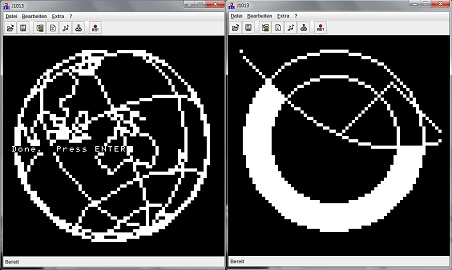

======= Robotron Z1013 =======

# Quick start

    zcc +z1013 -lm -o adventure -create-app adv_a.c
-or-
    zcc +z1013 -clib=ansi -lm -o adventure -create-app adv_a.c

This command will build a file called "adventure.z80", a binary file suitable to be run on the existing emulators.

It is possible to choose between a full VT/ANSI emulation and a tiny console support.
The ANSI version of the library depends a bit less on the ROM because the video memory is addressed directly.
16x16 text resolution is not supported in ANSI mode.

You can also change the program location with the "-zorg=" option.  The default position is at address $100.

# J1013 emulator

Download and build from http://www.jens-mueller.org/j1013

To run a ".z80" program use the "Datei/Laden" menu, pick your file and click on "Starten".

# KCemu Emulator

http://kcemu.sourceforge.net/

To run:

    start kcemu -0

# Z1013 related WEB Links

[The Z1013 at hc-ddr.hucki.net](http://hc-ddr.hucki.net/wiki/doku.php/z1013)

