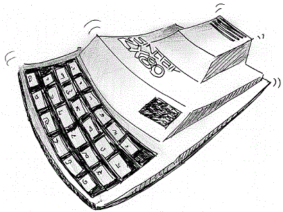

======= The ZX 80 platform =======

The Sinclair ZX80 is one of the smallest (in terms of power) platforms supported by the Z88DK.
It is suggested to have at least 8K of RAM to get some interesting program working, the minimum memory size allowed is 4K.

z88dk v.1.10 still does not support it, please use the version under developement.

# Quick start

zcc  +zx80 -lm -create-app -Cz--audio program.c

This will create a ''.o'' file and a ''.wav'' file.

# ZX80 peculiarities

The ZX80 runs in FAST mode only.
This means that the sceen will be normally visible only during the fgetc_cons() calls.
The programmer might want to try to keep the display visible also in other moments.  An exact timing computation is almost impossible while programming in C, but inserting the gen_tv_field() inside the loops might help:  test the results and correct its behaviour experimentally, but be aware that the emulators behave slightly differently than the real hardware and that your progam could not work on both the UK and USA models.

Such trick needs the gen_tv_field_init() to be called on startup.

